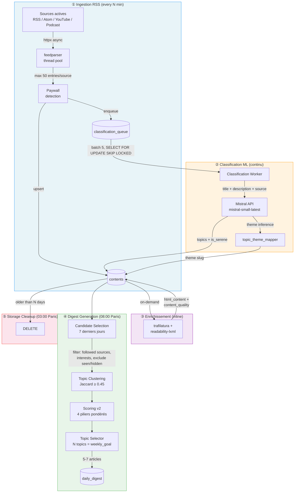
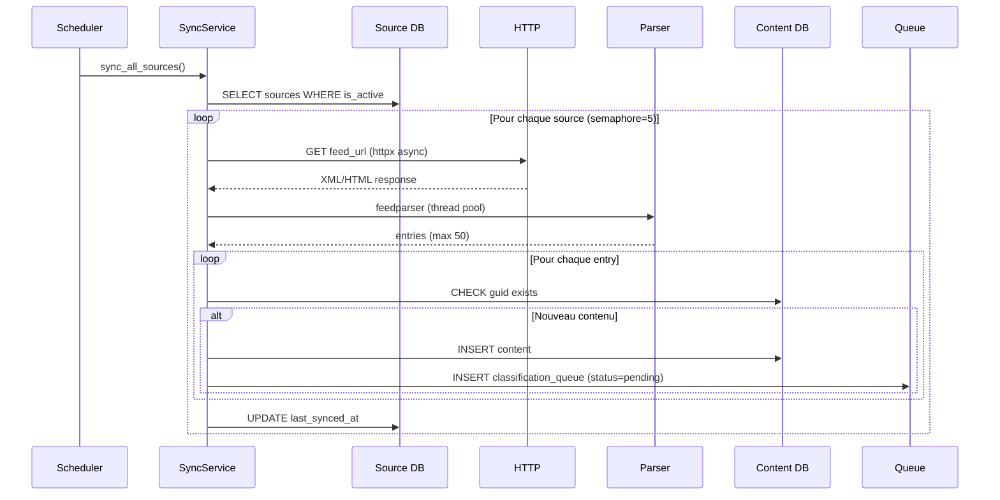
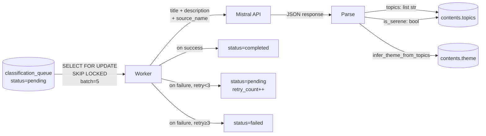
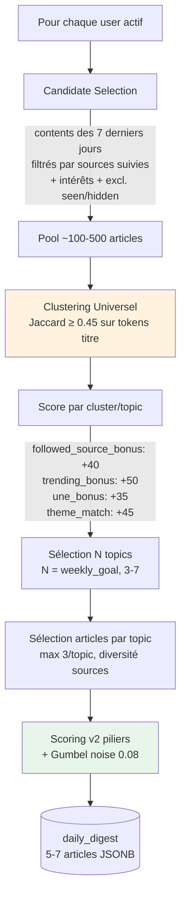
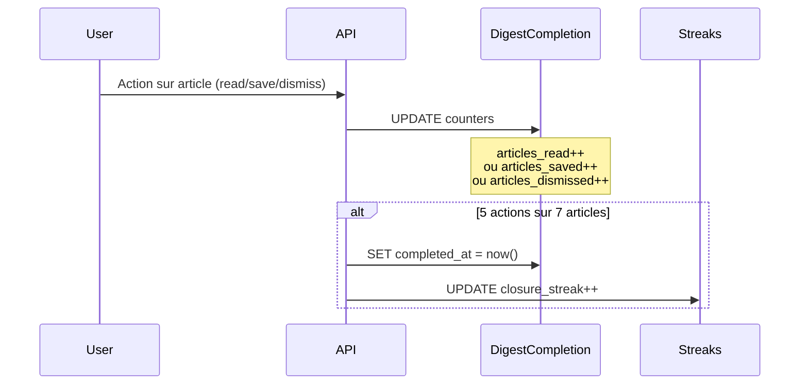
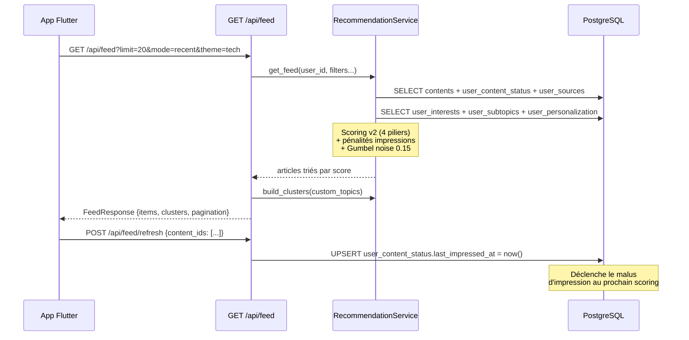

# Data Pipeline

> Source de vérité : `packages/api/app/workers/scheduler.py`, `packages/api/app/services/sync_service.py`

## Vue d'ensemble

> **Important** : il y a deux surfaces utilisateur distinctes avec deux architectures différentes.
> - **Feed** (`GET /api/feed`) — computation **temps réel** à chaque requête. C'est la surface principale aujourd'hui.
> - **Digest** (`GET /api/digest`) — généré une fois par jour à 08:00 par un job batch. En cours de refonte.



---

## ① Ingestion RSS

**Worker** : `workers/rss_sync.py` → `SyncService`
**Schedule** : `IntervalTrigger(minutes=settings.rss_sync_interval_minutes)` (default: 30 min)



### Détection de feed

Le `RSSParser` suit une cascade de 5 stratégies :

| Étape | Stratégie | Exemple |
|-------|-----------|---------|
| 0 | Transforms plateforme | Substack → `/feed`, Medium → `/feed/publication` |
| 1 | Parsing direct de l'URL | URL pointe directement vers un feed XML |
| 2 | Auto-discovery HTML | `<link rel="alternate" type="application/rss+xml">` |
| 3 | Scraping `<a href>` | Liens ressemblant à des feeds dans la page |
| 4 | Suffixes fallback | `/feed`, `/rss`, `/atom.xml`, `/feed.xml` |

**Anti-bot** : Fallback `curl-cffi` avec TLS fingerprinting pour bypass Cloudflare.

---

## ② Classification ML

**Worker** : `workers/classification_worker.py`
**Mode** : Boucle continue (check toutes les 10 secondes)



### Taxonomie

**51 topics** classifiés par le LLM, regroupés en **9 thèmes** :

| Thème | Topics |
|-------|--------|
| `tech` | ai, tech, cybersecurity, gaming, privacy |
| `science` | space, science |
| `politics` | politics |
| `economy` | economy, startups, finance, realestate, entrepreneurship, marketing |
| `society` | work, education, health, justice, immigration, inequality, feminism, lgbtq, religion, wellness, family, relationships, factcheck |
| `environment` | climate, environment, energy, biodiversity, agriculture, food |
| `culture` | cinema, music, literature, art, media, fashion, design, travel, gastronomy, history, philosophy |
| `international` | geopolitics, europe, usa, africa, asia, middleeast |
| `sport` | sport |

Le mapping complet est dans `packages/api/app/services/ml/topic_theme_mapper.py`.

### Output classification

Chaque article reçoit :
- `topics` : ARRAY de 1-3 slugs (par score ML décroissant)
- `theme` : slug dérivé du `topics[0]` via le mapper
- `is_serene` : booléen (article positif/constructif vs conflit/catastrophe)

---

## ③ Enrichissement contenu

**Service** : `ContentExtractor` (inline, déclenché à la demande)

| Étape | Outil | Output |
|-------|-------|--------|
| Extraction full-text | trafilatura + readability-lxml | `html_content` |
| Qualité | Heuristique longueur | `content_quality` = "full" / "partial" / "none" |
| Anti-retry | Timestamp | `extraction_attempted_at` |

---

## ④ Digest Generation

**Job** : `jobs/digest_generation_job.py` → `DigestService`
**Schedule** : `CronTrigger(hour=8, minute=0, timezone=Europe/Paris)`



### Completion tracking



---

## ⑤ Feed (on-demand — surface principale)

**Router** : `routers/feed.py` → `RecommendationService.get_feed()`
**Déclenchement** : À chaque ouverture du feed par l'utilisateur (pas de batch)

> Le feed n'a **pas de table dédiée**. C'est une requête scorée en temps réel sur `contents` + `user_content_status` + profil utilisateur.



### Filtres disponibles

| Paramètre | Valeurs | Effet |
|-----------|---------|-------|
| `mode` | `RECENT`, `INSPIRATION`, `PERSPECTIVES`, `DEEP_DIVE` | Modifie les filtres de scoring |
| `theme` | `tech`, `society`, `environment`... | Filtre par thème macro |
| `type` | `article`, `podcast`, `youtube`, `reddit` | Filtre par type de contenu |
| `saved` | `true` | Uniquement les articles bookmarkés |
| `has_note` | `true` | Uniquement les articles annotés |
| `source_id` | UUID | Filtre par source |

### Ce que le feed écrit en base

Chaque interaction utilisateur dans le feed met à jour `user_content_status` :

| Action | Colonne mise à jour | Impact scoring suivant |
|--------|---------------------|----------------------|
| Scroll sans cliquer | `last_impressed_at` | Malus temporel (-100 à -20 pts) |
| "Déjà vu" manuel | `manually_impressed = true` | Malus permanent -120 pts |
| Ouvrir un article | `status = seen`, `seen_at` | Article sort du pool "nouveau" |
| Lire jusqu'au bout | `status = consumed`, `time_spent_seconds` | +0.03 sur `user_subtopics.weight` |
| Like | `is_liked = true` | +0.15 sur `user_subtopics.weight` |
| Bookmark | `is_saved = true` | +0.05 sur `user_subtopics.weight` |
| Dismiss | `is_hidden = true` | -0.10 sur `user_subtopics.weight` |

---

## ⑥ Storage Cleanup

**Worker** : `workers/storage_cleanup.py`
**Schedule** : `CronTrigger(hour=3, minute=0, timezone=Europe/Paris)`

Supprime les articles plus anciens que `RSS_RETENTION_DAYS` (default: 20 jours).
Les `user_content_status` associés sont supprimés en cascade (FK `ON DELETE CASCADE`).

---

## Flux de données simplifié

```
RSS Feeds ──[30min]──> contents ──[continu]──> classification (topics, theme, serene)
                           │
                           ├──[on-demand]──> extraction (html_content)
                           │
                           ├──[temps réel]──> FEED ──> user interactions ──┐
                           │                                                │
                           └──[08:00]──> DIGEST ──> user interactions ──┐  │
                                                                         ↓  ↓
                                                              user_content_status
                                                                         │
                                                              weight learning (subtopics)
                                                                         │
                                                              feedback loop (scoring)
```

> Le **feed** est la boucle la plus rapide et la plus fréquente. C'est lui qui génère la majorité des données d'apprentissage. Le **digest** est une sélection quotidienne statique — la boucle la plus lente.
