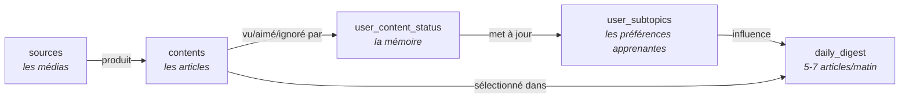
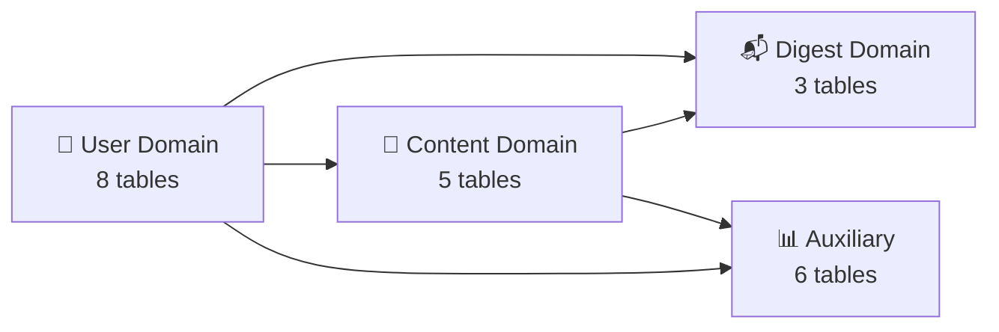
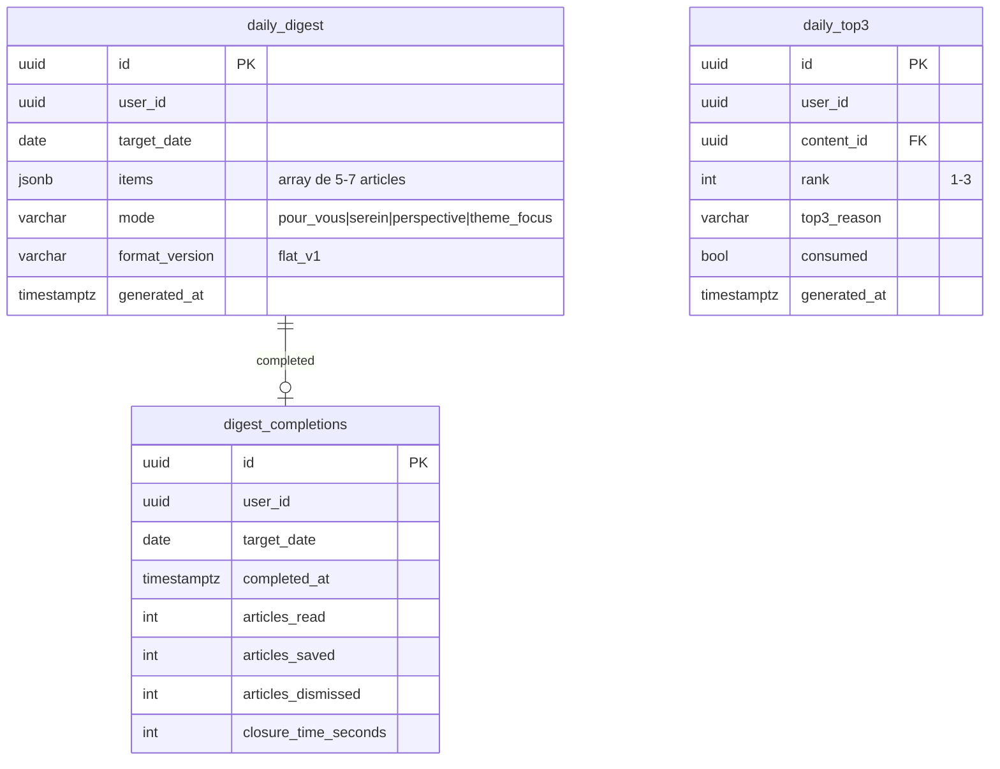
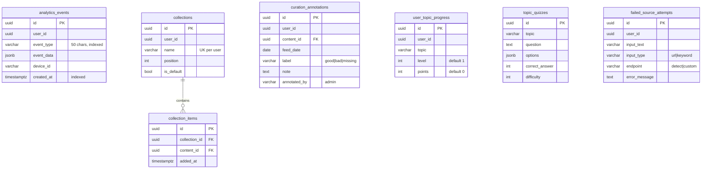

# Database Schema

> Source de vérité : `packages/api/app/models/` (17 fichiers SQLAlchemy)
> Base : PostgreSQL 15 via Supabase (managed)

---

## Parcours critique — 5 tables pour tout comprendre

Avant de plonger dans les 22 tables, voici le flux minimal qui représente le cœur du système :



**La boucle complète en une phrase** : on ingère des articles depuis des médias RSS (`sources` → `contents`), l'utilisateur les découvre dans le **feed** ou le **digest** → ses interactions sont stockées dans `user_content_status` → ses préférences s'ajustent automatiquement (`user_subtopics.weight`) → le lendemain son feed et son digest sont meilleurs.

> **Note architecture** : le feed (`GET /api/feed`) est la surface principale aujourd'hui — le digest est en cours de refonte. Le feed n'a **pas de table dédiée** : c'est une computation temps réel à chaque requête. C'est `user_content_status` qui capture toutes les interactions feed.

### Les 5 tables essentielles

| Table | Rôle en une ligne | Principal producteur |
|-------|-------------------|---------------------|
| `sources` | Les médias — Le Monde, TechCrunch, un podcast perso... | Admin / utilisateur |
| `contents` | Les articles ingérés, enrichis par ML (`topics[]`, `is_serene`) | Job RSS sync (30 min) |
| `user_content_status` | **La mémoire de toutes les interactions** : vu, aimé, ignoré, temps passé... | **Feed** (principalement) + digest |
| `user_subtopics` | Les préférences granulaires apprises | Mis à jour à chaque like/dismiss/read |
| `daily_digest` | Le digest du matin, 5-7 articles en JSONB | Job cron 08:00 Paris |

> Les 17 autres tables gravitent autour de ces 5. Voir les sections ci-dessous pour le détail.

---

## Vue d'ensemble des 4 domaines



---

## 1. User Domain

Tout ce qui concerne le profil, les préférences et l'apprentissage.

```mermaid
erDiagram
    user_profiles {
        uuid id PK
        uuid user_id UK "FK Supabase Auth"
        varchar display_name
        varchar age_range
        varchar gender
        bool onboarding_completed
        bool gamification_enabled
        int weekly_goal "default 10"
        timestamptz created_at
        timestamptz updated_at
    }

    user_interests {
        uuid id PK
        uuid user_id FK
        varchar interest_slug "ex: tech, politics, ai"
        float weight "default 1.0 — LEARNABLE"
        timestamptz created_at
    }

    user_subtopics {
        uuid id PK
        uuid user_id FK
        varchar topic_slug "ex: ai, climate, gaming"
        float weight "default 1.0 — LEARNABLE"
        timestamptz created_at
    }

    user_preferences {
        uuid id PK
        uuid user_id FK
        varchar preference_key
        varchar preference_value
        timestamptz created_at
    }

    user_personalization {
        uuid user_id PK_FK
        uuid_array muted_sources
        text_array muted_themes
        text_array muted_topics
        text_array muted_content_types
        bool hide_paid_content "default true"
        timestamptz updated_at
    }

    user_topic_profiles {
        uuid id PK
        uuid user_id FK
        varchar topic_name "ex: Prompt Engineering"
        varchar slug_parent "ex: ai"
        text_array keywords "LLM-enriched"
        text intent_description
        varchar source_type "explicit|inferred"
        float priority_multiplier "default 1.0"
        float composite_score "default 0.0"
        timestamptz updated_at
    }

    user_streaks {
        uuid id PK
        uuid user_id UK
        int current_streak
        int longest_streak
        date last_activity_date
        int closure_streak "digest completions"
        int longest_closure_streak
        date last_closure_date
        timestamptz updated_at
    }

    user_subscriptions {
        uuid id PK
        uuid user_id UK
        varchar status "trial|active|expired|cancelled"
        varchar revenuecat_user_id
        varchar product_id
        timestamptz trial_start
        timestamptz trial_end
        timestamptz current_period_start
        timestamptz current_period_end
    }

    user_profiles ||--o{ user_interests : "has interests"
    user_profiles ||--o{ user_subtopics : "has subtopics"
    user_profiles ||--o{ user_preferences : "has prefs"
    user_profiles ||--o| user_personalization : "has mutes"
    user_profiles ||--o{ user_topic_profiles : "has custom topics"
```

### Signaux d'apprentissage (colonnes clés)

| Table | Colonne | Type | Rôle |
|-------|---------|------|------|
| `user_interests` | `weight` | float | Poids macro-thème, ajusté par likes (+0.03) |
| `user_subtopics` | `weight` | float | Poids topic granulaire, ajusté par like/bookmark/read/dismiss |
| `user_personalization` | `muted_*` | ARRAY | Hard-filter : exclut du feed et du digest |
| `user_topic_profiles` | `keywords` | ARRAY | Mots-clés enrichis par LLM pour matching libre |
| `user_topic_profiles` | `composite_score` | float | Score agrégé de pertinence du custom topic |

---

## 2. Content Domain

Sources RSS, articles, interactions utilisateur, et queue de classification ML.

```mermaid
erDiagram
    sources {
        uuid id PK
        varchar name
        text url
        text feed_url UK
        enum type "rss|podcast|youtube|reddit"
        varchar theme "tech, society..."
        text_array secondary_themes
        text_array granular_topics
        bool is_curated
        bool is_active
        enum bias_stance "left|center_left|center|..."
        enum reliability_score "high|medium|low|unknown"
        enum bias_origin "editorial|ownership|..."
        float score_independence "FQS pillar"
        float score_rigor "FQS pillar"
        float score_ux "FQS pillar"
        varchar source_tier "mainstream|deep"
        text une_feed_url "A la Une feed"
        jsonb paywall_config
        timestamptz last_synced_at
    }

    user_sources {
        uuid id PK
        uuid user_id
        uuid source_id FK
        bool is_custom "ajoutée manuellement"
        float priority_multiplier "0.5 à 2.0"
        bool has_subscription "premium déclaré"
        timestamptz added_at
    }

    contents {
        uuid id PK
        uuid source_id FK
        varchar title
        text url
        text thumbnail_url
        text description
        timestamptz published_at
        int duration_seconds
        enum content_type "article|podcast|youtube|reddit"
        varchar guid UK
        text html_content "extraction trafilatura"
        text audio_url
        uuid cluster_id "Story 7.2 clustering"
        text_array topics "ML: 1-3 slugs de 51"
        varchar theme "dérivé du top topic"
        bool is_paid "paywall détecté"
        bool is_serene "ML: positif/constructif"
        varchar content_quality "full|partial|none"
        timestamptz extraction_attempted_at
    }

    user_content_status {
        uuid id PK
        uuid user_id
        uuid content_id FK
        enum status "unseen|seen|consumed"
        bool is_saved
        bool is_liked
        bool is_hidden
        varchar hidden_reason
        timestamptz seen_at
        int time_spent_seconds
        timestamptz saved_at
        timestamptz liked_at
        text note_text
        timestamptz last_impressed_at "feed refresh"
        bool manually_impressed "deja vu permanent"
    }

    classification_queue {
        uuid id PK
        uuid content_id FK_UK
        varchar status "pending|processing|completed|failed"
        int priority
        int retry_count
        text error_message
        timestamptz processed_at
    }

    sources ||--o{ contents : "produces"
    sources ||--o{ user_sources : "followed by"
    contents ||--o{ user_content_status : "interacted"
    contents ||--o| classification_queue : "queued for ML"
```

### Index de performance notables

| Index | Colonnes | Usage |
|-------|----------|-------|
| `ix_contents_source_published` | (source_id, published_at) | Requêtes feed par source |
| `ix_contents_theme_published` | (theme, published_at) | Feed filtré par thème |
| `ix_user_content_status_exclusion` | (user_id, content_id, is_hidden, is_saved, status) | Exclusion digest (EXISTS subquery) |
| `idx_queue_status_created` | (status, created_at) | Dequeue classification |
| `idx_queue_priority` | (priority DESC, created_at) | Priorité classification |

---

## 3. Digest Domain

Digest quotidien, complétion, et briefing legacy.



### Structure JSONB `daily_digest.items`

```json
[
  {
    "content_id": "uuid",
    "rank": 1,
    "reason": "Vos intérêts",
    "source_slug": "le-monde",
    "topic_label": "Intelligence artificielle"
  }
]
```

**Contrainte** : 1 seul digest par (user_id, target_date).

---

## 4. Auxiliary Domain

Analytics, collections, curation, progression.



### Tables intéressantes à regarder (apprentissage continu)

| Table | Intérêt |
|-------|---------|
| `analytics_events` | Funnel utilisateur, comportement, churn detection |
| `curation_annotations` | Ground truth pour mesurer la qualité de l'algo (precision/recall) |
| `failed_source_attempts` | Amélioration de la découverte de sources (UX data) |
| `user_topic_progress` | Gamification, potentiel feature "expertise" |

---

## Types de données spéciaux

| Pattern | Tables | Usage |
|---------|--------|-------|
| **JSONB** | daily_digest.items, analytics_events.event_data, sources.paywall_config, topic_quizzes.options | Données semi-structurées flexibles |
| **ARRAY(Text)** | contents.topics, user_personalization.muted_*, sources.granular_topics, user_topic_profiles.keywords | Listes de tags/slugs |
| **ARRAY(UUID)** | user_personalization.muted_sources | Listes d'IDs |
| **Enum (non-native)** | ContentStatus, ContentType, SourceType, BiasStance, ReliabilityScore | Enums validés côté app, stockés en varchar |
