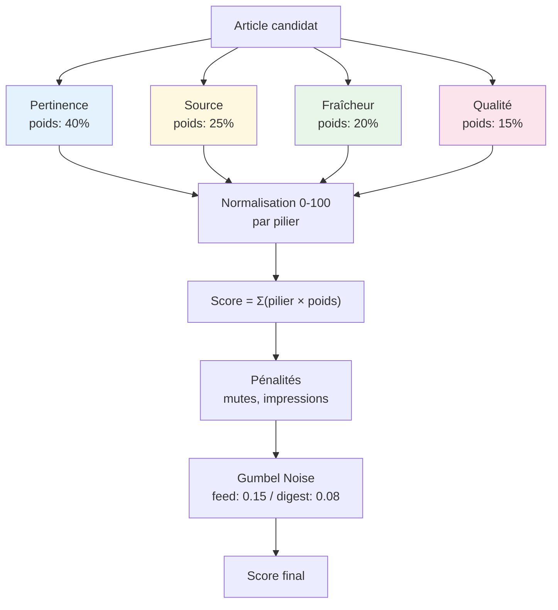
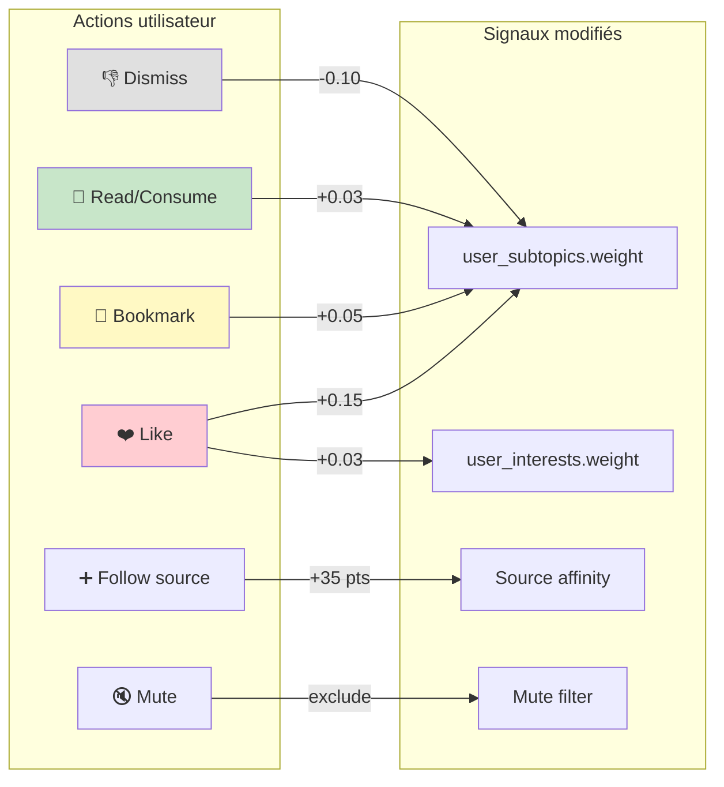

# Recommendation Engine

> Source de vérité : `packages/api/app/services/recommendation/scoring_config.py`

## Architecture Scoring v2 (Piliers)

Le moteur de recommandation utilise une architecture à **4 piliers normalisés** + un pass de pénalités.

---

## Détail des piliers

### Pertinence (40%)

| Signal | Points | Condition |
|--------|--------|-----------|
| Theme match | 50 | `content.theme` ∈ user interests |
| Secondary theme | 35 | `source.secondary_themes` match (×0.7) |
| Subtopic match | 45 × 2 max | `content.topics` ∩ `user_subtopics` |
| Precision bonus | 18 | Theme ET subtopic matchent |
| Custom topic | 15 × multiplier | Keywords match dans titre/description |
| Behavioral amplifier | ×1.1 | `weight > 1.0` sur subtopic |

**Max raw** : ~130 pts → normalisé 0-100

### Source (25%)

| Signal | Points | Condition |
|--------|--------|-----------|
| Trusted source | 35 | Source explicitement suivie |
| Custom source | 12 | Source ajoutée manuellement |
| Subscription | 20 | Abonnement premium déclaré |
| Source affinity | 0-25 | Appris des interactions passées |
| Curated source | 10 | Source éditorialement curée par Facteur |

**Max raw** : ~95 pts → normalisé 0-100

### Fraîcheur (20%)

| Âge de l'article | Points |
|-------------------|--------|
| < 6h | +30 |
| < 24h | +25 |
| < 48h | +15 |
| < 72h | +8 |
| < 120h (5j) | +3 |
| < 168h (7j) | +1 |
| > 168h | 0 |

**Base recency** : 100 pts (articles récents rivalisent avec la personnalisation)

**Max raw** : ~115 pts → normalisé 0-100

### Qualité (15%)

| Signal | Points | Condition |
|--------|--------|-----------|
| Thumbnail | 12 | `thumbnail_url` présente |
| Full text | 10 | `content_quality` = "full" |
| Curated source | 10 | Source curée |

**Max raw** : ~32 pts → normalisé 0-100

---

## Pénalités (post-combination)

Les pénalités sont soustraites **après** la combinaison pondérée des piliers.

### Impression decay (feed refresh)

| Dernière impression | Pénalité |
|---------------------|----------|
| < 1h | -100 (invisible) |
| < 24h | -70 |
| < 48h | -40 |
| < 72h | -20 |
| > 72h | 0 (récupéré) |
| "Déjà vu" manuel | -120 (permanent) |

### Mutes (hard filter)

Source, thème, topic ou type de contenu muté → **exclusion complète** du feed/digest.

### Diversité digest

Le 2ème article d'une même source dans le digest → **score ÷ 2**.
Évite la domination d'une seule source (effet "revue de presse").

---

## Signaux d'apprentissage utilisateur

Le système apprend en temps réel des actions de l'utilisateur.

### Tableau des deltas

| Action | Table impactée | Colonne | Delta | Notes |
|--------|---------------|---------|-------|-------|
| Like | user_subtopics | weight | **+0.15** | Signal explicite fort |
| Like | user_interests | weight | **+0.03** | Apprentissage macro lent |
| Bookmark | user_subtopics | weight | **+0.05** | Signal explicite moyen |
| Read/Consume | user_subtopics | weight | **+0.03** | Signal implicite faible, accumule |
| Dismiss | user_subtopics | weight | **-0.10** | ~2 dismisses annulent 1 like |
| Source follow | user_sources | — | +35 pts direct | Bonus scoring immédiat |
| Source priority | user_sources | priority_multiplier | 0.5 / 1.0 / 2.0 | Multiplicateur utilisateur |
| Mute | user_personalization | muted_* | exclude | Hard filter permanent |
| Impression | user_content_status | last_impressed_at | decay temporel | Récupère après 72h |
| "Déjà vu" | user_content_status | manually_impressed | -120 permanent | Pas de decay |

> **Design** : Le système est conçu pour être **progressif** (pas de kill switch) et **réversible** (les poids oscillent autour de 1.0, jamais de verrouillage).

---

## Taxonomie complète

```mermaid
graph TB
    ROOT[51 Topics → 9 Thèmes]

    ROOT --- TECH[tech]
    TECH --- ai & tech_t[tech] & cybersecurity & gaming & privacy

    ROOT --- SCIENCE[science]
    SCIENCE --- space & science_t[science]

    ROOT --- POLITICS[politics]
    POLITICS --- politics_t[politics]

    ROOT --- ECONOMY[economy]
    ECONOMY --- economy_t[economy] & startups & finance & realestate & entrepreneurship & marketing

    ROOT --- SOCIETY[society]
    SOCIETY --- work & education & health & justice & immigration & inequality & feminism & lgbtq & religion & wellness & family & relationships & factcheck

    ROOT --- ENVIRONMENT[environment]
    ENVIRONMENT --- climate & environment_t[environment] & energy & biodiversity & agriculture & food

    ROOT --- CULTURE[culture]
    CULTURE --- cinema & music & literature & art & media & fashion & design & travel & gastronomy & history & philosophy

    ROOT --- INTERNATIONAL[international]
    INTERNATIONAL --- geopolitics & europe & usa & africa & asia & middleeast

    ROOT --- SPORT[sport]
    SPORT --- sport_t[sport]

    style TECH fill:#e3f2fd
    style SCIENCE fill:#e8eaf6
    style POLITICS fill:#fce4ec
    style ECONOMY fill:#fff8e1
    style SOCIETY fill:#f3e5f5
    style ENVIRONMENT fill:#e8f5e9
    style CULTURE fill:#fff3e0
    style INTERNATIONAL fill:#e0f2f1
    style SPORT fill:#fbe9e7
```

**Mapping** : `packages/api/app/services/ml/topic_theme_mapper.py`
**Classification** : `packages/api/app/services/ml/classification_service.py` (Mistral API)

---

## Modes de feed

L'utilisateur peut basculer entre 4 modes qui modifient les filtres de scoring :

| Mode | Filtre | Effet |
|------|--------|-------|
| `RECENT` | Tri par fraîcheur | Fraîcheur domine |
| `INSPIRATION` | `is_serene = true` | Articles positifs/constructifs uniquement |
| `PERSPECTIVES` | Biais opposés | Diversité éditoriale (stance matching) |
| `DEEP_DIVE` | `source_tier = "deep"` | Sources systémiques/fond |

---

## Configuration

Tous les poids sont centralisés dans `ScoringWeights` (`scoring_config.py`).
Modifier un seul fichier pour rééquilibrer l'algorithme.

| Paramètre | Valeur | Rôle |
|-----------|--------|------|
| `SCORING_VERSION` | `pillars_v1` | Moteur actif (legacy: `layers_v1`) |
| `FEED_RANDOMIZATION_TEMPERATURE` | 0.15 | Bruit Gumbel feed (découverte) |
| `DIGEST_RANDOMIZATION_TEMPERATURE` | 0.08 | Bruit Gumbel digest (plus stable) |
| `TOPIC_CLUSTER_THRESHOLD` | 0.45 | Seuil Jaccard clustering |
| `DIGEST_DIVERSITY_DIVISOR` | 2 | Pénalité doublon source |
