# Scheduled Jobs & Workers

> Source de vérité : `packages/api/app/workers/scheduler.py`

## Vue d'ensemble

Facteur utilise **APScheduler** (AsyncIOScheduler) pour orchestrer 4 jobs cron + 1 worker continu.

```mermaid
gantt
    title Jobs quotidiens (timezone Europe/Paris)
    dateFormat HH:mm
    axisFormat %H:%M

    section Cron Jobs
    Storage Cleanup          :03:00, 30m
    Daily Top3 (legacy)      :08:00, 15m
    Daily Digest             :08:00, 30m

    section Intervalle
    RSS Sync                 :00:00, 24h

    section Continu
    Classification Worker    :00:00, 24h
```

## Jobs détaillés

| Job | Type | Schedule | Fichier | Fonction |
|-----|------|----------|---------|----------|
| **RSS Sync** | Intervalle | Toutes les N min (default: 30) | `workers/rss_sync.py` | `sync_all_sources()` |
| **Classification Worker** | Continu | Boucle, check chaque 10s | `workers/classification_worker.py` | Dequeue batch=5, appel Mistral API |
| **Daily Digest** | Cron | 08:00 Europe/Paris | `jobs/digest_generation_job.py` | `run_digest_generation()` |
| **Daily Top3** | Cron | 08:00 Europe/Paris | `workers/top3_job.py` | `generate_daily_top3_job()` (legacy) |
| **Storage Cleanup** | Cron | 03:00 Europe/Paris | `workers/storage_cleanup.py` | `cleanup_old_articles()` |

## Configuration

| Variable d'environnement | Default | Effet |
|--------------------------|---------|-------|
| `RSS_SYNC_INTERVAL_MINUTES` | 30 | Fréquence de synchronisation RSS |
| `RSS_RETENTION_DAYS` | 20 | TTL des articles avant cleanup |

## Notes

- Tous les jobs tournent dans le **même process** que l'API FastAPI (pas de worker séparé)
- Le scheduler démarre au boot de l'app (`start_scheduler()` dans `main.py`)
- Le classification worker utilise `SELECT FOR UPDATE SKIP LOCKED` pour le concurrency-safe dequeue
- Le Daily Top3 est un **legacy** en cours de remplacement par le Daily Digest
