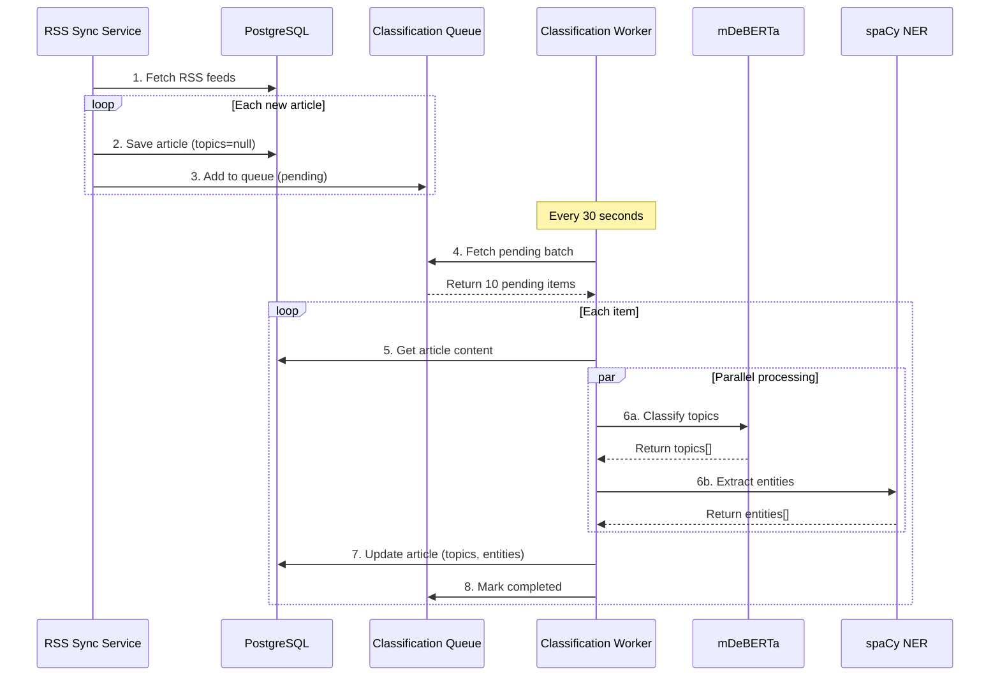
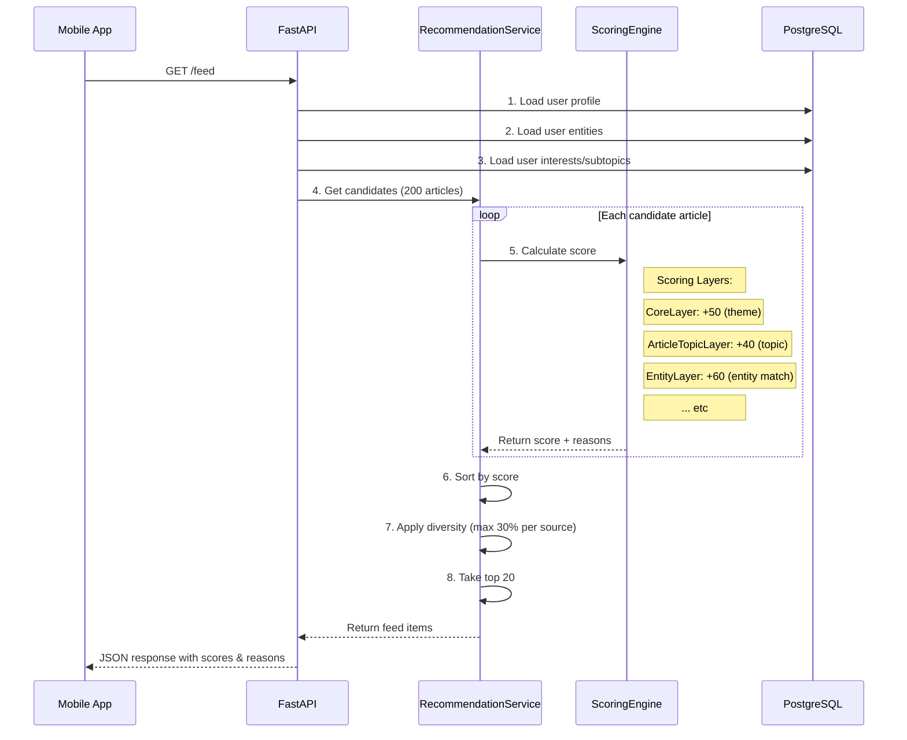
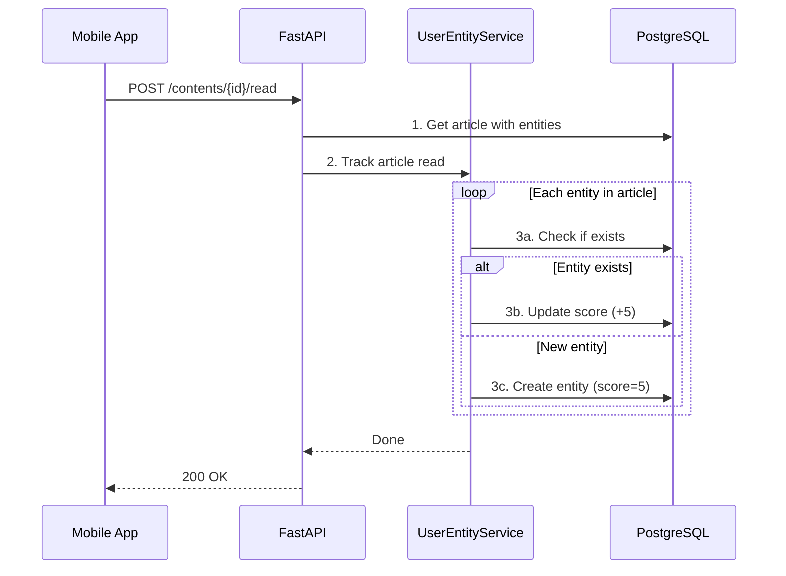

# Architecture: Recommendation Engine V3

**Document:** Architecture Technique - Système de Recommandation V3  
**Version:** 1.0  
**Date:** 2026-01-29  
**Related Stories:** 4.2.reco-engine-v3.story.md

---

## 🎯 Overview

### Architecture 3-Level System

```
┌─────────────────────────────────────────────────────────────────┐
│                    RECOMMENDATION ENGINE V3                     │
├─────────────────────────────────────────────────────────────────┤
│                                                                 │
│  LEVEL 1: Taxonomie Macro (47 labels)                          │
│  ├─ Source: mDeBERTa zero-shot classification                  │
│  ├─ Precision: 85-90%                                          │
│  ├─ Latency: ~200ms/article                                    │
│  └─ Scope: Catégories générales (tech, science, etc.)          │
│                                                                 │
│  LEVEL 2: Entités Nommées (Illimité)                           │
│  ├─ Source: spaCy NER (fr_core_news_md)                        │
│  ├─ Precision: 85-90%                                          │
│  ├─ Latency: ~30ms/article                                     │
│  └─ Scope: Personnes, orgs, produits, lieux, événements        │
│                                                                 │
│  LEVEL 3: Profilage Utilisateur                                │
│  ├─ User Entity Tracking                                       │
│  ├─ Time Decay (30-day half-life)                              │
│  └─ Scoring: +60pts per entity match                           │
│                                                                 │
└─────────────────────────────────────────────────────────────────┘
```

---

## 🏗️ System Architecture

### Component Diagram

```
┌──────────────────────────────────────────────────────────────────┐
│                           CLIENTS                                │
│  (Flutter App)                                                   │
└───────────────────────┬──────────────────────────────────────────┘
                        │
                        ▼
┌──────────────────────────────────────────────────────────────────┐
│                         API LAYER                                │
│  ┌─────────────────┐  ┌─────────────────┐  ┌─────────────────┐  │
│  │  Feed Router    │  │ Content Router  │  │  Admin Router   │  │
│  └────────┬────────┘  └────────┬────────┘  └─────────────────┘  │
└───────────┼────────────────────┼─────────────────────────────────┘
            │                    │
            ▼                    ▼
┌──────────────────────────────────────────────────────────────────┐
│                      SERVICE LAYER                               │
│                                                                  │
│  ┌──────────────────────────────────────────────────────────┐   │
│  │            RecommendationService                         │   │
│  │  ┌──────────────────────────────────────────────────┐    │   │
│  │  │           ScoringEngine                          │    │   │
│  │  │  ┌──────────┐ ┌──────────┐ ┌──────────┐        │    │   │
│  │  │  │CoreLayer │ │Article   │ │Entity    │ ...    │    │   │
│  │  │  │          │ │TopicLayer│ │Layer     │        │    │   │
│  │  │  └──────────┘ └──────────┘ └──────────┘        │    │   │
│  │  └──────────────────────────────────────────────────┘    │   │
│  └──────────────────────────────────────────────────────────┘   │
│                                                                  │
│  ┌─────────────────────┐  ┌─────────────────────┐               │
│  │ UserEntityService   │  │ ClassificationQueue │               │
│  │ - Track interests   │  │ - Async processing  │               │
│  │ - Apply decay       │  │ - Retry logic       │               │
│  └─────────────────────┘  └─────────────────────┘               │
│                                                                  │
└──────────────────────────────────────────────────────────────────┘
            │                    │
            ▼                    ▼
┌──────────────────────────────────────────────────────────────────┐
│                     WORKER LAYER                                 │
│                                                                  │
│  ┌──────────────────────────────────────────────────────────┐   │
│  │           ClassificationWorker                           │   │
│  │                                                          │   │
│  │  ┌─────────────────┐      ┌─────────────────┐           │   │
│  │  │ mDeBERTa        │      │ spaCy NER       │           │   │
│  │  │ Classification  │─────▶│ Entity Extract  │           │   │
│  │  │ Service         │      │ Service         │           │   │
│  │  └─────────────────┘      └─────────────────┘           │   │
│  │           │                        │                     │   │
│  │           ▼                        ▼                     │   │
│  │  ┌─────────────────────────────────────────┐             │   │
│  │  │         PostgreSQL (JSONB)              │             │   │
│  │  │  - content.topics[]                     │             │   │
│  │  │  - content.entities[]                   │             │   │
│  │  └─────────────────────────────────────────┘             │   │
│  └──────────────────────────────────────────────────────────┘   │
│                                                                  │
│  ┌──────────────────────────────────────────────────────────┐   │
│  │           EntityDecayJob (Daily 3AM)                     │   │
│  │  - Apply 30-day decay to user_entity scores              │   │
│  └──────────────────────────────────────────────────────────┘   │
│                                                                  │
└──────────────────────────────────────────────────────────────────┘
                        │
                        ▼
┌──────────────────────────────────────────────────────────────────┐
│                      DATA LAYER                                  │
│                                                                  │
│  ┌──────────────┐  ┌──────────────┐  ┌──────────────┐          │
│  │   contents   │  │ user_entities│  │ classification│          │
│  │   (JSONB)    │  │              │  │   _queue      │          │
│  │ - topics     │  │ - entity_text│  │ - status      │          │
│  │ - entities   │  │ - score      │  │ - retry_count │          │
│  └──────────────┘  └──────────────┘  └──────────────┘          │
│                                                                  │
└──────────────────────────────────────────────────────────────────┘
```

---

## 📊 Data Flow

### 1. RSS Sync Flow



### 2. User Feed Generation Flow



### 3. User Read Tracking Flow



---

## 🗄️ Database Schema

### New Tables

#### classification_queue
```sql
CREATE TABLE classification_queue (
    id UUID PRIMARY KEY DEFAULT gen_random_uuid(),
    content_id UUID NOT NULL REFERENCES contents(id) ON DELETE CASCADE,
    status VARCHAR(20) NOT NULL DEFAULT 'pending', -- pending, processing, completed, failed
    priority INTEGER DEFAULT 0,
    retry_count INTEGER DEFAULT 0,
    error_message TEXT,
    created_at TIMESTAMPTZ DEFAULT NOW(),
    updated_at TIMESTAMPTZ DEFAULT NOW(),
    processed_at TIMESTAMPTZ,
    
    UNIQUE(content_id)
);

CREATE INDEX idx_queue_status_created ON classification_queue(status, created_at);
CREATE INDEX idx_queue_priority ON classification_queue(priority DESC, created_at);
```

#### user_entities
```sql
CREATE TABLE user_entities (
    id UUID PRIMARY KEY DEFAULT gen_random_uuid(),
    user_id UUID NOT NULL REFERENCES users(id) ON DELETE CASCADE,
    entity_text VARCHAR(255) NOT NULL,
    entity_label VARCHAR(50) NOT NULL,
    score INTEGER DEFAULT 0,
    read_count INTEGER DEFAULT 0,
    first_seen_at TIMESTAMPTZ DEFAULT NOW(),
    last_seen_at TIMESTAMPTZ DEFAULT NOW(),
    decay_factor FLOAT DEFAULT 1.0,
    
    UNIQUE(user_id, entity_text)
);

CREATE INDEX idx_user_entities_user ON user_entities(user_id);
CREATE INDEX idx_user_entities_score ON user_entities(user_id, score DESC);
```

### Modified Tables

#### contents
```sql
-- Add columns
ALTER TABLE contents 
    ADD COLUMN topics JSONB DEFAULT NULL,
    ADD COLUMN entities JSONB DEFAULT NULL;

-- Add indexes
CREATE INDEX idx_contents_topics ON contents USING GIN(topics);
CREATE INDEX idx_contents_entities ON contents USING GIN(entities);
```

---

## 🧮 Scoring Algorithm

### Weight Matrix

| Layer | Match Type | Points | Max | Example Reason |
|-------|-----------|--------|-----|----------------|
| CoreLayer | Theme match | +50 | 50 | "Thème: tech" |
| CoreLayer | Trusted source | +40 | 40 | "Source suivie" |
| CoreLayer | Custom source | +10 | 10 | "Votre source" |
| ArticleTopicLayer | Topic match | +40 | 80 | "Sujet: startups" |
| **EntityLayer** | **Entity match** | **+60** | **180** | **"Centre d'intérêt: Tesla"** |
| QualityLayer | High reliability | +10 | 10 | "Source fiable" |
| QualityLayer | Low reliability | -30 | -30 | "Source peu fiable" |
| PersonalizationLayer | Muted topic | -50 | -50 | "Sujet masqué" |
| Recency | Time decay | +0-30 | 30 | (implicit) |

### Score Calculation

```python
def calculate_score(article, user_context):
    score = 0
    
    # Level 1: Broad themes
    if article.source.theme in user_context.interests:
        score += 50
    
    # Level 2: Topics
    for topic in article.topics or []:
        if topic in user_context.subtopics:
            score += 40
    
    # Level 3: Entities (NEW)
    for entity in article.entities or []:
        if entity["text"].lower() in user_context.entity_set:
            score += 60
    
    # Quality
    if article.source.reliability == "HIGH":
        score += 10
    elif article.source.reliability == "LOW":
        score -= 30
    
    # Recency decay
    hours_old = (now - article.published_at).total_seconds() / 3600
    score += 30 / (hours_old / 24 + 1)
    
    return score
```

---

## ⚡ Performance Specifications

### Latency Budgets

| Operation | Target | P95 Max | Notes |
|-----------|--------|---------|-------|
| **RSS Sync** | <2s | <5s | Regardless of article count |
| **Classification** | 250ms | 500ms | Per article (async) |
| **NER Extraction** | 30ms | 50ms | Per article (async) |
| **Feed Generation** | 300ms | 500ms | Full feed request |
| **Score Calculation** | 50ms | 100ms | Per 100 candidates |

### Throughput

| Metric | Target | Notes |
|--------|--------|-------|
| **Articles/day** | 1000+ | Classification capacity |
| **Feed requests/min** | 1000 | Concurrent users |
| **Concurrent workers** | 1-3 | Can scale horizontally |

### Resource Usage

| Component | RAM | CPU | Notes |
|-----------|-----|-----|-------|
| **mDeBERTa** | 500MB | 1 core | Per instance |
| **spaCy** | 100MB | 0.1 core | Per instance |
| **PostgreSQL** | 1GB | 0.5 core | Shared |
| **Total API** | 2-3GB | 1-2 cores | With all services |

---

## 🔒 Security & Privacy

### Data Privacy

- **All ML processing is local** - No data sent to external APIs
- **User reading history** - Never shared, stays in our DB
- **Entity tracking** - Anonymous, per-user only
- **No third-party tracking** - No Google Analytics, no Facebook Pixel

### Access Control

```python
# User can only see their own entities
@router.get("/me/entities")
async def get_my_entities(
    current_user: User = Depends(get_current_user)
):
    return await entity_service.get_user_entities(current_user.id)

# Cannot access other users' data
```

---

## 🚀 Deployment Architecture

### Docker Setup

```dockerfile
# Dockerfile (simplified)
FROM python:3.12-slim

# Install Python dependencies
COPY requirements.txt requirements-ml.txt ./
RUN pip install -r requirements.txt -r requirements-ml.txt

# Download spaCy model
RUN python -m spacy download fr_core_news_md

# Download mDeBERTa (at build time for faster startup)
RUN python -c "from transformers import pipeline; pipeline('zero-shot-classification', model='MoritzLaurer/mDeBERTa-v3-base-xnli-multilingual-nli-2mil7')"

COPY . .

CMD ["uvicorn", "app.main:app", "--host", "0.0.0.0", "--port", "8000"]
```

### Environment Variables

```bash
# Required
ML_ENABLED=true
DATABASE_URL=postgresql+psycopg://...

# Optional
TRANSFORMERS_CACHE=/tmp/transformers_cache
CLASSIFICATION_BATCH_SIZE=10
CLASSIFICATION_POLL_INTERVAL=30
ENTITY_DECAY_DAYS=30
```

### Railway/Render Deployment

```yaml
# railway.yaml (example)
services:
  api:
    build: .
    environment:
      ML_ENABLED: true
      DATABASE_URL: ${{Postgres.DATABASE_URL}}
    resources:
      memory: 2GB
      cpu: 2
```

---

## 📈 Monitoring & Observability

### Key Metrics

```python
# Metrics to track
METRICS = {
    # Performance
    "classification_latency_ms": Histogram,
    "ner_latency_ms": Histogram,
    "feed_generation_latency_ms": Histogram,
    
    # Throughput
    "articles_classified_per_minute": Counter,
    "queue_size": Gauge,
    
    # Quality
    "classification_success_rate": Gauge,
    "entity_extraction_count": Histogram,
    "top_entity_matches": Gauge,
    
    # Errors
    "classification_failures": Counter,
    "worker_errors": Counter,
}
```

### Health Checks

```python
@router.get("/health")
async def health_check():
    return {
        "status": "healthy",
        "ml_classifier": classifier.is_ready(),
        "ner_service": ner.is_ready(),
        "database": await check_db(),
    }
```

### Alerts

| Alert | Condition | Action |
|-------|-----------|--------|
| High failure rate | >5% classifications fail | Notify on-call |
| Queue backlog | >1000 pending | Scale workers |
| High latency | P95 >500ms | Investigate |
| ML model down | Classifier not ready | Restart service |

---

## 🔄 Migration Strategy

### Phase 1: Foundation (Week 1)
1. Deploy database migrations
2. Fix theme matching bug
3. Deploy queue infrastructure
4. Enable ML classification

### Phase 2: Intelligence (Week 2)
1. Deploy NER service
2. Deploy EntityLayer
3. Enable user tracking
4. Setup monitoring

### Rollback Plan

```python
# Emergency rollback: Disable ML
ML_ENABLED=false
# Falls back to source.granular_topics

# Database rollback:
alembic downgrade -1  # Reverse last migration
```

---

## 📚 Related Documents

- [User Story 4.2](../4.2.reco-engine-v3.story.md) - Story principale
- [US-1: Fix Theme Matching](../4.2.reco-engine-v3/us-1-fix-theme-matching.story.md)
- [US-2: Async Queue](../4.2.reco-engine-v3/us-2-async-queue.story.md)
- [US-3: mDeBERTa](../4.2.reco-engine-v3/us-3-mdeberta-worker.story.md)
- [US-4: NER](../4.2.reco-engine-v3/us-4-ner-service.story.md)
- [US-5: EntityLayer](../4.2.reco-engine-v3/us-5-entity-layer.story.md)
- [US-6: Tests](../4.2.reco-engine-v3/us-6-tests-monitoring.story.md)

---

*Document created: 2026-01-29*  
*Part of: Recommendation Engine V3*
