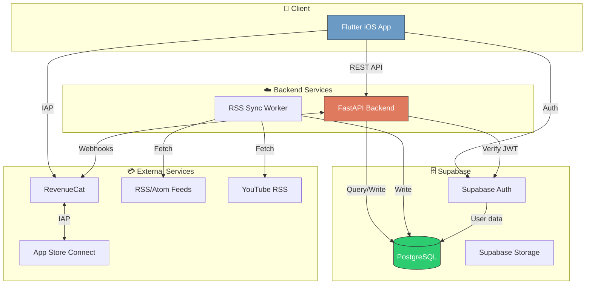
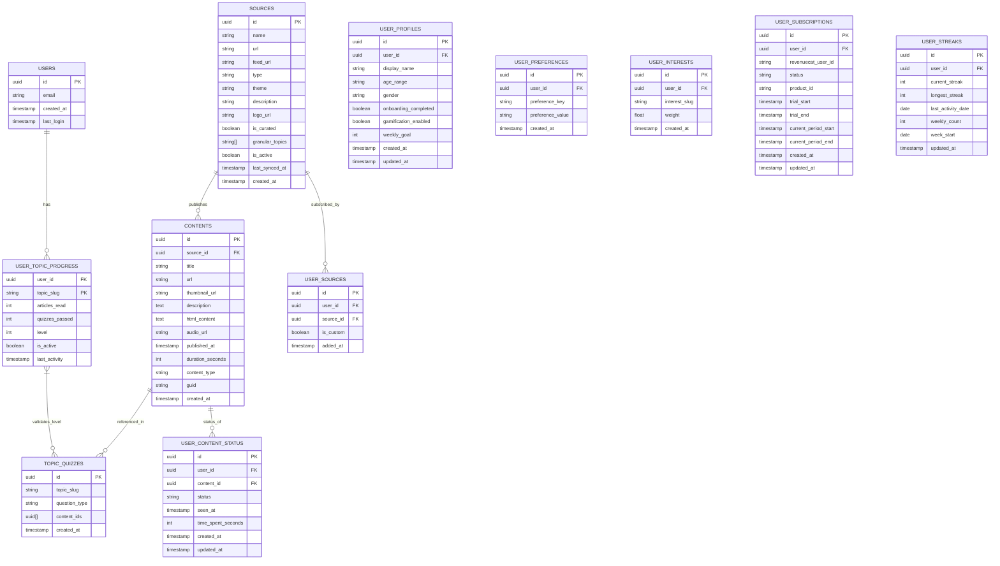
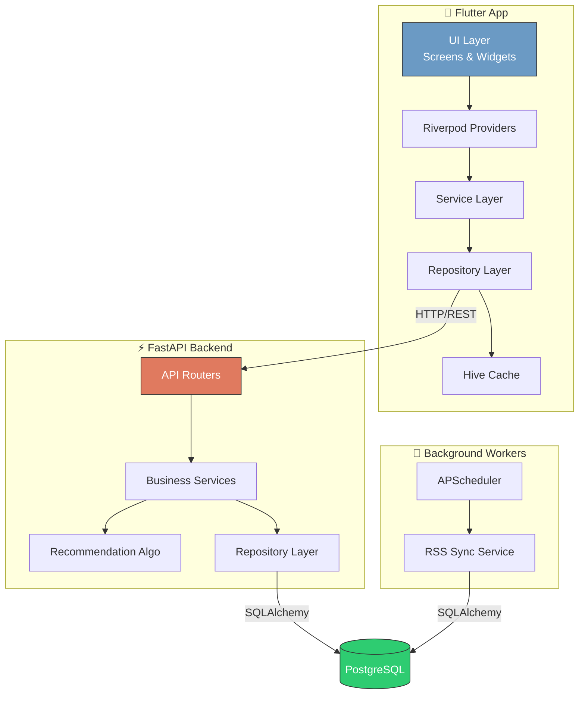
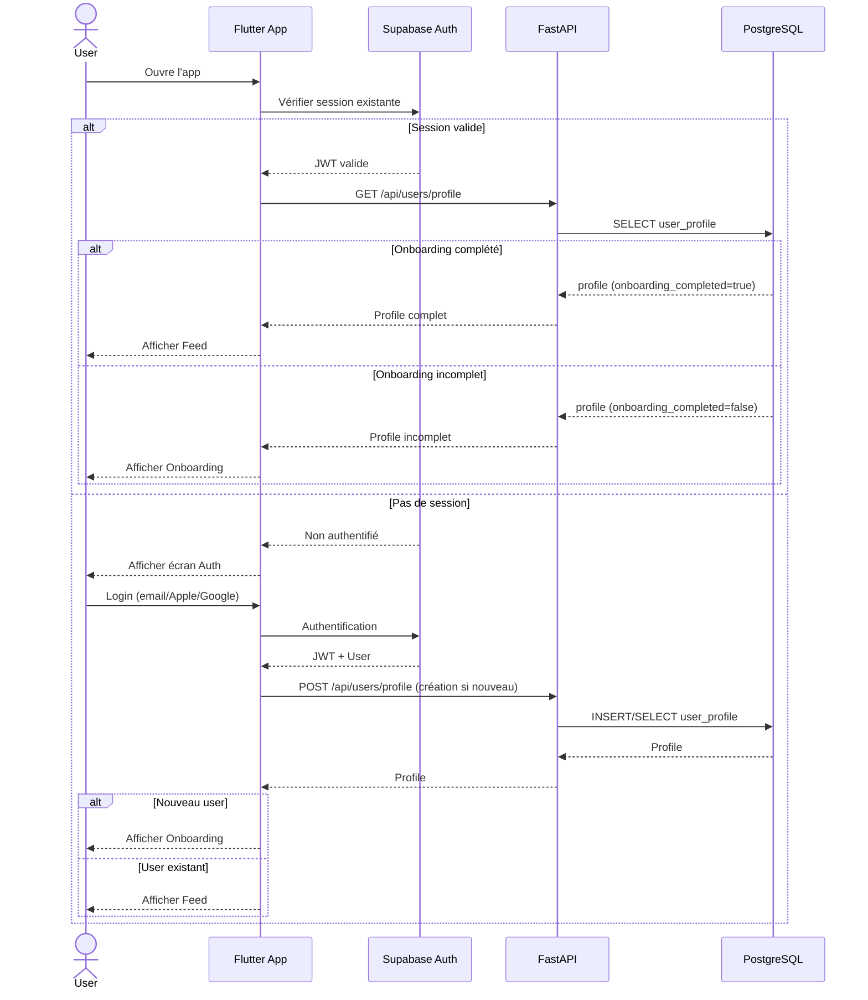
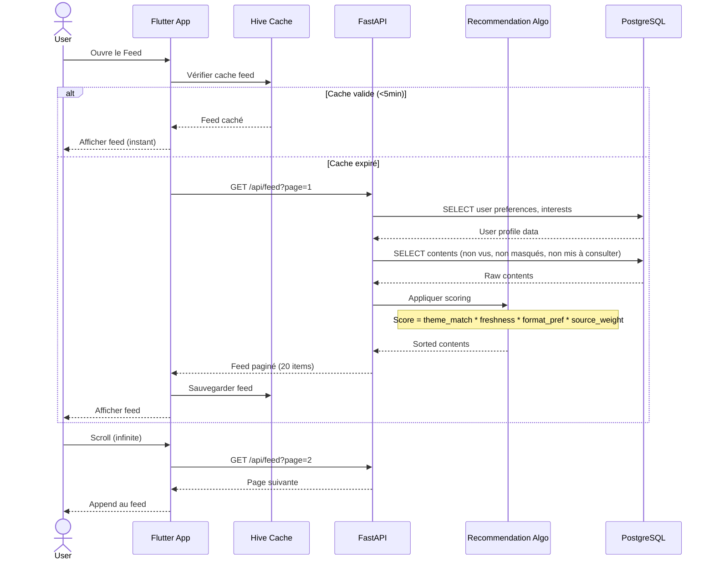
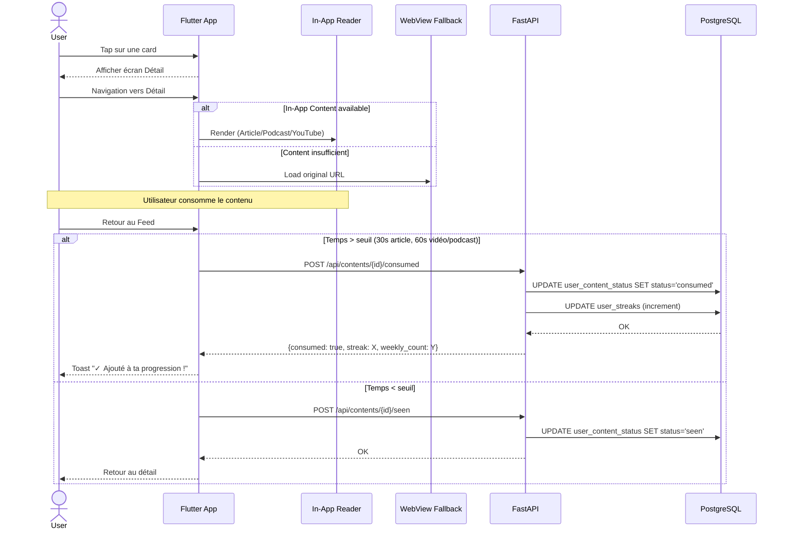
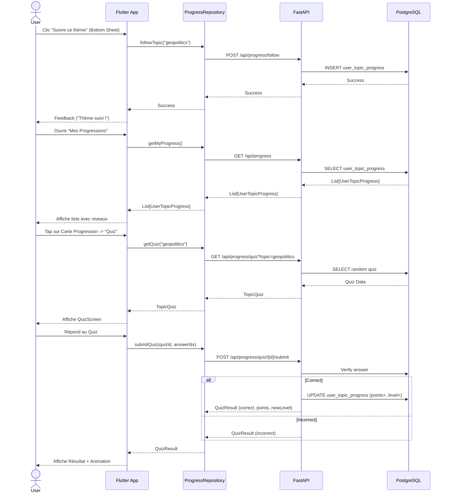
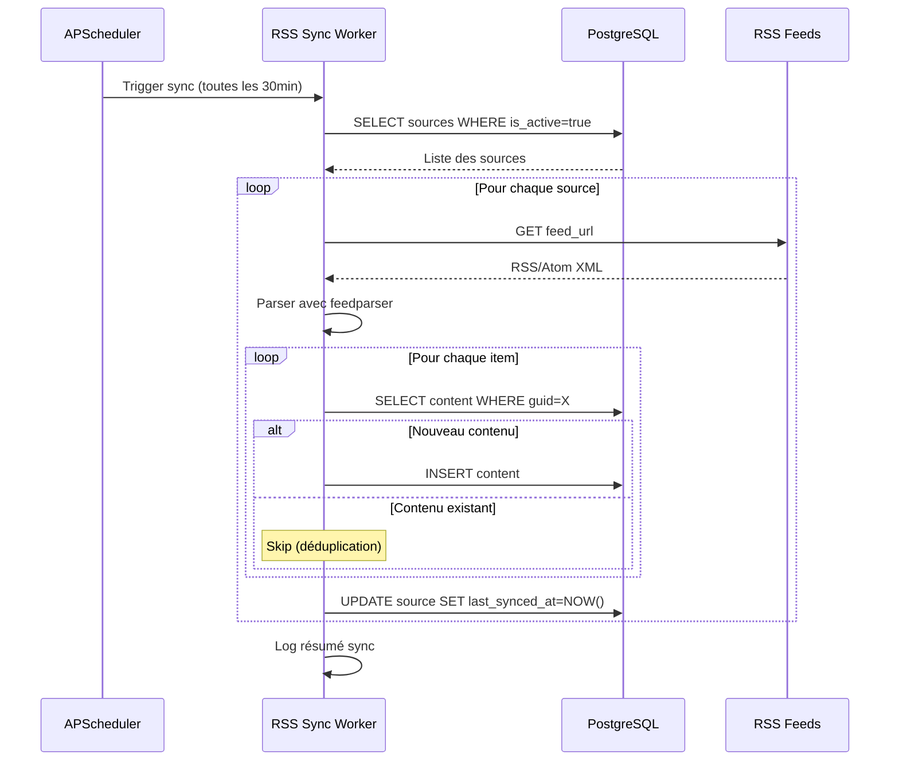

# Facteur — Architecture Document

**Version:** 1.0  
**Date:** 7 janvier 2026  
**Auteur:** BMad Method — Architect Agent  
**Statut:** Draft

---

## Change Log

| Date | Version | Description | Auteur |
|------|---------|-------------|--------|
| 07/01/2026 | 1.0 | Création initiale | Architect Agent |
| 16/01/2026 | 1.1 | Mise à jour Epic 8 : Approfondissement & Progression | Antigravity |
| 17/01/2026 | 1.2 | Implémentation complète Module Progression | Antigravity |
| 17/01/2026 | 1.3 | Restauration Backend & Optimisation Import (Port 8080) | Antigravity |
| 18/01/2026 | 1.4 | Stabilisation Vidéo (Web/Mobile) & Fix Logs | Antigravity |
| 18/01/2026 | 1.5 | Algo: Revalorisation "Confiance" (+200%) & "Thèmes" (+40%) | Antigravity |

---

## 1. Introduction

Ce document définit l'architecture technique complète de **Facteur**, l'application mobile de curation intelligente de contenus. Il sert de référence pour le développement, garantissant la cohérence des choix techniques et des patterns d'implémentation.

**Relation avec les autres documents :**
- `prd.md` : Exigences fonctionnelles et non-fonctionnelles
- `front-end-spec.md` : Spécifications UI/UX détaillées
- `prd.md` : Exigences fonctionnelles et non-fonctionnelles
- `front-end-spec.md` : Spécifications UI/UX détaillées
- `mobile-troubleshooting.md` : Problèmes courants et configuration de l'environnement mobile
- `sources/sources_master.csv` : Catalogue des sources (Curated & Indexed)

### 1.1 Starter Template

**Projet greenfield** — Pas de template de départ utilisé. L'architecture est conçue from scratch avec les best practices Flutter et FastAPI.

---

## 2. High Level Architecture

### 2.1 Technical Summary

Facteur adopte une architecture **monolithe modulaire** avec une API REST FastAPI servant une application mobile Flutter. La persistance est gérée par **Supabase** (PostgreSQL + Auth), les paiements par **RevenueCat**, et l'agrégation de contenus par un service de synchronisation RSS asynchrone. Cette architecture simple optimise la vélocité de développement pour le MVP tout en permettant une évolution future vers des microservices si nécessaire.

### 2.2 High Level Overview

| Aspect | Décision |
|--------|----------|
| **Style architectural** | Monolithe modulaire |
| **Repository** | Monorepo (apps/mobile + packages/api) |
| **Communication** | REST API synchrone + Jobs asynchrones |
| **Authentification** | Supabase Auth (JWT) |
| **Paiements** | RevenueCat (webhooks) |

**Flux principal utilisateur :**
1. L'utilisateur s'authentifie via Supabase Auth (email/Apple/Google)
2. L'app Flutter appelle l'API FastAPI pour le feed personnalisé
3. L'API interroge PostgreSQL et applique l'algorithme de tri
4. Les contenus sont affichés avec suivi de consommation
5. RevenueCat gère le cycle de vie de l'abonnement

### 2.3 High Level Project Diagram



### 2.4 Architectural and Design Patterns

| Pattern | Description | Rationale |
|---------|-------------|-----------|
| **Repository Pattern** | Abstraction de l'accès aux données | Testabilité, séparation des responsabilités |
| **Service Layer** | Logique métier isolée dans des services | Réutilisabilité, maintenabilité |
| **Dependency Injection** | Injection via FastAPI Depends | Tests unitaires facilités |
| **DTO Pattern** | Pydantic models pour validation I/O | Validation automatique, documentation API |
| **Observer Pattern** | Riverpod côté Flutter | State management réactif |
| **Scheduler Pattern** | APScheduler pour jobs RSS | Synchronisation périodique fiable |

---

## 3. Tech Stack

### 3.1 Cloud Infrastructure

- **Provider:** Supabase (PostgreSQL managé) + Railway/Render (API)
- **Key Services:** PostgreSQL, Auth, Storage, Edge Functions (si besoin)
- **Deployment Region:** EU (Frankfurt) pour conformité RGPD

### 3.2 Technology Stack Table

| Category | Technology | Version | Purpose | Rationale |
|----------|------------|---------|---------|-----------|
| **Mobile Framework** | Flutter | 3.24.x | Application iOS/Web cross-platform | UX fluide, codebase unique |
| **Mobile Language** | Dart | 3.5.x | Langage Flutter | Performance, null safety |
| **State Management** | Riverpod | 2.5.x | Gestion d'état Flutter | Simplicité, testabilité, compile-time safety |
| **HTTP Client** | Dio | 5.4.x | Requêtes HTTP Flutter | Interceptors, retry, logging |
| **Local Storage** | Hive | 2.2.x | Cache local | Performance, encryption possible |
| **Backend Framework** | FastAPI | 0.109.x | API REST Python | Performance async, auto-doc, typing |
| **Backend Language** | Python | 3.12.x | Langage backend | Écosystème data/ML, feedparser |
| **ORM** | SQLAlchemy | 2.0.x | Mapping objet-relationnel | Maturité, async support |
| **DB Driver** | psycopg (v3) | 3.1.x | Driver PostgreSQL | Meilleure stabilité avec les pools et PgBouncer |
| **Database** | PostgreSQL | 15.x | Base de données relationnelle | Via Supabase, JSONB, full-text search |
| **PGBouncer Mode**| Transaction | - | Pooling Supabase | Nécessite `NullPool` et désactivation des prepared statements |

| **Video Player (Web)** | youtube_player_iframe | 5.1.x | Support Vidéo Web | Compatible Web (vs mobile plugin) |
> [!IMPORTANT]
> **Compatibilité psycopg v3 & PgBouncer (Railway/Supabase) :**
> - **Prepared Statements** : Désactiver via `connect_args={"prepare_threshold": None}`.
> - **SSL Mode** : Forcer `sslmode=require` dans la `DATABASE_URL` pour éviter les échecs de négociation.
> - **Timeouts** : Ne pas utiliser `command_timeout` dans `connect_args` (non supporté).
> - **Pool** : Utiliser `sqlalchemy.pool.NullPool` car PgBouncer gère déjà le pooling.
> - **Port Local** : Forcer le port **8080** (standardisé pour Mobile/Web/Simulator).
> - **Service Stability** : Les scripts d'importation massifs doivent utiliser un client HTTP singleton (ex: `httpx.AsyncClient`) pour éviter la saturation des ports locaux et les erreurs de pool DB.
> - **Port Local** : Forcer le port **8080** (standardisé pour Mobile/Web/Simulator).
| **Auth** | Supabase Auth | - | Authentification | OAuth intégré, JWT, RLS |
| **Payments** | RevenueCat | 7.x | Gestion abonnements | SDK Flutter, webhooks, analytics |
| **RSS Parser** | feedparser | 6.0.x | Parsing RSS/Atom | Robuste, gère les edge cases |
| **Task Scheduler** | APScheduler | 3.10.x | Jobs périodiques | Cron-like, persistance jobs |
| **Validation** | Pydantic | 2.6.x | Validation données | Intégré FastAPI, performance |
| **Test (Python)** | pytest | 8.0.x | Tests unitaires/intégration | Standard Python, fixtures |
| **Hosting** | Railway | - | PaaS Infrastructure | Déploiement via Docker, SSL managé |
| **Docker Base** | python:3.12-slim | - | Image de base backend | Légèreté et sécurité |
| **Testing (Flutter)** | flutter_test | - | Tests unitaires Flutter | Intégré Flutter SDK |
| **Linting (Python)** | ruff | 0.2.x | Linting + formatting | Rapide, remplace black/isort/flake8 |
| **Linting (Dart)** | flutter_lints | 3.0.x | Linting Dart | Règles officielles Flutter |
| **Error Tracking** | Sentry | 7.x | Monitoring erreurs | SDK Flutter + Python |

---

## 4. Data Models

### 4.1 Diagramme Entités-Relations



### 4.2 Model Details

#### Users (via Supabase Auth)
**Purpose:** Utilisateurs authentifiés, gérés par Supabase Auth

| Attribut | Type | Description |
|----------|------|-------------|
| `id` | UUID | Identifiant unique (Supabase) |
| `email` | string | Email de l'utilisateur |
| `created_at` | timestamp | Date de création |
| `last_login` | timestamp | Dernière connexion |

#### User Profiles
**Purpose:** Données de profil issues de l'onboarding

| Attribut | Type | Description |
|----------|------|-------------|
| `id` | UUID | PK |
| `user_id` | UUID | FK vers users |
| `display_name` | string | Nom affiché (optionnel) |
| `age_range` | enum | "18-24", "25-34", "35-44", "45+" |
| `gender` | string | Optionnel |
| `onboarding_completed` | boolean | Onboarding terminé |
| `gamification_enabled` | boolean | Streak/progression activés |
| `weekly_goal` | int | Objectif hebdo (5, 10, 15) |

#### User Preferences
**Purpose:** Préférences key-value issues de l'onboarding

| Key | Values possibles |
|-----|-----------------|
| `approach` | "direct", "detailed" |
| `perspective` | "big_picture", "detail_oriented" |
| `opinion_style` | "assertive", "nuanced" |
| `content_freshness` | "recent", "evergreen" |
| `format_length` | "short", "long", "mixed" |

#### User Interests
**Purpose:** Centres d'intérêt avec pondération

| Slug | Description |
|------|-------------|
| `tech` | Tech & Futur |
| `geopolitics` | Géopolitique |
| `economy` | Économie |
| `society_climate` | Société & Climat |
| `culture_ideas` | Culture & Idées |

#### Sources
**Purpose:** Sources de contenu (curées ou custom)

| Attribut | Type | Description |
|----------|------|-------------|
| `type` | enum | "article", "podcast", "youtube" |
| `theme` | string | Thème principal |
| `is_curated` | boolean | Source du catalogue officiel |
| `granular_topics` | string[] | Sous-thèmes fins (ex: ["ai", "crypto"]) |
| `feed_url` | string | URL du flux RSS (peut différer de url) |

#### 4.3 Source Lifecycle Management

| État (Status) | Description | `is_curated` | Critères |
| :--- | :--- | :--- | :--- |
| **ARCHIVED** | Backlog / Inactif | - | URL connue uniquement. |
| **INDEXED** | Pour Comparaison | `false` | Feed RSS valide + Biais/Fiabilité macro. |
| **CURATED** | Catalogue Officiel | `true` | Full FQS (Scores Indep, Rigueur, UX) + Rationale. |

**Transition :** La promotion d'une source s'effectue via `sources_master.csv`. L'importateur valide les critères minimaux avant mise à jour en base.

#### Contents
**Purpose:** Contenus individuels (articles, épisodes, vidéos)

| Attribut | Type | Description |
|----------|------|-------------|
| `content_type` | enum | "article", "podcast", "youtube" |
| `duration_seconds` | int | Duration (reading or listening) |
| `html_content` | text | Parsed HTML for in-app reading |
| `audio_url` | string | Direct link to audio enclosure |
| `guid` | string | Unique RSS ID for deduplication |

#### User Content Status
**Purpose:** Suivi de l'interaction utilisateur avec les contenus

| Status | Description |
|--------|-------------|
| `unseen` | Jamais vu |
| `seen` | Vu dans le feed |
| `consumed` | Consommé (seuil atteint) |
| `saved` | Ajouté aux Progressions (anciennement "À consulter") |
| `hidden` | Masqué ("pas intéressé") |

#### User Subscriptions
**Purpose:** État de l'abonnement premium

| Status | Description |
|--------|-------------|
| `trial` | En période d'essai |
| `active` | Abonnement actif |
| `expired` | Abonnement expiré |
| `cancelled` | Annulé mais actif jusqu'à fin période |

#### User Streaks
**Purpose:** Gamification - streak et progression

| Attribut | Type | Description |
|----------|------|-------------|
| `current_streak` | int | Jours consécutifs actuels |
| `longest_streak` | int | Record personnel |
| `weekly_count` | int | Contenus consommés cette semaine |
| `week_start` | date | Début de la semaine en cours |

#### User Topic Progress
**Purpose:** Progression gamifiée par sous-thème (Duolingo de l'info)

| Attribut | Type | Description |
|----------|------|-------------|
| `user_id` | UUID | FK vers users |
| `topic_slug` | string | Identifiant du sous-thème (ex: "ai") |
| `articles_read`| int | Nombre d'articles du thème consommés |
| `quizzes_passed`| int | Nombre de quiz validés sur ce thème |
| `level` | int | Niveau calculé (articles/5 + quiz*2) |
| `is_active` | boolean | Si le thème est activement suivi |
| `last_activity`| timestamp| Date de dernière lecture/quiz |

#### Topic Quizzes (V0)
**Purpose:** Quiz simples pour valider les paliers de progression

| Attribut | Type | Description |
|----------|------|-------------|
| `id` | UUID | PK |
| `topic_slug` | string | Lien vers le thème |
| `question_type`| enum | "memory_check" |
| `content_ids` | UUID[] | Articles utilisés pour le quiz |
| `created_at` | timestamp | Date de génération |

---

## 5. Components

### 5.1 Mobile App (Flutter)

**Responsibility:** Interface utilisateur iOS, state management, cache local

**Key Interfaces:**
- Écrans : Auth, Onboarding, Feed, Détail, Sources, Progression, Settings, Paywall
- Services : AuthService, FeedService, SourceService, SubscriptionService
- Providers : Riverpod providers pour state management

**Dependencies:** API Backend, Supabase Auth, RevenueCat SDK

**Technology Stack:**
- Flutter 3.24.x avec Riverpod
- Dio pour HTTP
- Hive pour cache local
- go_router pour navigation

### 5.2 API Backend (FastAPI)

**Responsibility:** Logique métier, endpoints REST, validation

**Key Interfaces:**
- `/api/auth/*` : Endpoints d'authentification
- `/api/users/*` : Gestion profil utilisateur
- `/api/feed` : Feed personnalisé
- `/api/sources/*` : Gestion des sources
- `/api/contents/*` : Interactions contenus
- `/api/subscription/*` : État abonnement
- `/api/progress/*` : Endpoints de progression thématique
- `/api/webhooks/revenuecat` : Webhooks paiement

**Dependencies:** PostgreSQL (Supabase), RevenueCat API

**Technology Stack:**
- FastAPI 0.109.x
- SQLAlchemy 2.0 async
- Pydantic 2.6.x

> [!WARNING]
> **Adressage Mobile Local (Android vs iOS/Web) :**
> - **Web / iOS Simulator** : Utiliser `http://localhost:8080/api/`
> - **Android Emulator** : Utiliser `http://10.0.2.2:8080/api/`
> *Configuration gérée dans `apps/mobile/lib/config/constants.dart`.*

### 5.3 RSS Sync Worker

**Responsibility:** Synchronisation périodique des flux RSS

**Key Interfaces:**
- `sync_all_sources()` : Sync toutes les sources actives
- `sync_source(source_id)` : Sync une source spécifique
- `detect_source_type(url)` : Détection automatique du type

**Dependencies:** feedparser, PostgreSQL

**Technology Stack:**
- APScheduler pour scheduling
- feedparser pour parsing RSS/Atom
- asyncio pour concurrence

### 5.4 Component Diagram



---

## 6. External APIs

### 6.1 Supabase Auth API

- **Purpose:** Authentification utilisateurs (email, Apple, Google)
- **Documentation:** https://supabase.com/docs/guides/auth
- **Base URL:** `https://<project>.supabase.co/auth/v1`
- **Authentication:** API Key + JWT
- **Rate Limits:** 100 req/s (plan gratuit)

**Key Endpoints Used:**
- `POST /signup` - Création de compte
- `POST /token?grant_type=password` - Login email
- `POST /token?grant_type=id_token` - Login OAuth
- `POST /logout` - Déconnexion
- `POST /user` - Récupérer l'utilisateur courant
- `POST /recover` - Envoyer un email de réinitialisation de mot de passe

**Integration Notes:**
- Utiliser le SDK Supabase Flutter pour simplifier
- JWT vérifié côté backend avec la clé publique Supabase
- **Gestion de la persistence** : Configurable via `FlutterAuthClientOptions(localStorage: ...)` dans `Supabase.initialize`. Par défaut, la session est persistée. Pour "Stay Connected" à `false`, l'app doit explicitement appeler `signOut()` lors de la fermeture ou invalider la session locale.
- **Réinitialisation de mot de passe** : `supabase.auth.resetPasswordForEmail(email)` déclenche un email avec un lien de redirection.

### 6.2 RevenueCat API

- **Purpose:** Gestion des abonnements et achats in-app
- **Documentation:** https://www.revenuecat.com/docs
- **Base URL:** `https://api.revenuecat.com/v1`
- **Authentication:** API Key (Bearer token)
- **Rate Limits:** 1000 req/min

**Key Endpoints Used:**
- `GET /subscribers/{app_user_id}` - État abonnement
- `POST /receipts` - Valider un achat (via SDK)

**Webhooks:**
- `INITIAL_PURCHASE` - Premier achat
- `RENEWAL` - Renouvellement
- `CANCELLATION` - Annulation
- `EXPIRATION` - Expiration

**Integration Notes:**
- SDK Flutter gère les achats natifs
- Webhooks pour synchroniser l'état backend
- `app_user_id` = UUID Supabase de l'utilisateur

### 6.3 YouTube RSS

- **Purpose:** Récupérer les vidéos des chaînes YouTube
- **Documentation:** https://support.google.com/youtube/answer/6098135
- **Base URL:** `https://www.youtube.com/feeds/videos.xml`
- **Authentication:** Aucune (public)
- **Rate Limits:** Non documenté (respecter 30min minimum)

**Key Endpoints Used:**
- `GET ?channel_id={CHANNEL_ID}` - Flux RSS d'une chaîne

**Integration Notes:**
- Extraire `channel_id` depuis URL chaîne ou handle @
- Format Atom, parser avec feedparser
- Thumbnail via `https://img.youtube.com/vi/{VIDEO_ID}/mqdefault.jpg`

---

## 7. Core Workflows

### 7.1 Workflow : Authentification & Onboarding



### 7.2 Workflow : Feed personnalisé



### 7.3 Workflow : Consommation de contenu (In-App Reader)



### 7.5 Workflow : Progression & Quiz



### 7.4 Workflow : Synchronisation RSS



---

## 8. REST API Specification

### 8.1 OpenAPI Overview

```yaml
openapi: 3.0.0
info:
  title: Facteur API
  version: 1.0.0
  description: API REST pour l'application Facteur
servers:
  - url: https://api.facteur.app/api
    description: Production
  - url: http://localhost:8000/api
    description: Development
```

### 8.2 Authentication Endpoints

| Method | Endpoint | Description |
|--------|----------|-------------|
| `POST` | `/auth/signup` | Créer un compte (email) |
| `POST` | `/auth/login` | Connexion (email) |
| `POST` | `/auth/oauth` | Connexion OAuth (Apple/Google) |
| `POST` | `/auth/logout` | Déconnexion |
| `POST` | `/auth/refresh` | Rafraîchir le token |

### 8.3 User Endpoints

| Method | Endpoint | Description |
|--------|----------|-------------|
| `GET` | `/users/profile` | Récupérer le profil |
| `PUT` | `/users/profile` | Mettre à jour le profil |
| `POST` | `/users/onboarding` | Sauvegarder les réponses onboarding |
| `GET` | `/users/preferences` | Récupérer les préférences |
| `PUT` | `/users/preferences` | Mettre à jour les préférences |
| `GET` | `/users/stats` | Statistiques utilisateur |

### 8.4 Feed Endpoints

| Method | Endpoint | Description |
|--------|----------|-------------|
| `GET` | `/feed` | Feed personnalisé paginé |
| `GET` | `/feed/source/{source_id}` | Feed filtré par source |

**Query Parameters (GET /feed) :**
| Param | Type | Default | Description |
|-------|------|---------|-------------|
| `page` | int | 1 | Numéro de page |
| `per_page` | int | 20 | Items par page |
| `type` | string | null | Filtrer par type (article/podcast/youtube) |
| `theme` | string | null | Filtrer par thème |

**Response Example :**
```json
{
  "items": [
    {
      "id": "uuid",
      "title": "L'IA va-t-elle remplacer les développeurs ?",
      "source": {
        "id": "uuid",
        "name": "Hugo Décrypte",
        "logo_url": "https://..."
      },
      "thumbnail_url": "https://...",
      "content_type": "youtube",
      "duration_seconds": 720,
      "published_at": "2026-01-06T14:00:00Z",
      "status": "unseen"
    }
  ],
  "pagination": {
    "page": 1,
    "per_page": 20,
    "total": 150,
    "has_next": true
  }
}
```

### 8.5 Content Endpoints

| Method | Endpoint | Description |
|--------|----------|-------------|
| `GET` | `/contents/{id}` | Détail d'un contenu |
| `POST` | `/contents/{id}/seen` | Marquer comme vu |
| `POST` | `/contents/{id}/consumed` | Marquer comme consommé |
| `POST` | `/contents/{id}/save` | Ajouter aux Progressions ("À lire") |
| `DELETE` | `/contents/{id}/save` | Retirer des Progressions |
| `POST` | `/contents/{id}/hide` | Masquer ("pas intéressé") |

### 8.6 Progress Endpoints

| Method | Endpoint | Description |
|--------|----------|-------------|
| `GET` | `/progress` | Liste des progressions utilisateur |
| `GET` | `/progress/{topic}` | Détail d'un thème (progression + suggestions) |
| `POST` | `/progress/{topic}/activate` | Suivre activement un thème |
| `POST` | `/progress/{topic}/quiz` | Soumettre un quiz de validation |
| `GET` | `/progress/quiz/{topic}` | Récupérer un quiz disponible |

### 8.6 Source Endpoints

| Method | Endpoint | Description |
|--------|----------|-------------|
| `GET` | `/sources` | Liste des sources (curées + custom) |
| `GET` | `/sources/catalog` | Catalogue des sources curées |
| `POST` | `/sources` | Ajouter une source custom |
| `DELETE` | `/sources/{id}` | Supprimer une source custom |
| `POST` | `/sources/detect` | Détecter le type d'une URL |

**POST /sources/detect Request :**
```json
{
  "url": "https://youtube.com/@ScienceEtonnante"
}
```

**Response :**
```json
{
  "detected_type": "youtube",
  "feed_url": "https://www.youtube.com/feeds/videos.xml?channel_id=UC...",
  "name": "ScienceEtonnante",
  "preview": {
    "item_count": 15,
    "latest_title": "Pourquoi le ciel est bleu ?"
  }
}
```

### 8.7 Subscription Endpoints

| Method | Endpoint | Description |
|--------|----------|-------------|
| `GET` | `/subscription` | État de l'abonnement |
| `POST` | `/subscription/restore` | Restaurer les achats |

**GET /subscription Response :**
```json
{
  "status": "trial",
  "trial_end": "2026-01-14T00:00:00Z",
  "days_remaining": 7,
  "is_premium": true,
  "can_access": true
}
```

### 8.8 Streak Endpoints

| Method | Endpoint | Description |
|--------|----------|-------------|
| `GET` | `/streaks` | Streak et progression |

**Response :**
```json
{
  "current_streak": 12,
  "longest_streak": 15,
  "weekly_count": 7,
  "weekly_goal": 10,
  "weekly_progress": 0.7,
  "last_activity_date": "2026-01-07"
}
```

### 8.9 Webhook Endpoints

| Method | Endpoint | Description |
|--------|----------|-------------|
| `POST` | `/webhooks/revenuecat` | Webhooks RevenueCat |

---

## 9. Recommendation Algorithm

### 9.1 Overview

L'algorithme de recommandation utilise un **scoring pondéré** basé sur les préférences utilisateur. Pas de ML pour le MVP — règles explicites et déterministes.

### 9.2 Score Formula

```
score = (theme_score * 0.35) + 
        (freshness_score * 0.25) + 
        (format_score * 0.20) + 
        (source_score * 0.15) + 
        (random_factor * 0.05)
```

### 9.3 Score Components

#### Theme Score (0-1)
Basé sur les `user_interests` et le `theme` du contenu.

```python
def calculate_theme_score(content, user_interests):
    interest = user_interests.get(content.theme, None)
    if interest:
        return interest.weight  # 0.0 à 1.0
    return 0.3  # Score par défaut pour thèmes non sélectionnés
```

#### Freshness Score (0-1)
Décroissance exponentielle depuis la publication.

```python
def calculate_freshness_score(content, user_pref):
    hours_old = (now - content.published_at).total_seconds() / 3600
    
    if user_pref.content_freshness == "recent":
        # Décroissance rapide : 24h = 0.5
        return math.exp(-hours_old / 35)
    else:  # "evergreen"
        # Décroissance lente : 7j = 0.5
        return math.exp(-hours_old / 240)
```

#### Format Score (0-1)
Correspondance entre préférence et type de contenu.

```python
def calculate_format_score(content, user_pref):
    pref = user_pref.format_length
    
    if content.content_type == "article":
        duration = content.duration_seconds
        if pref == "short" and duration < 300:  # <5min
            return 1.0
        elif pref == "long" and duration > 600:  # >10min
            return 1.0
        elif pref == "mixed":
            return 0.8
        return 0.5
    
    elif content.content_type in ["podcast", "youtube"]:
        if pref == "short" and duration < 900:  # <15min
            return 1.0
        elif pref == "long" and duration > 1800:  # >30min
            return 1.0
        elif pref == "mixed":
            return 0.8
        return 0.5
```

#### Source Score (0-1)
Basé sur l'historique utilisateur avec la source.

```python
def calculate_source_score(content, user_history):
    source_stats = user_history.get(content.source_id)
    
    if not source_stats:
        return 0.5  # Nouvelle source = neutre
    
    # Ratio de consommation sur les contenus vus
    consumption_rate = source_stats.consumed / source_stats.seen
    
    # Bonus si source explicitement ajoutée
    if source_stats.is_custom:
        return min(1.0, consumption_rate * 1.2)
    
    return consumption_rate
```

#### Random Factor (0-1)
Légère variance pour diversifier le feed.

```python
def calculate_random_factor():
    return random.uniform(0.8, 1.0)
```

### 9.4 Filtering Rules

Avant le scoring, les contenus sont filtrés :

```python
def filter_contents(contents, user_id):
    return contents.filter(
        # Exclure les contenus déjà consommés ou masqués
        ~ContentStatus.status.in_(['consumed', 'hidden']),
        # Exclure les contenus trop vieux (>30 jours)
        Content.published_at > (now - timedelta(days=30)),
        # Inclure uniquement les sources de l'utilisateur
        Content.source_id.in_(user_source_ids)
    )
```

### 9.5 Diversification

Pour éviter la monotonie, appliquer une diversification post-scoring :

```python
def diversify_feed(scored_contents, page_size=20):
    result = []
    seen_sources = set()
    seen_types = {"article": 0, "podcast": 0, "youtube": 0}
    
    for content in scored_contents:
        # Éviter >3 contenus consécutifs de la même source
        if content.source_id in seen_sources:
            recent_from_source = sum(1 for c in result[-3:] if c.source_id == content.source_id)
            if recent_from_source >= 2:
                continue
        
        # Équilibrer les types (max 60% d'un type)
        if seen_types[content.content_type] / max(len(result), 1) > 0.6:
            continue
        
        result.append(content)
        seen_sources.add(content.source_id)
        seen_types[content.content_type] += 1
        
        if len(result) >= page_size:
            break
    
    return result
```

---

## 10. Database Schema

### 10.1 SQL Schema (PostgreSQL)

```sql
-- Extension pour UUID
CREATE EXTENSION IF NOT EXISTS "uuid-ossp";

-- Table user_profiles
CREATE TABLE user_profiles (
    id UUID PRIMARY KEY DEFAULT uuid_generate_v4(),
    user_id UUID NOT NULL UNIQUE REFERENCES auth.users(id) ON DELETE CASCADE,
    display_name VARCHAR(100),
    age_range VARCHAR(10) CHECK (age_range IN ('18-24', '25-34', '35-44', '45+')),
    gender VARCHAR(20),
    onboarding_completed BOOLEAN DEFAULT FALSE,
    gamification_enabled BOOLEAN DEFAULT TRUE,
    weekly_goal INTEGER DEFAULT 10 CHECK (weekly_goal IN (5, 10, 15)),
    created_at TIMESTAMPTZ DEFAULT NOW(),
    updated_at TIMESTAMPTZ DEFAULT NOW()
);

-- Table user_preferences
CREATE TABLE user_preferences (
    id UUID PRIMARY KEY DEFAULT uuid_generate_v4(),
    user_id UUID NOT NULL REFERENCES auth.users(id) ON DELETE CASCADE,
    preference_key VARCHAR(50) NOT NULL,
    preference_value VARCHAR(100) NOT NULL,
    created_at TIMESTAMPTZ DEFAULT NOW(),
    UNIQUE(user_id, preference_key)
);

-- Table user_interests
CREATE TABLE user_interests (
    id UUID PRIMARY KEY DEFAULT uuid_generate_v4(),
    user_id UUID NOT NULL REFERENCES auth.users(id) ON DELETE CASCADE,
    interest_slug VARCHAR(50) NOT NULL,
    weight DECIMAL(3,2) DEFAULT 1.0 CHECK (weight >= 0 AND weight <= 1),
    created_at TIMESTAMPTZ DEFAULT NOW(),
    UNIQUE(user_id, interest_slug)
);

-- Table sources
CREATE TABLE sources (
    id UUID PRIMARY KEY DEFAULT uuid_generate_v4(),
    name VARCHAR(200) NOT NULL,
    url TEXT NOT NULL,
    feed_url TEXT NOT NULL,
    type VARCHAR(20) NOT NULL CHECK (type IN ('article', 'podcast', 'youtube')),
    theme VARCHAR(50) NOT NULL,
    description TEXT,
    logo_url TEXT,
    is_curated BOOLEAN DEFAULT FALSE,
    is_active BOOLEAN DEFAULT TRUE,
    last_synced_at TIMESTAMPTZ,
    created_at TIMESTAMPTZ DEFAULT NOW(),
    UNIQUE(feed_url)
);

-- Table user_sources
CREATE TABLE user_sources (
    id UUID PRIMARY KEY DEFAULT uuid_generate_v4(),
    user_id UUID NOT NULL REFERENCES auth.users(id) ON DELETE CASCADE,
    source_id UUID NOT NULL REFERENCES sources(id) ON DELETE CASCADE,
    is_custom BOOLEAN DEFAULT FALSE,
    added_at TIMESTAMPTZ DEFAULT NOW(),
    UNIQUE(user_id, source_id)
);

-- Table contents
CREATE TABLE contents (
    id UUID PRIMARY KEY DEFAULT uuid_generate_v4(),
    source_id UUID NOT NULL REFERENCES sources(id) ON DELETE CASCADE,
    title VARCHAR(500) NOT NULL,
    url TEXT NOT NULL,
    thumbnail_url TEXT,
    description TEXT,
    published_at TIMESTAMPTZ NOT NULL,
    duration_seconds INTEGER,
    content_type VARCHAR(20) NOT NULL CHECK (content_type IN ('article', 'podcast', 'youtube')),
    guid VARCHAR(500) NOT NULL,
    created_at TIMESTAMPTZ DEFAULT NOW(),
    UNIQUE(source_id, guid)
);

-- Table user_content_status
CREATE TABLE user_content_status (
    id UUID PRIMARY KEY DEFAULT uuid_generate_v4(),
    user_id UUID NOT NULL REFERENCES auth.users(id) ON DELETE CASCADE,
    content_id UUID NOT NULL REFERENCES contents(id) ON DELETE CASCADE,
    status VARCHAR(20) NOT NULL DEFAULT 'unseen' 
        CHECK (status IN ('unseen', 'seen', 'consumed', 'saved', 'hidden')),
    seen_at TIMESTAMPTZ,
    time_spent_seconds INTEGER DEFAULT 0,
    created_at TIMESTAMPTZ DEFAULT NOW(),
    updated_at TIMESTAMPTZ DEFAULT NOW(),
    UNIQUE(user_id, content_id)
);

-- Table user_subscriptions
CREATE TABLE user_subscriptions (
    id UUID PRIMARY KEY DEFAULT uuid_generate_v4(),
    user_id UUID NOT NULL UNIQUE REFERENCES auth.users(id) ON DELETE CASCADE,
    revenuecat_user_id VARCHAR(200),
    status VARCHAR(20) NOT NULL DEFAULT 'trial'
        CHECK (status IN ('trial', 'active', 'expired', 'cancelled')),
    product_id VARCHAR(100),
    trial_start TIMESTAMPTZ DEFAULT NOW(),
    trial_end TIMESTAMPTZ DEFAULT (NOW() + INTERVAL '7 days'),
    current_period_start TIMESTAMPTZ,
    current_period_end TIMESTAMPTZ,
    created_at TIMESTAMPTZ DEFAULT NOW(),
    updated_at TIMESTAMPTZ DEFAULT NOW()
);

-- Table user_streaks
CREATE TABLE user_streaks (
    id UUID PRIMARY KEY DEFAULT uuid_generate_v4(),
    user_id UUID NOT NULL UNIQUE REFERENCES auth.users(id) ON DELETE CASCADE,
    current_streak INTEGER DEFAULT 0,
    longest_streak INTEGER DEFAULT 0,
    last_activity_date DATE,
    weekly_count INTEGER DEFAULT 0,
    week_start DATE DEFAULT DATE_TRUNC('week', CURRENT_DATE),
    updated_at TIMESTAMPTZ DEFAULT NOW()
);

-- Index pour les requêtes fréquentes
CREATE INDEX idx_contents_source_published ON contents(source_id, published_at DESC);
CREATE INDEX idx_contents_published ON contents(published_at DESC);
CREATE INDEX idx_user_content_status_user ON user_content_status(user_id, status);
CREATE INDEX idx_user_sources_user ON user_sources(user_id);
CREATE INDEX idx_sources_active ON sources(is_active) WHERE is_active = TRUE;

-- Row Level Security (RLS)
ALTER TABLE user_profiles ENABLE ROW LEVEL SECURITY;
ALTER TABLE user_preferences ENABLE ROW LEVEL SECURITY;
ALTER TABLE user_interests ENABLE ROW LEVEL SECURITY;
ALTER TABLE user_sources ENABLE ROW LEVEL SECURITY;
ALTER TABLE user_content_status ENABLE ROW LEVEL SECURITY;
ALTER TABLE user_subscriptions ENABLE ROW LEVEL SECURITY;
ALTER TABLE user_streaks ENABLE ROW LEVEL SECURITY;

-- Policies RLS (l'utilisateur ne voit que ses données)
CREATE POLICY "Users can view own profile" ON user_profiles
    FOR ALL USING (auth.uid() = user_id);

CREATE POLICY "Users can view own preferences" ON user_preferences
    FOR ALL USING (auth.uid() = user_id);

CREATE POLICY "Users can view own interests" ON user_interests
    FOR ALL USING (auth.uid() = user_id);

CREATE POLICY "Users can view own sources" ON user_sources
    FOR ALL USING (auth.uid() = user_id);

CREATE POLICY "Users can view own content status" ON user_content_status
    FOR ALL USING (auth.uid() = user_id);

CREATE POLICY "Users can view own subscription" ON user_subscriptions
    FOR ALL USING (auth.uid() = user_id);

CREATE POLICY "Users can view own streaks" ON user_streaks
    FOR ALL USING (auth.uid() = user_id);

-- Trigger pour updated_at
CREATE OR REPLACE FUNCTION update_updated_at()
RETURNS TRIGGER AS $$
BEGIN
    NEW.updated_at = NOW();
    RETURN NEW;
END;
$$ LANGUAGE plpgsql;

CREATE TRIGGER update_user_profiles_updated_at
    BEFORE UPDATE ON user_profiles
    FOR EACH ROW EXECUTE FUNCTION update_updated_at();

CREATE TRIGGER update_user_content_status_updated_at
    BEFORE UPDATE ON user_content_status
    FOR EACH ROW EXECUTE FUNCTION update_updated_at();

CREATE TRIGGER update_user_subscriptions_updated_at
    BEFORE UPDATE ON user_subscriptions
    FOR EACH ROW EXECUTE FUNCTION update_updated_at();
```

---

## 11. Source Tree

```
facteur/
├── apps/
│   └── mobile/                          # Application Flutter iOS
│       ├── android/                     # Config Android (pour plus tard)
│       ├── ios/                         # Config iOS native
│       ├── lib/
│       │   ├── main.dart                # Entry point
│       │   ├── app.dart                 # MaterialApp configuration
│       │   ├── config/
│       │   │   ├── constants.dart       # Constantes app
│       │   │   ├── theme.dart           # Thème Facteur (dark mode)
│       │   │   └── routes.dart          # Configuration go_router
│       │   ├── core/
│       │   │   ├── api/
│       │   │   │   ├── api_client.dart  # Dio client configuré
│       │   │   │   ├── api_exceptions.dart
│       │   │   │   └── endpoints.dart
│       │   │   ├── auth/
│       │   │   │   ├── auth_service.dart
│       │   │   │   └── auth_state.dart
│       │   │   └── storage/
│       │   │       └── hive_service.dart
│       │   ├── features/
│       │   │   ├── auth/
│       │   │   │   ├── screens/
│       │   │   │   │   ├── login_screen.dart
│       │   │   │   │   └── signup_screen.dart
│       │   │   │   └── providers/
│       │   │   │       └── auth_provider.dart
│       │   │   ├── onboarding/
│       │   │   │   ├── screens/
│       │   │   │   │   ├── onboarding_screen.dart
│       │   │   │   │   └── questions/
│       │   │   │   │       ├── overview_questions.dart
│       │   │   │   │       ├── preferences_questions.dart
│       │   │   │   │       └── sources_questions.dart
│       │   │   │   ├── widgets/
│       │   │   │   │   ├── question_card.dart
│       │   │   │   │   └── progress_indicator.dart
│       │   │   │   └── providers/
│       │   │   │       └── onboarding_provider.dart
│       │   │   ├── feed/
│       │   │   │   ├── screens/
│       │   │   │   │   └── feed_screen.dart
│       │   │   │   ├── widgets/
│       │   │   │   │   ├── content_card.dart
│       │   │   │   │   ├── filter_chips.dart
│       │   │   │   │   └── progress_widget.dart
│       │   │   │   ├── models/
│       │   │   │   │   └── content.dart
│       │   │   │   └── providers/
│       │   │   │       └── feed_provider.dart
│       │   │   ├── detail/
│       │   │   │   ├── screens/
│       │   │   │   │   └── content_detail_screen.dart
│       │   │   │   └── widgets/
│       │   │   │       └── action_buttons.dart
│       │   │   ├── sources/
│       │   │   │   ├── screens/
│       │   │   │   │   ├── sources_screen.dart
│       │   │   │   │   └── add_source_screen.dart
│       │   │   │   ├── models/
│       │   │   │   │   └── source.dart
│       │   │   │   └── providers/
│       │   │   │       └── sources_provider.dart
│       │   │   ├── saved/
│       │   │   │   ├── screens/
│       │   │   │   │   └── saved_screen.dart
│       │   │   │   └── providers/
│       │   │   │       └── saved_provider.dart
│       │   │   ├── progress/
│       │   │   │   ├── screens/
│       │   │   │   │   └── progress_screen.dart
│       │   │   │   └── providers/
│       │   │   │       └── streak_provider.dart
│       │   │   ├── settings/
│       │   │   │   ├── screens/
│       │   │   │   │   └── settings_screen.dart
│       │   │   │   └── providers/
│       │   │   │       └── settings_provider.dart
│       │   │   └── subscription/
│       │   │       ├── screens/
│       │   │       │   └── paywall_screen.dart
│       │   │       ├── services/
│       │   │       │   └── revenuecat_service.dart
│       │   │       └── providers/
│       │   │           └── subscription_provider.dart
│       │   ├── shared/
│       │   │   ├── widgets/
│       │   │   │   ├── buttons/
│       │   │   │   │   ├── primary_button.dart
│       │   │   │   │   └── secondary_button.dart
│       │   │   │   ├── cards/
│       │   │   │   │   └── base_card.dart
│       │   │   │   ├── inputs/
│       │   │   │   │   └── text_input.dart
│       │   │   │   ├── feedback/
│       │   │   │   │   ├── toast.dart
│       │   │   │   │   └── skeleton.dart
│       │   │   │   └── navigation/
│       │   │   │       └── bottom_nav_bar.dart
│       │   │   └── utils/
│       │   │       ├── date_utils.dart
│       │   │       └── duration_utils.dart
│       │   └── models/
│       │       ├── user.dart
│       │       └── subscription.dart
│       ├── test/
│       │   └── ...
│       ├── pubspec.yaml
│       └── analysis_options.yaml
│
├── packages/
│   └── api/                             # Backend FastAPI
│       ├── app/
│       │   ├── __init__.py
│       │   ├── main.py                  # FastAPI app + routes
│       │   ├── config.py                # Settings (pydantic-settings)
│       │   ├── dependencies.py          # Dependency injection
│       │   ├── routers/
│       │   │   ├── __init__.py
│       │   │   ├── auth.py
│       │   │   ├── users.py
│       │   │   ├── feed.py
│       │   │   ├── contents.py
│       │   │   ├── sources.py
│       │   │   ├── subscription.py
│       │   │   ├── streaks.py
│       │   │   └── webhooks.py
│       │   ├── services/
│       │   │   ├── __init__.py
│       │   │   ├── auth_service.py
│       │   │   ├── user_service.py
│       │   │   ├── feed_service.py
│       │   │   ├── content_service.py
│       │   │   ├── source_service.py
│       │   │   ├── subscription_service.py
│       │   │   ├── streak_service.py
│       │   │   └── recommendation_service.py
│       │   ├── repositories/
│       │   │   ├── __init__.py
│       │   │   ├── base.py
│       │   │   ├── user_repository.py
│       │   │   ├── content_repository.py
│       │   │   ├── source_repository.py
│       │   │   └── subscription_repository.py
│       │   ├── models/
│       │   │   ├── __init__.py
│       │   │   ├── user.py              # SQLAlchemy models
│       │   │   ├── content.py
│       │   │   ├── source.py
│       │   │   └── subscription.py
│       │   ├── schemas/
│       │   │   ├── __init__.py
│       │   │   ├── user.py              # Pydantic schemas
│       │   │   ├── content.py
│       │   │   ├── source.py
│       │   │   ├── feed.py
│       │   │   └── subscription.py
│       │   ├── workers/
│       │   │   ├── __init__.py
│       │   │   ├── scheduler.py         # APScheduler setup
│       │   │   └── rss_sync.py          # RSS sync worker
│       │   └── utils/
│       │       ├── __init__.py
│       │       ├── rss_parser.py
│       │       ├── youtube_utils.py
│       │       └── duration_estimator.py
│       ├── tests/
│       │   ├── __init__.py
│       │   ├── conftest.py
│       │   ├── test_auth.py
│       │   ├── test_feed.py
│       │   └── ...
│       ├── alembic/                     # Migrations (si pas Supabase CLI)
│       │   └── versions/
│       ├── pyproject.toml
│       ├── requirements.txt
│       └── Dockerfile
│
├── docs/
│   ├── project-brief.md
│   ├── prd.md
│   ├── front-end-spec.md
│   ├── architecture.md                  # Ce document
│   └── api/
│       └── openapi.yaml                 # Spec OpenAPI exportée
│
├── sources/
│   └── sources.csv                      # Catalogue des 24 sources curées
│
├── scripts/
│   ├── import_sources.py                # Import initial des sources
│   └── setup_supabase.sql               # Script SQL setup
│
├── .github/
│   └── workflows/
│       ├── api-ci.yml                   # CI backend
│       └── mobile-ci.yml                # CI Flutter
│
├── .gitignore
├── README.md
└── docker-compose.yml                   # Dev local
```

---

## 12. Infrastructure and Deployment

### 12.1 Infrastructure Overview

| Composant | Service | Plan |
|-----------|---------|------|
| **Database** | Supabase | Free tier → Pro |
| **Auth** | Supabase Auth | Inclus |
| **API Backend** | Railway | Starter → Pro | Déployé avec `--proxy-headers` |
| **RSS Worker** | Railway (même service) | Inclus | |
| **CDN/Assets** | Supabase Storage | Inclus | |

### 12.2 Configuration Critique (Production)

#### Proxy & SSL Termination
Railway gère la terminaison SSL. Pour que FastAPI génère des URLs correctes (notamment lors des redirections 307 de trailing slash) et gère correctement les en-têtes CORS, Uvicorn doit être lancé avec :
- `--proxy-headers` : Trust les headers `X-Forwarded-*`.
- `--forwarded-allow-ips='*'` : Autorise le proxy Railway.

#### CORS Middleware
L'ordre des middlewares est critique dans FastAPI. Le `CORSMiddleware` doit être ajouté **APRES** les décorateurs `@app.middleware("http")` pour être exécuté **AVANT** dans la pile (les middlewares ajoutés via `app.add_middleware` s'empilent à l'extérieur).
Configuration recommandée :
- `allow_origins=["*"]`
- `allow_credentials=False` (obligatoire avec wildcard origin)
- `allow_methods=["*"]`
- `allow_headers=["*"]`
- `expose_headers=["*"]`

### 12.2 Infrastructure as Code

- **Tool:** Scripts SQL + Supabase CLI
- **Location:** `scripts/setup_supabase.sql`
- **Approach:** Migrations via Supabase Dashboard ou CLI

### 12.3 Deployment Strategy

- **Strategy:** Blue-Green via Railway
- **CI/CD Platform:** GitHub Actions
- **Pipeline Configuration:** `.github/workflows/`

**Workflow :**
1. Push sur `main` → Build + Tests
2. Tests passent → Deploy sur Railway (staging)
3. Smoke tests → Promote en production

### 12.4 Environments

| Environnement | Purpose | URL |
|---------------|---------|-----|
| **Development** | Local | `localhost:8000` |
| **Staging** | Tests d'intégration | `staging-api.facteur.app` |
| **Production** | Live | `api.facteur.app` |

### 12.5 Environment Promotion Flow

```
[Local Dev] → [PR Review] → [Staging] → [Production]
     ↓            ↓            ↓            ↓
  localhost    Tests CI    Auto-deploy   Manual trigger
                          (merge main)   (après QA)
```

### 12.6 Rollback Strategy

- **Primary Method:** Railway instant rollback (previous deployment)
- **Trigger Conditions:** Erreur critique, latence >5s, taux erreur >5%
- **Recovery Time Objective:** <5 minutes

---

## 13. Error Handling Strategy

### 13.1 General Approach

- **Error Model:** Exceptions typées + codes d'erreur standardisés
- **Exception Hierarchy:**
  - `FacteurException` (base)
  - `AuthException`
  - `ValidationException`
  - `NotFoundError`
  - `SubscriptionError`
- **Error Propagation:** Catch au niveau router, log, retourner response standardisée

### 13.2 Logging Standards

- **Library:** `structlog` 24.1.x
- **Format:** JSON structuré
- **Levels:** DEBUG (dev), INFO (staging), WARNING (prod minimum)

**Required Context:**
```python
log.info(
    "content_consumed",
    user_id=str(user_id),
    content_id=str(content_id),
    time_spent=time_spent,
    correlation_id=request.state.correlation_id
)
```

### 13.3 Error Response Format

```json
{
  "error": {
    "code": "CONTENT_NOT_FOUND",
    "message": "Le contenu demandé n'existe pas.",
    "details": null
  }
}
```

### 13.4 Error Codes

| Code | HTTP | Description |
|------|------|-------------|
| `AUTH_INVALID_TOKEN` | 401 | Token JWT invalide ou expiré |
| `AUTH_UNAUTHORIZED` | 403 | Accès non autorisé |
| `VALIDATION_ERROR` | 422 | Données invalides |
| `NOT_FOUND` | 404 | Ressource non trouvée |
| `SUBSCRIPTION_REQUIRED` | 402 | Abonnement requis |
| `RATE_LIMITED` | 429 | Trop de requêtes |
| `INTERNAL_ERROR` | 500 | Erreur interne |

---

## 14. Coding Standards

### 14.1 Core Standards

- **Languages & Runtimes:**
  - Python 3.12+ (backend)
  - Dart 3.5+ (mobile)
- **Style & Linting:**
  - Python: `ruff` avec config stricte
  - Dart: `flutter_lints` + règles custom
- **Test Organization:**
  - Python: `tests/` miroir de `app/`
  - Flutter: `test/` dans `apps/mobile/`

### 14.2 Naming Conventions

| Element | Convention | Example |
|---------|------------|---------|
| **Python modules** | snake_case | `user_service.py` |
| **Python classes** | PascalCase | `UserService` |
| **Python functions** | snake_case | `get_user_feed()` |
| **Dart files** | snake_case | `feed_screen.dart` |
| **Dart classes** | PascalCase | `FeedScreen` |
| **Dart widgets** | PascalCase | `ContentCard` |
| **API endpoints** | kebab-case | `/api/users/content-status` |
| **DB tables** | snake_case pluriel | `user_profiles` |

### 14.3 Critical Rules

| Rule | Description |
|------|-------------|
| **No print()** | Utiliser `structlog` ou `logger` uniquement |
| **Async everywhere** | Toutes les opérations I/O doivent être async |
| **Pydantic pour I/O** | Toute entrée/sortie API passe par un schema Pydantic |
| **Repository pattern** | Pas d'accès direct à SQLAlchemy dans les services |
| **Error codes** | Toute erreur doit avoir un code du catalogue |
| **Secrets via env** | Jamais de secrets hardcodés, utiliser `config.py` |

### 14.4 Flutter Specifics

| Rule | Description |
|------|-------------|
| **Riverpod only** | Pas de setState, Provider, Bloc — Riverpod uniquement |
| **const constructors** | Utiliser `const` partout où possible |
| **Separation** | Screens ≠ Widgets — screens orchestrent, widgets affichent |

---

## 15. Test Strategy

### 15.1 Testing Philosophy

- **Approach:** Test-after pour MVP, TDD pour features critiques
- **Coverage Goals:** >60% unit, 100% endpoints critiques
- **Test Pyramid:** 70% unit, 25% integration, 5% E2E

### 15.2 Test Types

#### Unit Tests (Python)

- **Framework:** pytest 8.0.x
- **File Convention:** `test_<module>.py`
- **Location:** `packages/api/tests/`
- **Mocking:** `pytest-mock`
- **Coverage:** >60%

**Scope :** Services, algorithme de recommandation, utils

#### Integration Tests (Python)

- **Scope:** Endpoints API avec base de données
- **Location:** `packages/api/tests/integration/`
- **Infrastructure:** PostgreSQL via `testcontainers`

**Endpoints à couvrir obligatoirement :**
- `POST /api/users/onboarding`
- `GET /api/feed`
- `POST /api/contents/{id}/consumed`
- `POST /api/webhooks/revenuecat`

#### Unit Tests (Flutter)

- **Framework:** `flutter_test`
- **File Convention:** `<widget>_test.dart`
- **Location:** `apps/mobile/test/`

**Scope :** Providers Riverpod, logique métier, widgets critiques

### 15.3 Test Data Management

- **Strategy:** Fixtures + Factories
- **Fixtures:** `tests/fixtures/` (JSON)
- **Factories:** `tests/factories.py` (factory_boy)
- **Cleanup:** Transaction rollback après chaque test

---

## 16. Security

### 16.1 Input Validation

- **Validation Library:** Pydantic 2.6.x
- **Validation Location:** Schemas dans `app/schemas/`
- **Rules:**
  - Toute entrée externe validée via Pydantic
  - Validation au niveau router, avant traitement
  - Whitelist des valeurs acceptées (enums)

### 16.2 Authentication & Authorization

- **Auth Method:** JWT via Supabase Auth
- **Session Management:** Token stocké via FlutterSecureStorage
- **Patterns:**
  - Vérifier le JWT sur chaque requête API
  - Extraire `user_id` du token, jamais du body
  - RLS PostgreSQL comme filet de sécurité

### 16.3 Secrets Management

- **Development:** Fichier `.env` (gitignored)
- **Production:** Variables d'environnement Railway
- **Code Requirements:**
  - Accès via `config.py` (pydantic-settings)
  - Jamais de secrets dans les logs
  - Jamais de secrets côté client

### 16.4 API Security

- **Rate Limiting:** 100 req/min par user (à implémenter V1)
- **CORS Policy:** Origins spécifiques (pas de wildcard)
- **Security Headers:** Via middleware FastAPI
- **HTTPS:** Obligatoire (Railway/Render gèrent)

### 16.5 Data Protection

- **Encryption at Rest:** Via Supabase (AES-256)
- **Encryption in Transit:** TLS 1.3
- **PII Handling:** Minimum nécessaire (email, préférences)
- **Logging Restrictions:**
  - Jamais d'email en clair
  - Jamais de tokens
  - User ID UUID uniquement

### 16.6 RGPD Compliance

| Requirement | Implementation |
|-------------|----------------|
| **Consentement** | Checkbox CGV à l'inscription |
| **Droit d'accès** | Endpoint `/api/users/export` (V1) |
| **Droit à l'oubli** | Endpoint `/api/users/delete` → cascade |
| **Portabilité** | Export JSON des données |

---

## 17. Next Steps

### 17.1 Immediate Actions

1. ✅ Valider ce document Architecture
2. 🏗️ Setup projet Flutter (`apps/mobile/`)
3. 🏗️ Setup projet FastAPI (`packages/api/`)
4. 🗄️ Créer le projet Supabase et appliquer le schema SQL
5. 📋 Commencer l'Epic 1 (Fondations & Infrastructure)

### 17.2 Story Implementation Order

Suivre l'ordre des Epics défini dans le PRD :

1. **Epic 1:** Fondations (Flutter + FastAPI + Supabase + Auth)
2. **Epic 2:** Onboarding & Profil
3. **Epic 3:** Gestion des Sources
4. **Epic 4:** Feed & Algorithme
5. **Epic 5:** Consommation & Gamification
6. **Epic 6:** Premium & Paiement

### 17.3 Dev Agent Prompt

> Tu es le développeur de Facteur. Utilise ce document `architecture.md` comme référence technique principale, en complément du `prd.md` pour les exigences fonctionnelles et du `front-end-spec.md` pour les spécifications UI. Commence par l'Epic 1, Story 1.1 : Setup projet Flutter.

---

## 18. Technical Standards

### 18.1 String Management (Flutter)

Pour faciliter les itérations éditoriales et le futur support multi-langues, les textes de l'application (wordings) ne doivent pas être codés en dur dans les widgets.

**Directives :**
- Les wordings d'une fonctionnalité spécifique (ex: Onboarding) doivent être centralisés dans un fichier `*_strings.dart`.
- Utiliser des constantes de classe static (`static const`).
- Le fichier doit se situer dans le dossier `widgets` ou `providers` de la feature concernée.

Exemple : `lib/features/onboarding/onboarding_strings.dart`

---

*Document généré via BMad Method — Architect Agent*

