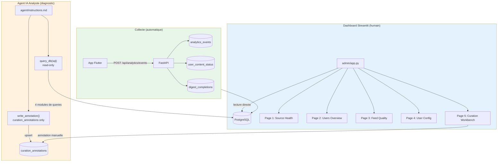
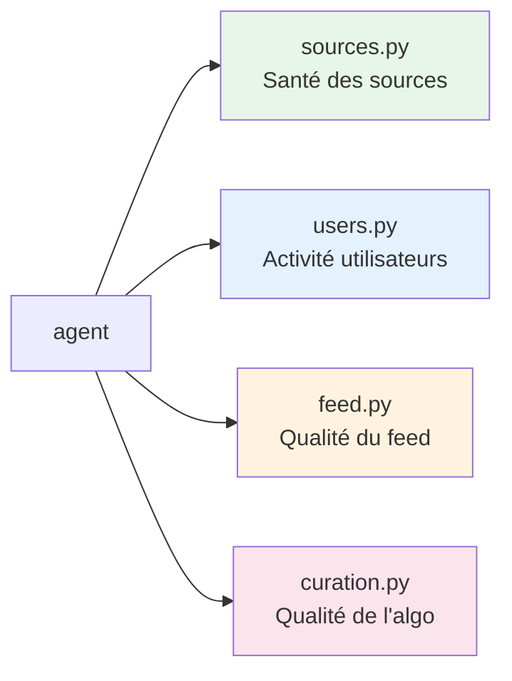
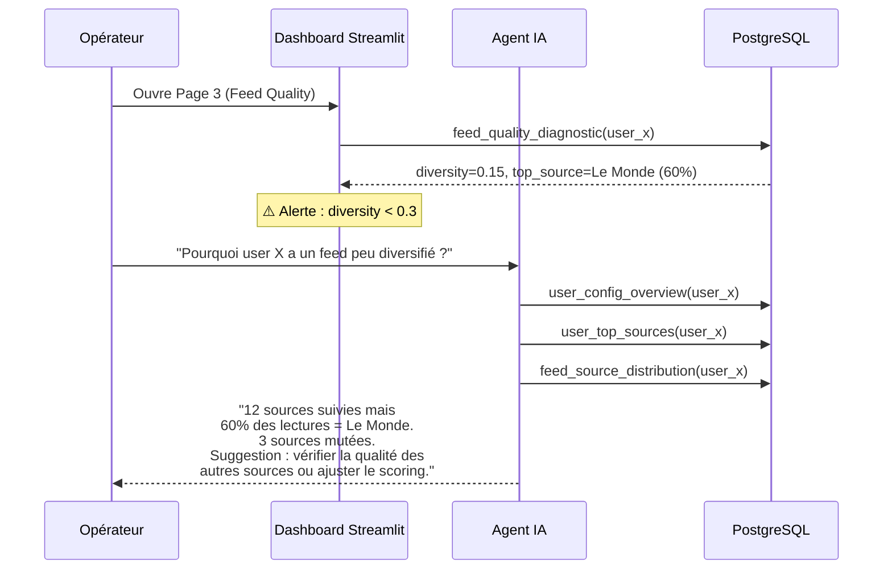

# Backoffice & Monitoring

> Source de vérité : `agent/` (agent IA), `admin/` (dashboard Streamlit)

## Architecture

Facteur dispose d'un **double système de monitoring** :



---

## Dashboard Streamlit (`admin/`)

5 pages, chacune répond à une question opérationnelle :

| Page | Question | Données clés | Alertes |
|------|----------|-------------|---------|
| **1. Source Health** | "Une source est-elle cassée ?" | last_synced_at, avg publish interval | OK / Retard / KO (seuil : delta > 4× intervalle moyen) |
| **2. Users Overview** | "Qui est actif, qui churn ?" | DAU, articles lus/semaine, dernière activité | Active (<24h) / Slowing (<7j) / Inactive (>7j) |
| **3. Feed Quality** | "Le feed est-il diversifié et frais ?" | diversity_score, source distribution, freshness | Diversity < 0.3, une source > 50%, feed > 48h |
| **4. User Config** | "Inspecter la config d'un user" | Sources suivies/mutées, topics, préférences | < 3 sources actives (risque churn) |
| **5. Curation Workbench** | "Annoter les articles pour mesurer l'algo" | Articles servis + candidats manqués | Annotation manuelle good/bad/missing |

### Seuils d'alerte (`admin/utils/config.py`)

```python
SOURCE_STALE_MULTIPLIER_WARNING = 2    # delta ≤ avg×2 = OK
SOURCE_STALE_MULTIPLIER_CRITICAL = 4   # delta > avg×4 = KO
DIVERSITY_SCORE_WARNING = 0.3          # < 0.3 = une source domine
FRESHNESS_HOURS_WARNING = 48           # feed sans article frais
TOP_SOURCE_PCT_WARNING = 50            # une source > 50% du feed
USER_ACTIVE_HOURS = 24                 # < 24h = Active
```

---

## Agent IA Analyste (`agent/`)

Un agent Claude avec accès **read-only** à la base + écriture limitée aux annotations de curation.

### Outils

| Outil | Fichier | Droits | Usage |
|-------|---------|--------|-------|
| `query_db(sql, params)` | `agent/tools/query_db.py` | **Read-only** (INSERT/UPDATE/DELETE bloqués) | Diagnostiquer, explorer, analyser |
| `write_annotation(...)` | `agent/tools/write_annotation.py` | **Write curation_annotations only** | Annoter good/bad/missing, `annotated_by='agent'` |

### 4 modules de queries pré-écrites (`agent/queries/`)



#### Sources (`sources.py`)

| Query | Ce qu'elle mesure |
|-------|-------------------|
| `source_health_summary` | Toutes les sources actives + nb articles + dernier sync |
| `source_publish_frequency` | Intervalle moyen entre publications (heures) |
| `source_sync_staleness` | Sources non synchronisées depuis > 6h |
| `source_detail` | Détail complet d'une source (thème, biais, fiabilité) |

#### Users (`users.py`)

| Query | Ce qu'elle mesure |
|-------|-------------------|
| `user_activity_summary` | Dernière activité, temps passé, articles lus/sauvés (7j) |
| `inactive_users` | Users sans activité depuis > X jours |
| `user_engagement_detail` | Breakdown jour par jour sur 30 jours |
| `user_config_overview` | Profil + sources/thèmes/topics mutés |
| `user_top_sources` | Sources classées par articles lus |
| `users_with_degraded_config` | < 3 sources actives (signal pré-churn) |

#### Feed (`feed.py`)

| Query | Ce qu'elle mesure |
|-------|-------------------|
| `feed_quality_diagnostic` | Articles servis, diversity score, fraîcheur |
| `feed_source_distribution` | % du feed par source |
| `users_with_poor_diversity` | Users avec diversity < 0.3 |
| `digest_history` | Completions + engagement sur N derniers digests |

#### Curation (`curation.py`)

| Query | Ce qu'elle mesure |
|-------|-------------------|
| `curation_precision_recall` | good/(good+bad) et good/(good+missing) |
| `curation_by_source` | Good/bad/missing par source |
| `curation_trend` | Évolution quotidienne de la precision |
| `curation_gap_candidates` | Articles qui auraient dû être servis mais ne l'ont pas été |

---

## API Admin (`packages/api/app/routers/internal.py`)

| Endpoint | Méthode | Usage |
|----------|---------|-------|
| `/sync` | POST | Déclenche un sync RSS manuel |
| `/briefing` | POST | Génère le Top 3 manuellement |
| `/admin/queue-stats` | GET | Stats de la queue de classification ML |
| `/admin/reclassify` | POST | Re-queue des articles pour reclassification |

---

## API Analytics (`packages/api/app/routers/analytics.py`)

| Endpoint | Méthode | Usage |
|----------|---------|-------|
| `/api/analytics/events` | POST | Log d'événements (content_interaction, page_view...) |
| `/api/analytics/digest-metrics` | GET | Taux de complétion, temps moyen, breakdown interactions |

### Events collectés (`analytics_service.py`)

| Méthode | Event | Données |
|---------|-------|---------|
| `log_event()` | Générique | event_type, event_data (JSONB), device_id |
| `log_digest_session()` | Digest closure | articles_read, articles_saved, closure_time |
| `log_feed_session()` | Feed scroll | scroll_depth, items_seen |
| `get_interaction_breakdown()` | — | Counts : read / save / dismiss / pass |

---

## Flux de diagnostic typique



---

## Limitations actuelles

| Limitation | Impact | Opportunité pour Lirav |
|-----------|--------|----------------------|
| **Pas d'alertes push** | Il faut ouvrir le dashboard pour voir les problèmes | Cron job rapport quotidien par email/Slack |
| **Pas de dashboard prod** | Streamlit = prototype, pas scalable | Metabase ou Grafana sur les mêmes queries |
| **Analytics SQL en vrac** | `scripts/analytics_dashboard.sql` pas intégré | Intégrer dans l'agent ou le dashboard |
| **Curation manuelle uniquement** | Pas de scoring automatique de la qualité | Pipeline de scoring automatique via curation_annotations |
| **Agent non programmable** | Pas d'API pour lancer l'agent automatiquement | Wrapper API ou cron job hebdo |
| **Pas de cohortes/funnels** | Les queries existent dans `scripts/` mais pas exposées | Dashboard dédié conversion trial→payant |

---

## Fichiers clés

```
agent/
├── instructions.md            # Prompt système de l'agent
├── context.py                 # Injection de contexte (schéma, KPIs)
├── tools/
│   ├── query_db.py            # Read-only SQL
│   └── write_annotation.py    # Écriture curation_annotations
└── queries/
    ├── sources.py             # 4 queries santé sources
    ├── users.py               # 6 queries activité utilisateurs
    ├── feed.py                # 4 queries qualité feed
    └── curation.py            # 4 queries qualité algo

admin/
├── app.py                     # Entry point Streamlit
├── pages/
│   ├── 1_source_health.py
│   ├── 2_users_overview.py
│   ├── 3_feed_quality.py
│   ├── 4_user_config.py
│   └── 5_curation.py
└── utils/
    ├── db.py                  # Connexion PostgreSQL
    ├── config.py              # Seuils d'alerte
    └── status.py              # Calcul badges/statuts

scripts/
├── analytics_dashboard.sql    # Queries analytics en vrac (DAU, retention, funnels)
└── query_failed_sources.py    # Rapport sources échouées
```
