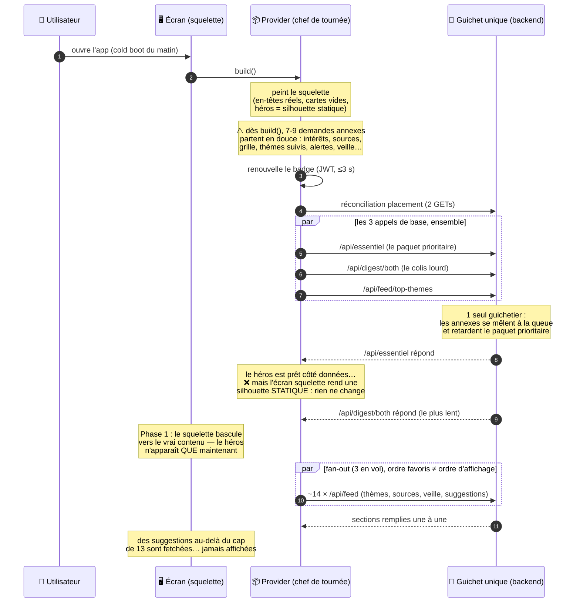
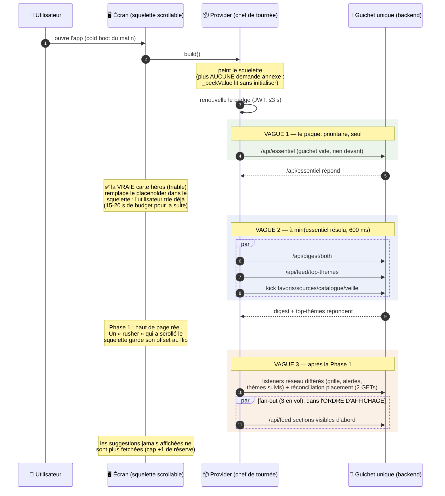

# Maintenance : cold start — ordre de chargement « héros d'abord »

**Date :** 2026-08-18
**Classification :** MAINTENANCE
**Branche :** `boujonlaurin-dotcom/cold-start-load-order`
**Précède :** [#1097](maintenance-tournee-loading-smoothness.md) (gzip + émission anticipée du héros + loader vélo)

---

## Demande PO

1. Un **diagramme complet et vulgarisé** de ce qui charge au cold boot, dans quel
   ordre (ce document).
2. **Revoir l'ordre des appels** pour privilégier au maximum la 1ʳᵉ carte « Ton
   Essentiel » : elle retient désormais l'utilisateur 15-20 s de tri, donc tout
   le reste dispose d'un budget de temps naturel pendant qu'il trie. Et rendre
   **smooth** le chargement des cartes suivantes quand un utilisateur « rush »
   la carte héros sans trier.

---

## Le bureau de poste, vulgarisé

Pour lire les diagrammes : l'app est un **bureau de poste** qui ouvre ses portes
le matin.

- Le **guichet** = le backend (un **seul** guichetier : l'unique worker uvicorn).
  Tout appel réseau fait la queue au même guichet.
- Le **badge** = le JWT. Le matin, le badge de la veille est toujours périmé
  (TTL 1 h) : il faut le renouveler avant de demander quoi que ce soit au
  guichet, sinon c'est un refus (401) puis re-queue garanti.
- La **carte héros** « Ton Essentiel » = le paquet prioritaire (`/api/essentiel`).
  C'est le premier contenu réel que l'utilisateur voit — et depuis la refonte
  du tri, celui qui l'occupe 15-20 secondes.
- La **lettre du jour** (`/api/digest/both`) = le colis le plus lourd (2 digests,
  texte intégral des articles).
- La **tournée** = les ~14 sections thème/source/veille/suggestions, remplies par
  un fan-out de `GET /api/feed` (3 en vol max).

## Aujourd'hui (avant ce lot) : tout le monde fait la queue devant le paquet prioritaire

### Diagnostic (vérifié dans le code)

- **D1 — Le gain n°1 est un trou de peinture, pas un problème réseau.**
  L'émission anticipée de #1097 publie bien le héros hydraté dans l'état
  squelette (`flux_continu_provider.dart`, early-emit sur `essentielFuture`),
  mais `_FluxContinuSkeleton` rend un `_HeroSkeleton` statique inconditionnel et
  **saute** l'`EssentielSection`. La pile ne devient visible qu'à la Phase 1 =
  max des 3 appels de base, en pratique `/api/digest/both` (le plus lourd).
- **D2 — 7 à 9 appels annexes partent avant/avec le héros.** Les `ref.listen` de
  `build()` initialisent immédiatement `userInterestsProvider`,
  `userSourcesStateProvider`, `grilleProvider`, `themesFollowedProvider`,
  `alertsProvider` (réseau) ; `_reconcilePlacementThenSync` ajoute 2 GETs et
  peut publier un état non-squelette mi-bootstrap. Des `ref.read` dans la
  composition du squelette initialisent aussi ces providers en douce
  (`_pickFavorites`, `veilleActiveConfigProvider`, `_pickFavoriteSources`,
  grille, alertes, `_stampFollowedCounts`). Tout ça concurrence `/api/essentiel`
  sur le pool Dio et l'unique worker uvicorn.
- **D3 — Le fan-out (~14 GET `/api/feed`, concurrence 3) part dans l'ordre
  favoris, pas l'ordre d'affichage** (veille avant sources, bias/ordre
  custom/score ignorés), et fetch des suggestions au-delà du cap de 13 jamais
  affichées.
- **Le gate JWT ≤3 s est le chemin rapide, pas l'ennemi** : le token du matin
  est toujours mort (TTL 1 h), tirer avant = 401→refresh→retry garanti. On le
  garde.

---

## Instrumentation `[PERF]` (commit 1 — capture l'avant)

Grammaire existante (`[PERF] fluxContinu.<metric>=<ms>`), origine = entrée de
`build()` du provider (sauf `hero_paint_ms`, origine = montage de l'écran) :

| Métrique | Où | Sens |
|---|---|---|
| `gate_ms` | provider | fin du gate JWT (refresh initial borné 3 s) |
| `essentiel_dispatch_ms` | provider | départ de la requête `/api/essentiel` |
| `essentiel_resolved_ms` | provider | réponse de `/api/essentiel` |
| `hero_emit_ms` | provider | émission de l'état squelette portant le héros hydraté |
| `phase1_ms` | provider | émission Phase 1 (haut de page réel : héros+Actus+Bonnes) |
| `fanout_done_ms tasks=N dropped=M` | provider | fin du fan-out des sections (M = suggestions non fetchées) |
| `hero_paint_ms` | écran | **la** métrique avant/après : premier frame qui peint la carte héros hydratée |

Protocole de mesure : kill app + purge du snapshot Hive (simule le matin),
3 runs avant/après sur staging.

## Après (ce lot) : le paquet prioritaire passe devant

Ce qui change, en une ligne chacune :

- **B0** — le héros hydraté est peint dans le squelette dès la réponse de
  `/api/essentiel` (vraie carte interactive), au lieu d'attendre le digest.
- **B1** — 3 vagues : essentiel seul → digest/top-thèmes à
  `min(essentiel, 600 ms)` → annexes après la Phase 1.
- **B2** — plus d'initialisations furtives : `_peekValue` (lecture sans init) +
  attente bornée (2 s) des prérequis avant le seed des coquilles (corrige la
  course de `_pickFavorites`).
- **B3** — fan-out dans l'ordre d'affichage (ordre custom/score/quota compris) ;
  suggestions hors cap non fetchées, +1 de réserve pour `dismissSuggestion`.
- **C1** — squelette scrollable (clamping), offset conservé au flip Phase 1.

Coût assumé : `phase1_ms` peut prendre jusqu'à +600 ms (la tête d'avance du
héros) — pendant lesquels l'utilisateur a déjà sa carte à trier.

### Chiffres mesurés (build web local → API staging, compte QA, 18/08/2026)

Protocole : purge du snapshot Hive (`flux_continu_cache` IndexedDB) + reload —
simule le cold boot du matin. 3 runs `mode=cold` :

| Run | `gate_ms` | `essentiel_resolved_ms` | `hero_paint_ms` | `phase1_ms` | héros avant Phase 1 |
|---|---|---|---|---|---|
| 1 | 1 425 | 5 621 | 5 499 | 6 567 | **~1,0 s** |
| 2 | 874 | 6 766 | 6 671 | 8 851 | **~2,2 s** |
| 3 | 768 | 4 815 | 4 721 | 6 131 | **~1,4 s** |

Avant ce lot, `hero_paint_ms ≈ phase1_ms` (le squelette rendait une silhouette
statique jusqu'à l'arrivée du digest) : la carte à trier apparaît désormais
**1 à 2 s plus tôt** dès que `/api/essentiel` répond — et c'est la borne basse :
sur ces runs staging, l'essentiel lui-même est lent (~4-6 s, unique worker) ;
tout gain côté backend se transfère intégralement au héros, plus au digest.
`fanout_done_ms tasks=11 dropped=0` (compte QA sans suggestion hors cap ; le
test unitaire couvre `dropped>0`).

QA visuelle (Playwright, viewport 390×844) : la vraie carte héros (article +
météo) est peinte dans le squelette avant la Phase 1 ; un scroll pendant le
squelette (coquilles « Ta tournée se prépare… ») conserve sa position au flip
Phase 1 — pas de retour en haut, sections remplies en place. Console sans
erreur inattendue (bruit connu au boot : stripe/gstatic).

## Étapes du lot

1. Instrumentation `[PERF]` + ce document (l'« avant »').
2. **B0+C1** — peindre le héros dès qu'il atterrit (vraie carte interactive dans
   le squelette) + squelette scrollable qui conserve l'offset au flip Phase 1.
3. **B1+B2** — 3 vagues d'appels (essentiel seul → digest/top-thèmes après
   `min(essentiel résolu, 600 ms)` → providers annexes après la Phase 1) + fin
   des initialisations furtives (`_peek`).
4. **B3** — fan-out dans l'ordre d'affichage + cap des suggestions fetchées
   (+1 de réserve pour `dismissSuggestion`).
5. _(droppée si besoin)_ Cache local des noms de coquilles.
6. Doc « après » + chiffres.
