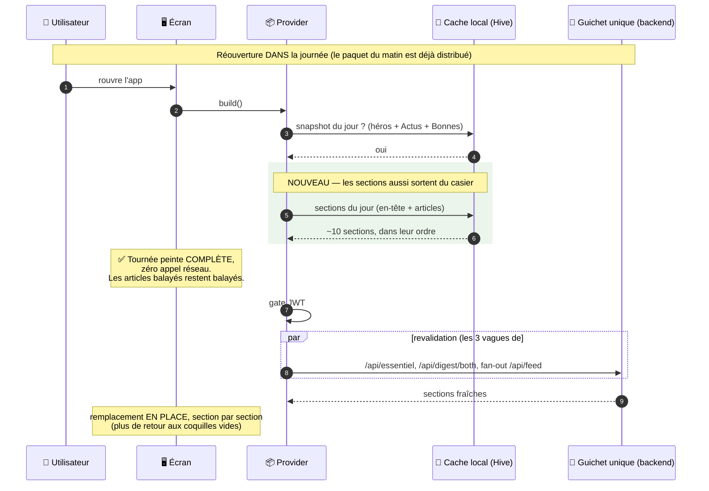

# Maintenance : SWR in-day — les articles de la Tournée en cache local

**Date :** 2026-08-19
**Classification :** MAINTENANCE
**Branche :** `boujonlaurin-dotcom/tournee-swr-in-day`
**Suite de :** [#1099](maintenance-cold-start-load-order.md) (cold start « héros
d'abord »), et réalise le **périmètre PR 3** annoncé dans
[`maintenance-essentiel-loading-speed.md`](maintenance-essentiel-loading-speed.md)
(§ « Suite : périmètre réel de PR 3 »).

---

## Demande PO

> « Un vrai caching sur les articles pendant la journée. »

### Où en est le lot cold start

| Étape du plan `cold-start-load-order` | État |
|---|---|
| 1 — instrumentation `[PERF]` + doc | livrée (#1099) |
| 2 — B0+C1 (héros peint dans le squelette, squelette scrollable) | livrée (#1099) |
| 3 — B1+B2 (3 vagues, fin des inits furtives) | livrée (#1099) |
| **4 — B3 (fan-out dans l'ordre d'affichage + cap suggestions)** | **livrée (#1099)** — #1098 avait mergé à temps |
| 5 — C2 (cache local des **noms** de coquilles) | droppée |

L'étape 5 telle qu'écrite ne met en cache **que les libellés** des coquilles
(`{sectionKey, label, accent, logoUrl, kind}`), explicitement « affichage
seulement ». Elle ne cache **aucun article** : à une réouverture dans la
journée, l'utilisateur verrait ses sections avec leur vrai nom… et toujours
vides. Ce document remplace donc l'étape 5 par le vrai périmètre demandé, dont
elle devient un sous-produit (l'en-tête minimal est persisté **à côté** des
articles).

---

## Ce qui se passe aujourd'hui à une réouverture in-day (vérifié dans le code)

`flux_continu_provider.dart` `build()` (`:358-382`) lit le snapshot Hive
`flux_continu_cache`. Snapshot du jour + même mode serein ⇒
`_buildStateFromPayload(fetchThemes: false)` (`:753`).

Ce chemin peint **instantanément** :

- la carte héros « Ton Essentiel » (`essentiel_articles` du snapshot) ;
- « Actus du jour » et « Bonnes Nouvelles » (`dual` du snapshot) ;
- la citation du jour.

…et **rien d'autre** : `_themes = _shellThemeSections(...)` et
`_sources = _shellSourceSections(...)` (`:831-832`) produisent des **coquilles
`items: []`**. Les ~10 sections de la Tournée restent vides jusqu'à la fin du
fan-out complet relancé par `_fetchAll()` — soit, sous l'unique worker uvicorn,
plusieurs secondes après le gate JWT, section par section.

Le snapshot ne porte donc **que les 3 blocs éditoriaux**
(`flux_continu_cache_service.dart:102-125` : `dual`, `top_themes`,
`essentiel_articles`). Le contenu de `GET /api/feed` n'est persisté nulle part.

### Les 3 bloquants, re-vérifiés sur `main` (c6221cfc)

Ce sont ceux annoncés dans `maintenance-essentiel-loading-speed.md` ; ils sont
toujours exacts après #1099.

- **B-a — le reseed de revalidation détruirait l'hydratation, visiblement.**
  `_buildStateFromPayload(fetchThemes: true)` réécrit `_themes`/`_sources` en
  coquilles vides et fait `_resolvedSectionKeys.clear()` (`:831-844`), puis
  `sectionTask` appelle `emit()` **inconditionnellement** (`:2725`), hors de la
  garde `emitProgressive`. Inoffensif aujourd'hui (coquilles → coquilles) ; avec
  l'hydratation, la 1ʳᵉ section revalidée publierait un état où **toutes les
  autres sont redevenues vides** ⇒ flash contenu → vide → contenu sur toute la
  page. Le commentaire en place (`:858-862`, « pas de blink des sections
  thèmes/sources ») promet déjà l'inverse de ce que le code fait.
- **B-b — les sections source ne s'hydrateraient pas.** Le chemin
  `fetchThemes: false` retourne (`:853-856`) **avant** `_ensureSourceCatalog`
  (`:885`), et `_shellSourceSections` (`:1076-1098`) lit le catalogue via
  `_peekValue(userSourcesProvider)` — qui, par construction B2, **n'initialise
  pas** le provider ⇒ `null` au boot ⇒ `if (src == null) continue` : chaque
  favori source est droppé. Idem pour la veille (`_skeletonVeilleSection :1031`
  renvoie `null` sans `veilleActiveConfigProvider` résolu) et pour le label des
  sujets custom. ⇒ il faut persister **l'en-tête minimal à côté du raw** (c'est
  là que l'étape 5 est absorbée).
- **B-c — un article balayé réapparaîtrait.** `_dismissedIds` (`:195`) est en
  mémoire seule. Invisible aujourd'hui (rien à réafficher) ; avec
  l'hydratation, c'est le pire ressenti possible.

### Pièges déjà épinglés — à ne pas redécouvrir

- ne **pas** hydrater `_resolvedSectionKeys` (pilote `demote`/`underfilled` ⇒
  saut d'ordre des sections au boot) ;
- ne **pas** hydrater les coquilles « Choisie pour vous » (`onEmpty` retire la
  coquille ⇒ disparition sous le doigt) ;
- `getVeilleFeedItems` (`flux_continu_repository.dart`) **avale les
  DioException** et renvoie un feed vide ⇒ ne jamais persister une section
  **vide** comme légitime (fail-closed) ;
- ne **pas** grossir le snapshot `flux_continu_cache` (~80 KB → ~600 KB) :
  `patchContentConsumed` en fait decode + walk + encode **entier, sur le thread
  UI, au retour de WebView** (`read_sync_service.dart:425`). ⇒ une **entrée Hive
  par section**.

---

## Ce qu'on livre

Un **stale-while-revalidate par section**, borné à la journée :

- à une réouverture in-day, la Tournée est peinte **complète** (articles
  compris) depuis le cache local, sans un seul appel réseau ;
- la revalidation part derrière (les 3 vagues de #1099, inchangées) et remplace
  chaque section **en place**, sans flash ;
- au lendemain (`day_key` différent), le cache est ignoré puis purgé : on
  retombe exactement sur le cold start « héros d'abord » d'aujourd'hui.

### Réutilisation : `FeedCacheService`, pas un nouveau design

`feed_cache_service.dart` fait déjà exactement ça pour la vue Flâner (box Hive
`feed_cache`, valeur `{saved_at, data: <raw API>}`, `patchContentStatus`,
`clearForUser`), et pour la bonne raison : **les modèles feed n'ont pas de
`toJson`** — on persiste le JSON brut et on le repasse dans le parseur existant.
`FeedRepository.getFeedWithRaw` (`:126`) expose déjà ce brut. On étend ce
service à un namespace de clés section plutôt que d'en écrire un second.

---

## Livré (1 PR, mobile only — aucune migration, aucun backend)

### Commit 1 — le reseed de revalidation préserve le contenu monté (bloquant B-a)

Pré-requis de tout le reste, et **correction utile en soi** : c'est aussi le
comportement attendu du pull-to-refresh.

Dans `_buildStateFromPayload`, quand l'état monté porte déjà du contenu
(`mounted != null && !mounted.isSkeleton`) : reseeder via `_reseedShells`
(`:886` — déjà utilisé pour le re-seed post-catalogue) au lieu d'écraser par
`_shellThemeSections`/`_shellSourceSections`. Les sections dont la clé a disparu
des favoris sortent ; les autres **gardent leurs items** jusqu'à leur
remplacement par `_upsertByKey`. `_resolvedSectionKeys.clear()` est conservé
(on ne réhydrate jamais la classification maigre/riche).

Test : « une revalidation ne publie jamais un état où une section déjà hydratée
est repassée à `items: []` ».

### Commit 2 — persistance + hydratation des sections (le cœur)

**Écriture** — dans `_fanOutSectionsProgressive`, chaque `sectionTask` résolu
**non vide** persiste `{day_key, saved_at, header, data: raw}` :

- `_fetchOneTheme`/`_fetchOneSource` passent à `getFeedWithRaw` (le brut
  remonte jusqu'au `sectionTask`, le parsé reste inchangé) ;
- `header` = `{kind, label, accent, sourceId, sourceLogoUrl, themeSlug,
  customTopicId}` — de quoi reconstruire l'en-tête **sans** `userSourcesProvider`
  ni `veilleActiveConfigProvider` (bloquant B-b, et absorption de l'étape 5) ;
- **jamais d'entrée vide** (fail-closed sur le piège `getVeilleFeedItems`) ;
- clé `tournee:{userId}:{variant}:{sectionKey}` dans la box `feed_cache`
  existante ; `variant` = normal/serein (le contenu est mode-dépendant, comme le
  snapshot Flux).

**Lecture** (`_hydrateSectionsFromCache`, chemin `fetchThemes: false` uniquement)
— deux cas, tous deux nécessaires :

- la coquille existe ⇒ elle est hydratée en place ;
- la coquille **manque** ⇒ la section est réinsérée depuis son en-tête
  persisté, par `rank` croissant. C'est le cas **nominal** au boot : ni
  `userInterestsProvider` ni `userSourcesProvider` ne sont résolus (`_peekValue`
  n'initialise rien depuis #1099), donc le seed ne produit aucune section
  thème/source. Sans en-tête persisté, la Tournée resterait vide jusqu'à la
  Phase 1 — c'est là que l'étape 5 du plan précédent est absorbée, avec les
  articles en plus.

Le décodage passe par `FeedRepository.parseFeedData(raw)` (même parseur que le
réseau) puis `decodeTourneeSection(header, items)`
(`utils/tournee_section_codec.dart`). `_resolvedSectionKeys` et les suggestions
restent intouchés.

**Cohérence lecture** — `read_sync_service._propagateLocal` (`:394-426`) patche
aussi les entrées section. Pré-filtre sur la **chaîne encodée** (`contains(id)`)
avant tout `jsonDecode` : même stratégie que l'invalidation content-scoped du
backend (`feed_cache.py`), coût nul sur les entrées qui ne portent pas
l'article.

**Purge** — entrées d'un autre `day_key` supprimées à l'hydratation ;
`clearForUser` balaie le préfixe `tournee:{userId}:` au logout / changement de
compte.

Instrumentation : `[PERF] fluxContinu.sections_hydrated_ms=<ms> n=<k>`.

### Commit 3 — `_dismissedIds` persistés par jour (bloquant B-c)

`TourneeProgressService` reçoit `loadDismissedIdsForToday` /
`setDismissedIdsToday`, sur le modèle **auto-invalidant** de
`tournee_score_order_v1` (`{"day": …, "ids": […]}`) : une seule entrée, périmée
d'elle-même au changement de journée tournée, donc rien à ajouter à
`purgeOldPrefsKeys`. Chargés avant le premier `_compose` (en **union** avec les
balayages de la session, pour qu'un refetch n'en perde aucun), écrits en
fire-and-forget au `confirmDismiss`.

### Commit 4 — passe `simplify` + doc « après »

Ce document, et deux nettoyages relevés à la relecture :

- `readTourneeSectionsForToday` absorbe l'ancien `purgeStaleTourneeSections`
  (une passe au lieu de deux) **et** trie jour/variante sur la chaîne encodée :
  fusionner naïvement les deux boucles aurait mis le décodage des sections de
  l'autre mode d'affichage sur le chemin de peinture du boot ;
- `CachedTourneeSection` perd son `savedAt` inutilisé (la fraîcheur d'une
  section, c'est son `day_key`, pas un TTL glissant).

### Effet de bord assumé : les mocks de test des suites Tournée

Le fan-out appelle désormais `getFeedWithRaw` / `getVeilleFeedItemsWithRaw`
alors que 8 suites stubbent `getFeed` / `getVeilleFeedItems`. Plutôt que de
réécrire ~50 stubs, un mock partagé
(`test/…/providers/feed_repository_mock.dart`) rétablit la délégation avec
`raw: null` — les suites historiques restent écrites comme avant et le cache y
est **inerte**. Piège épinglé au passage : `Invocation.namedArguments` ne
contient que les arguments **explicitement** fournis ; un mock qui repasse les
paramètres par défaut ne matche plus les `when(…)` des suites (c'était la cause
d'un flake « la veille disparaît de la Tournée »).

---

## Tests

`test/features/flux_continu/providers/flux_continu_swr_in_day_test.dart` (7) :

| Test | Ce qu'il épingle |
|---|---|
| revalidation sans flash | aucune section hydratée ne repasse par `items: []` |
| favori retiré | le reseed n'est pas un cache infini |
| persistance du fan-out | section résolue mémorisée, section **vide** jamais |
| réouverture in-day | Tournée peinte **avec ses articles**, zéro fetch, seed impossible (intérêts non résolus) |
| cache d'hier | jamais peint, puis purgé |
| article balayé | toujours absent après réouverture |
| `patchTourneeContentStatus` | seule l'entrée porteuse de l'id est réécrite |

**Non-vacuité vérifiée** — chaque correctif a été désactivé tour à tour et la
suite relancée ; elle passe au rouge à chaque fois, donc aucun de ces tests ne
passe « par accident » :

| Correctif neutralisé | Échecs |
|---|---|
| commit 1 (`hasMountedContent` forcé à `false`) | 1 — « revalidation sans flash » |
| commit 2 (`_persistSection` en no-op) | 2 — « persistance du fan-out » + « réouverture in-day » |
| commit 3 (`_dismissedIds` non rechargés) | 1 — « article balayé » |

Verts intouchés : `flux_continu_cold_start_waves_test.dart`,
`flux_continu_block_score_order_test.dart`,
`flux_continu_progressive_fanout_test.dart`, `flux_continu_tournee_order_test.dart`,
`essentiel_placement_sync_test.dart`.

## Vérification

- `flutter analyze lib` : **0 erreur**, 29 warnings — tous pré-existants
  (inférence générique dans `core/api`, imports morts hors périmètre) ; aucun
  dans les fichiers touchés.
- `flutter test` (suite complète) comparée à un worktree `origin/main`, même
  machine, même run :

  | | tests | échecs |
  |---|---|---|
  | `origin/main` (baseline) | 2505 | 26 |
  | cette branche | 2512 (+7) | 26 |

  Diff des **noms** d'échecs : vide dans les deux sens — aucun test nouvellement
  rouge, aucun accidentellement vert. Les 26 sont la baseline connue du dépôt
  (`bookmark_test`, `notification_test`, `topic_chip_test`, `feed_sources_test`
  « Test not implemented », 2 × perspectives, `theme_section_screen_test`,
  `settings_sheet_test`, `subscriptions_screen_test`, `widget_test`).
- Instrumentation en place : `[PERF] fluxContinu.sections_hydrated_ms=<ms>
  n=<k>` est bien émis sur le chemin in-day (observé dans les runs de test).
  Le rapport `sections_hydrated_ms` vs `fanout_done_ms` **sur appareil** reste à
  relever en QA — les timings de test sont dominés par la latence des mocks et
  ne mesurent rien d'utile.

### Reste à faire (QA manuelle, hors périmètre du merge)

Le scénario demande deux sessions applicatives contre un backend réel ; il n'est
pas automatisable via le build web dans l'état (cf. `.context/qa-handoff.md`) :

1. ouvrir la Tournée, laisser le fan-out finir → recharger dans la journée :
   sections peintes **pleines** immédiatement, `sections_hydrated_ms` dans les
   logs, aucun `/api/feed` avant le gate JWT ;
2. balayer un article puis recharger → il ne revient pas ;
3. pull-to-refresh → aucun blink contenu → vide → contenu ;
4. le lendemain (ou `day_key` forcé) → cold start « héros d'abord » inchangé.

## Risques

- **Fraîcheur** : une section cachée à 9 h reste affichée à 18 h jusqu'à la fin
  de la revalidation (quelques secondes). C'est le contrat SWR assumé ; borné
  par la journée.
- **Taille** : ~10 entrées × 30-60 KB. Entrées séparées ⇒ aucun decode global
  sur le thread UI (contrairement au snapshot Flux).
- **Commit 1 touche le chemin pull-to-refresh** (même fonction) : couvert par
  test, et QA manuelle du refresh.
