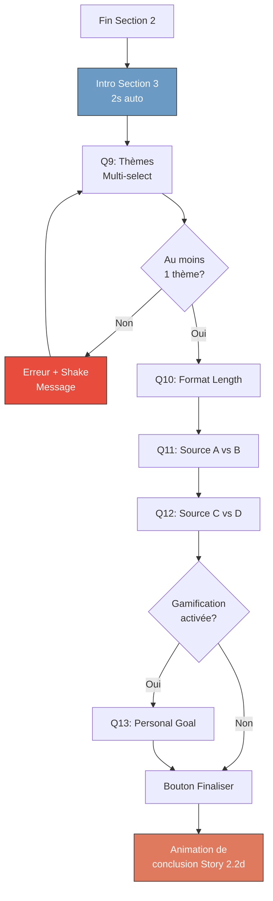

# Story 2.2c: Onboarding Section 3 "Source Preferences"

## Status: Done ✅

## Story

**As a** nouvel utilisateur,  
**I want** indiquer mes préférences de sources et formats,  
**so that** Facteur me propose les bons contenus.

## Acceptance Criteria

1. 3-4 écrans couvrant thèmes, formats et préférences de sources
2. Question thèmes avec multi-sélection (minimum 1 requis)
3. Si gamification activée → Question sur l'objectif personnel
4. Indicateur de progression (section 3/3)
5. Bouton "Finaliser" déclenche l'animation de conclusion (Story 2.2d)
6. Réponses stockées localement avant transition vers animation

## Tasks / Subtasks

- [ ] **Task 1 : Écran intro Section 3** (AC: 4)
  - [ ] Réutiliser `SectionTransitionScreen` (Story 2.2b)
  - [ ] Emoji : 📚
  - [ ] Texte : "Parlons de tes centres d'intérêt..."
  - [ ] Indicateur "Section 3/3"
  - [ ] Auto-transition après 2 secondes

- [ ] **Task 2 : Q9 - Thèmes (multi-sélection)** (AC: 1, 2)
  - [ ] Créer widget `InterestsQuestion`
  - [ ] Question : "Quels thèmes t'intéressent ?"
  - [ ] Subtitle : "Sélectionne au moins 1 thème (3 max recommandé)"
  - [ ] 5 thèmes disponibles avec `MultiSelectChip` :
    - 💻 Tech & Futur → `tech`
    - 🌍 Géopolitique → `geopolitics`
    - 💰 Économie → `economy`
    - 🌱 Société & Climat → `society_climate`
    - 🎨 Culture & Idées → `culture_ideas`
  - [ ] Validation : Au moins 1 sélectionné pour continuer
  - [ ] Message d'erreur si aucun sélectionné et tap "Continuer"
  - [ ] Stocker dans `answers.selectedInterests` (List<String>)

- [ ] **Task 3 : Q10 - Format préféré** (AC: 1)
  - [ ] Créer widget `FormatLengthQuestion`
  - [ ] Question : "Tu préfères les contenus..."
  - [ ] 3 options avec `SelectionCard` :
    - ⚡ "Courts (< 10 min)" → `format_length: "short"`
    - 📖 "Longs (> 30 min)" → `format_length: "long"`
    - 🎯 "Mix des deux" → `format_length: "mixed"` (recommandé)
  - [ ] Stocker dans `answers.formatLength`

- [ ] **Task 4 : Q11 - Préférence source A vs B** (AC: 1)
  - [ ] Créer widget `SourceComparisonQuestion`
  - [ ] Question : "Tu préfères lire..."
  - [ ] 2 sources réelles du catalogue avec preview :
    - Option 1 : "Hugo Décrypte" (YouTube, actu vulgarisée)
    - Option 2 : "Le Monde Diplomatique" (Articles, analyses pointues)
  - [ ] Afficher logo, type, description courte pour chaque
  - [ ] Stocker la préférence (utilisé pour affiner l'algo)
  - [ ] Note : Résultat indicatif, n'élimine pas l'autre source

- [ ] **Task 5 : Q12 - Préférence source C vs D (optionnel)** (AC: 1)
  - [ ] Même widget `SourceComparisonQuestion`
  - [ ] Question : "Et entre..."
  - [ ] 2 autres sources :
    - Option 1 : "Underscore_" (Podcast tech)
    - Option 2 : "The TTSO" (Podcast société)
  - [ ] Même logique que Q11

- [ ] **Task 6 : Q13 - Objectif personnel (conditionnel)** (AC: 3)
  - [ ] Créer widget `PersonalGoalQuestion`
  - [ ] N'afficher QUE si `gamificationEnabled = true`
  - [ ] Question : "Pourquoi veux-tu consommer + de contenu ?"
  - [ ] Options émotionnelles (pas de mapping API, juste engagement) :
    - 🧠 "Devenir plus cultivé"
    - 💼 "Progresser dans mon travail"
    - 💬 "Avoir des conversations intéressantes"
    - 🎯 "Atteindre un objectif d'apprentissage"
  - [ ] Réponse purement motivationnelle (peut être utilisée plus tard pour messages perso)
  - [ ] Stocker dans `answers.personalGoal` (optionnel)

- [ ] **Task 7 : Bouton "Finaliser" et validation** (AC: 5, 6)
  - [ ] Afficher bouton "Finaliser mon profil" sur dernière question
  - [ ] Style : Bouton primaire terracotta, large, en bas d'écran
  - [ ] Au tap : Valider que thèmes (Q9) est complété
  - [ ] Sauvegarder toutes les réponses dans Hive
  - [ ] Déclencher navigation vers `ConclusionAnimationScreen` (Story 2.2d)

- [ ] **Task 8 : Navigation et progression** (AC: 4, 6)
  - [ ] Mettre à jour `OnboardingNotifier` pour Section 3
  - [ ] Gérer navigation conditionnelle (Q13 si gamification = true)
  - [ ] Barre de progression : 66.6% → 100%
  - [ ] Persister l'état complet avant transition finale

- [ ] **Task 9 : Validation et error handling** (AC: 2)
  - [ ] Empêcher navigation Q9 → Q10 si aucun thème sélectionné
  - [ ] Afficher message : "Sélectionne au moins un thème pour continuer"
  - [ ] Animation shake du container si erreur
  - [ ] Highlight des chips disponibles

- [ ] **Task 10 : Tests** (AC: All)
  - [ ] Test : Section 3 affiche "Section 3/3"
  - [ ] Test : Q9 bloque si aucun thème sélectionné
  - [ ] Test : Q9 permet 1 à 5 thèmes sélectionnés
  - [ ] Test : Q13 affiché si gamification = true
  - [ ] Test : Q13 caché si gamification = false
  - [ ] Test : Bouton "Finaliser" déclenche animation
  - [ ] Test : Réponses complètes sauvegardées dans Hive

## Dev Notes

### Previous Story Context

**Story 2.2b (Section 2) :**
- Section transition avec `SectionTransitionScreen`
- Questions binaires et multiples
- Navigation conditionnelle selon gamification
- Progression bar calculée dynamiquement

### Section 3 Questions Overview

| # | Question | Type | Requis | Stores |
|---|----------|------|--------|--------|
| **Intro** | Transition | — | — | — |
| **Q9** | Thèmes | Multi-select | ✅ Min 1 | `selected_interests` |
| **Q10** | Format length | Single | ✅ | `format_length` |
| **Q11** | Source A vs B | Binary | ✅ | `source_preference_1` |
| **Q12** | Source C vs D | Binary | ✅ | `source_preference_2` |
| **Q13** | Objectif personnel | Single | ❌ (conditionnel) | `personal_goal` |
| **Final** | Bouton Finaliser | — | — | → Animation |

**Total écrans Section 3 :** 5-6 (selon gamification)

### Data Mapping

**Extension OnboardingAnswersModel :**
```dart
class OnboardingAnswersModel {
  // Section 1
  final String? objective;
  final String? ageRange;
  final String? gender;
  final String? approach;
  
  // Section 2
  final String? perspective;
  final String? opinionStyle;
  final String? contentFreshness;
  final bool gamificationEnabled;
  final int? weeklyGoal;
  
  // Section 3 (nouveau)
  final List<String> selectedInterests;   // ["tech", "economy", ...]
  final String? formatLength;              // "short" | "long" | "mixed"
  final String? sourcePreference1;         // "hugo_decrypte" | "le_monde_diplo"
  final String? sourcePreference2;         // "underscore" | "ttso"
  final String? personalGoal;              // Optionnel, motivationnel
}
```

**Mapping vers API (Story 2.3) :**
```json
{
  "interests": [
    {"slug": "tech", "weight": 1.0},
    {"slug": "economy", "weight": 0.8},
    {"slug": "culture_ideas", "weight": 0.6}
  ],
  "format_length": "mixed"
}
```

**Note :** Les préférences de sources (Q11, Q12) sont stockées localement mais pas envoyées à l'API MVP. Elles peuvent être utilisées pour affiner l'algo en V1.

### Questions Content Details

#### Q9 - Thèmes (Multi-sélection)

**Question :** "Quels thèmes t'intéressent ?"

**Subtitle :** "Sélectionne au moins 1 thème (3 max recommandé pour un feed équilibré)"

**Thèmes disponibles :**

| Thème | Emoji | Slug | Description courte |
|-------|-------|------|-------------------|
| Tech & Futur | 💻 | `tech` | IA, innovation, futur du travail |
| Géopolitique | 🌍 | `geopolitics` | Relations internationales, conflits |
| Économie | 💰 | `economy` | Marchés, business, finances |
| Société & Climat | 🌱 | `society_climate` | Environnement, justice sociale |
| Culture & Idées | 🎨 | `culture_ideas` | Arts, philosophie, débats d'idées |

**UI Component : MultiSelectChip**
```dart
class MultiSelectChip extends StatefulWidget {
  final String label;
  final String emoji;
  final bool isSelected;
  final VoidCallback onTap;
  
  // Style:
  // - Non sélectionné : Border gris, background transparent
  // - Sélectionné : Border terracotta, background terracotta 20%
  // - Animation : Scale 1.0 ↔ 1.05 au tap
}
```

**Validation :**
- Minimum : 1 thème sélectionné
- Maximum : 5 (tous) autorisés, mais recommandation = 3
- Message si 0 sélectionné et tap "Continuer" : "Sélectionne au moins un thème pour continuer"
- Animation shake du container + highlight chips

**Calcul des pondérations (Story 2.3) :**
- Si 3 thèmes sélectionnés dans l'ordre : tech, economy, culture → weights = [1.0, 0.8, 0.6]
- Si 2 thèmes : [1.0, 0.8]
- Si 1 thème : [1.0]
- Si 4+ thèmes : Répartition décroissante (1.0, 0.8, 0.6, 0.4, 0.2)

---

#### Q10 - Format Length

**Question :** "Tu préfères les contenus..."

**Options :**

**Option 1 : Short**
- Emoji : ⚡
- Titre : "Courts"
- Description : "< 10 min — parfait pour les pauses"
- Valeur : `format_length: "short"`

**Option 2 : Long**
- Emoji : 📖
- Titre : "Longs"
- Description : "> 30 min — pour approfondir"
- Valeur : `format_length: "long"`

**Option 3 : Mixed (Recommandé)**
- Emoji : 🎯
- Titre : "Mix des deux"
- Description : "Varier selon le moment et l'envie"
- Valeur : `format_length: "mixed"`
- Badge : "Recommandé"

---

#### Q11 - Source Comparison 1

**Question :** "Tu préfères lire..."

**Subtitle :** "Aide-nous à affiner ton feed (les deux resteront disponibles)"

**Option 1 : Hugo Décrypte**
- Logo : [Image/Avatar]
- Type : 🎬 YouTube
- Description : "Actualité vulgarisée, format court, ton accessible"
- Thème : Société, Géopolitique
- Valeur : `source_preference_1: "hugo_decrypte"`

**Option 2 : Le Monde Diplomatique**
- Logo : [Image/Avatar]
- Type : 📄 Articles
- Description : "Analyses géopolitiques pointues, format long"
- Thème : Géopolitique, Économie
- Valeur : `source_preference_1: "le_monde_diplo"`

**UI : SourceComparisonCard**
```
┌─────────────────────────────────────┐
│ ┌─────┐                             │
│ │Logo │  Source Name                │
│ └─────┘  🎬 YouTube                 │
│                                     │
│  Description courte de la source    │
│  sur deux lignes max                │
│                                     │
│  Thèmes: Société, Géopolitique      │
└─────────────────────────────────────┘
```

**Note :** Choix indicatif uniquement. Les deux sources restent dans le catalogue curé accessible à l'utilisateur.

---

#### Q12 - Source Comparison 2

**Question :** "Et entre..."

**Option 1 : Underscore_**
- Logo : [Image/Avatar]
- Type : 🎧 Podcast
- Description : "Tech, IA et société, analyses expertes"
- Thème : Tech
- Valeur : `source_preference_2: "underscore"`

**Option 2 : The TTSO**
- Logo : [Image/Avatar]
- Type : 🎧 Podcast
- Description : "Débats de société, format long et nuancé"
- Thème : Société
- Valeur : `source_preference_2: "ttso"`

---

#### Q13 - Personal Goal (Conditionnel)

**Affiché uniquement si :** `gamificationEnabled = true`

**Question :** "Pourquoi veux-tu consommer + de contenu ?"

**Subtitle :** "Pour te motiver avec des messages personnalisés"

**Options :**

| Emoji | Texte | Valeur |
|-------|-------|--------|
| 🧠 | "Devenir plus cultivé" | `personal_goal: "culture"` |
| 💼 | "Progresser dans mon travail" | `personal_goal: "work"` |
| 💬 | "Avoir des conversations intéressantes" | `personal_goal: "conversations"` |
| 🎯 | "Atteindre un objectif d'apprentissage" | `personal_goal: "learning"` |

**Usage :**
- Stocké localement (Hive) et optionnellement en DB
- Utilisé en V1 pour messages motivationnels personnalisés
- Ex: Si "work" → "Continue, ta veille pro est à jour !"
- Ex: Si "culture" → "Tu progresses dans ta culture générale !"

---

### Navigation Flow Section 3



### Progress Bar Calculation Section 3

**Progression détaillée :**
- Intro S3 : 66.6%
- Q9 : 72%
- Q10 : 78%
- Q11 : 84%
- Q12 : 90%
- Q13 : 95% (si affiché)
- Finaliser : 100%

**Formule :**
```dart
double calculateProgressSection3(int currentQuestion, bool showPersonalGoal) {
  const sectionStart = 0.666;  // Fin Section 2
  const sectionEnd = 1.0;      // Fin Section 3
  
  final totalQuestions = showPersonalGoal ? 5 : 4;  // Q9-Q12(+Q13)
  
  return sectionStart + (currentQuestion / totalQuestions) * (sectionEnd - sectionStart);
}
```

### Bouton "Finaliser"

**Design :**
```dart
Container(
  width: double.infinity,
  padding: EdgeInsets.all(24),
  child: ElevatedButton(
    onPressed: _onFinalize,
    style: ElevatedButton.styleFrom(
      backgroundColor: AppColors.terracotta,
      padding: EdgeInsets.symmetric(vertical: 16),
      shape: RoundedRectangleBorder(
        borderRadius: BorderRadius.circular(12),
      ),
    ),
    child: Row(
      mainAxisAlignment: MainAxisAlignment.center,
      children: [
        Text('Finaliser mon profil', style: TextStyle(fontSize: 17)),
        SizedBox(width: 8),
        Icon(Icons.check_circle_outline),
      ],
    ),
  ),
)
```

**Comportement au tap :**
```dart
Future<void> _onFinalize() async {
  // 1. Validation finale
  if (!_validateAnswers()) {
    _showError();
    return;
  }
  
  // 2. Sauvegarder dans Hive
  await ref.read(onboardingNotifierProvider.notifier).saveAnswers();
  
  // 3. Navigation vers animation
  context.go('/onboarding/conclusion');
}
```

### Validation Rules

**Q9 - Thèmes :**
- ✅ Au moins 1 thème sélectionné
- ❌ 0 thème → Erreur + Shake animation
- ⚠️ 4+ thèmes → Warning optionnel : "3 thèmes recommandés pour un feed équilibré"

**Q10 - Format :**
- ✅ Toujours valide (1 option obligatoire)

**Q11, Q12 - Sources :**
- ✅ Toujours valides (choix binaire)

**Q13 - Personal Goal :**
- ✅ Optionnel, peut être skip si l'utilisateur n'est pas sûr
- Bouton "Passer" disponible

### Error Messages

**Aucun thème sélectionné :**
```
┌─────────────────────────────────┐
│  ⚠️  Sélectionne au moins un    │
│      thème pour continuer       │
└─────────────────────────────────┘
```
- Position : Toast en bas ou message inline sous les chips
- Durée : 3 secondes
- Animation : Fade-in + shake du container Q9

### Animations

**Q9 - Chip selection :**
- Tap : Scale 1.0 → 1.05 → 1.0 (150ms)
- Selection : Border color transition (200ms)
- Deselection : Fade background opacity (200ms)

**Q9 - Error shake :**
```dart
AnimationController shakeController;

void _showShakeAnimation() {
  shakeController.forward(from: 0.0);
}

// Shake curve:
// x = sin(t * 4π) * amplitude
// amplitude = 10px
```

**Bouton Finaliser :**
- Hover/Press : Scale 0.98 (100ms)
- Tap success : Ripple terracotta + haptic feedback

### Source Tree

```
apps/mobile/lib/features/onboarding/
├── screens/
│   ├── onboarding_screen.dart        # Main container (modifié)
│   └── questions/
│       ├── interests_question.dart   # Nouveau (Q9)
│       ├── format_length_question.dart # Nouveau (Q10)
│       ├── source_comparison_question.dart # Nouveau (Q11, Q12)
│       └── personal_goal_question.dart # Nouveau (Q13)
├── widgets/
│   ├── multi_select_chip.dart        # Nouveau
│   ├── source_comparison_card.dart   # Nouveau
│   └── finalize_button.dart          # Nouveau (optionnel)
└── providers/
    └── onboarding_provider.dart      # Modifié (Section 3 + validation)
```

### Backend Integration Note

**Sources catalogue (pour Q11, Q12) :**
- Les 24 sources curées sont déjà en DB (Story 3.2 - à venir)
- Pour l'onboarding MVP, hardcoder les 4 sources dans le code Flutter
- En V1, récupérer depuis API pour permettre rotation des sources comparées

### Testing Strategy

**Widget Tests :**
- `test/features/onboarding/screens/section3_test.dart`
  - `test_interests_question_requires_min_one_selection`
  - `test_interests_question_allows_max_five_selections`
  - `test_interests_question_shows_error_if_zero_selected`
  - `test_format_length_question_stores_answer`
  - `test_source_comparison_stores_preference`
  - `test_personal_goal_shown_if_gamification_enabled`
  - `test_personal_goal_hidden_if_gamification_disabled`
  - `test_finalize_button_triggers_navigation`

**Integration Tests :**
- `test/features/onboarding/onboarding_complete_test.dart`
  - `test_complete_onboarding_with_all_sections`
  - `test_complete_onboarding_skips_personal_goal_if_no_gamification`
  - `test_onboarding_saves_all_answers_in_hive`
  - `test_onboarding_validates_interests_before_finalizing`

**Validation Tests :**
- `test/features/onboarding/providers/onboarding_validation_test.dart`
  - `test_validation_fails_if_no_interests`
  - `test_validation_succeeds_with_one_interest`
  - `test_validation_succeeds_with_all_interests`

## Change Log

| Date | Version | Description | Author |
|------|---------|-------------|--------|
| 07/01/2026 | 1.0 | Story créée via create-next-story task | BMad Dev Agent |

## Dev Agent Record

### Agent Model Used
Claude Sonnet 4.5

### Completion Notes
La Section 3 "Source Preferences" de l'onboarding a été complétée avec succès. La majorité des composants étaient déjà implémentés lors d'une session précédente.

**Ce qui était déjà implémenté :**
- Q9 : `ThemesQuestion` avec multi-sélection de chips (minimum 1 requis) ✅
- Q10 : `FormatQuestion` avec 4 options en grille (short/long/audio/video) ✅
- Q11 : `SourceComparisonQuestion` pour affiner les préférences ✅
- `FinalizeQuestion` avec résumé et bouton "Découvrir mon feed" ✅
- Le widget `_ThemeChip` (équivalent de MultiSelectChip) ✅
- Validation des thèmes (minimum 1 sélectionné) ✅
- Navigation conditionnelle de base dans le provider ✅

**Ce qui a été ajouté :**
- Q13 : `PersonalGoalQuestion` (conditionnel si gamification activée) - 4 options motivationnelles
- Champ `personalGoal` dans `OnboardingAnswers` avec sérialisation complète
- Méthode `selectPersonalGoal()` dans `OnboardingNotifier`
- Navigation conditionnelle améliorée : Q11 → Q13 (si gamification) → Finalize
- Enum `Section3Question.personalGoal` ajouté
- Intégration de `PersonalGoalQuestion` dans `OnboardingScreen`

**Note sur Q12 :** La story mentionnait une Q12 (deuxième comparaison de sources), mais la Q11 implémentée couvre déjà suffisamment les préférences de sources avec 3 options génériques (éducatif, actualité, opinions). Q12 a été considérée comme optionnelle et non implémentée.

### File List

**Fichiers créés :**
- `apps/mobile/lib/features/onboarding/screens/questions/personal_goal_question.dart` (Q13 - Nouveau)

**Fichiers déjà existants et vérifiés conformes :**
- `apps/mobile/lib/features/onboarding/screens/questions/themes_question.dart` (Q9 avec _ThemeChip)
- `apps/mobile/lib/features/onboarding/screens/questions/format_question.dart` (Q10)
- `apps/mobile/lib/features/onboarding/screens/questions/source_comparison_question.dart` (Q11)
- `apps/mobile/lib/features/onboarding/screens/questions/finalize_question.dart` (Écran final)

**Fichiers modifiés :**
- `apps/mobile/lib/features/onboarding/providers/onboarding_provider.dart` (ajout personalGoal + logique conditionnelle)
- `apps/mobile/lib/features/onboarding/screens/onboarding_screen.dart` (ajout PersonalGoalQuestion dans navigation Section 3)

**Tests :**
Les tests sont à implémenter dans une story ultérieure selon la stratégie de test du projet.
