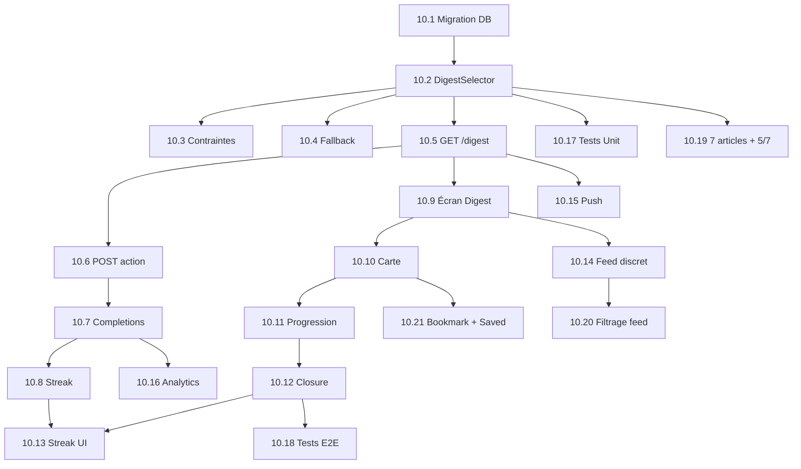

# Epic 10 : Pivot Digest Central

**Version:** 2.0
**Date:** 9 février 2026
**Auteur:** BMad Master
**Statut:** Phase 2 — Phases 1-3 livrées (GSD, 01/02→08/02), Phase 4 en cours (stories 10.19-10.21)

---

## Résumé Exécutif

Ce pivot stratégique transforme Facteur d'une application "Feed-First" (scroll infini) vers une expérience "Digest-First" centrée sur la **closure** : l'utilisateur reçoit exactement **5 articles** par jour, les traite, puis reçoit une validation satisfaisante ("Tu es informé !").

### Promesse Utilisateur

> "Sois informé de l'essentiel en 2-4 minutes. Pas de scroll infini. Juste ce qui compte, puis la liberté de passer à autre chose."

### Méthodologie

Ce pivot est basé sur la méthodologie **Jobs to be Done** :
- **Job fonctionnel** : Rester informé sans y passer des heures
- **Job émotionnel** : Se sentir "à jour" et libéré
- **Job social** : Pouvoir parler de l'actualité sans stress

---

## Changements Paradigmatiques

| Aspect | Avant (Feed-First) | Après (Digest-First) |
|--------|-------------------|---------------------|
| **Expérience principale** | Feed infini scrollable | 5 articles fixes par jour |
| **Objectif utilisateur** | Engagement maximal | Closure satisfaisante en 2-4 min |
| **Métrique North Star** | Temps passé, DAU/MAU | Weekly MoC Consistency (>5/7 jours) |
| **Gamification** | Streak lecture | Streak **closure** |
| **Feed classique** | Écran principal | Accessible via lien discret "Explorer plus" |
| **Source des articles** | Algo + curées | UNIQUEMENT sources déclarées par l'utilisateur |

---

## Objectifs Mesurables

### Métriques de "Moment of Closure" (MoC)

| Métrique | Définition | Cible V1 |
|----------|-----------|----------|
| **MoC Completion Rate** | % users ayant terminé le digest quotidien | >60% |
| **Time-to-Closure** | Temps médian pour compléter les 5 articles | 2-4 min |
| **Post-MoC Return Rate** | % users qui reviennent au feed après closure | <20% |
| **Streak de Closure** | Jours consécutifs avec digest complété | >3 jours médian |
| **NPS "Sérénité"** | Micro-survey post-closure : "Te sens-tu informé ?" | >8/10 |

---

## Architecture Technique

### Vue d'ensemble

```
┌─────────────────────────────────────────────────────────────────┐
│                    ARCHITECTURE DIGEST V1                        │
└─────────────────────────────────────────────────────────────────┘

                         ┌─────────────────┐
                         │   SCHEDULER     │
                         │   (APScheduler) │
                         └────────┬────────┘
                                  │ 08:00 Paris
                                  ▼
┌─────────────────────────────────────────────────────────────────┐
│                    DAILY DIGEST JOB                              │
│                                                                  │
│  for user in active_users:                                       │
│      1. Get user_sources (declared)                              │
│      2. Get candidates (36h window, not consumed)                │
│      3. Score (theme + freshness + une + trending + quality)     │
│      4. Apply diversity constraints (2/source, 2/theme)          │
│      5. Select top 5                                             │
│      6. Fallback curées si < 5                                   │
│      7. Persist to daily_digest table                            │
│                                                                  │
└─────────────────────────────────────────────────────────────────┘
                                  │
                                  ▼
                    ┌─────────────────────────┐
                    │     daily_digest        │
                    │  - user_id              │
                    │  - digest_date          │
                    │  - items[5] (JSONB)     │
                    │    - content_id         │
                    │    - rank               │
                    │    - status             │
                    │    - digest_reason      │
                    └─────────────────────────┘
                                  │
          ┌───────────────────────┼───────────────────────┐
          │                       │                       │
          ▼                       ▼                       ▼
┌─────────────────┐   ┌─────────────────┐   ┌─────────────────┐
│  GET /api/      │   │ POST /api/      │   │ digest_         │
│  digest         │   │ digest/{id}/    │   │ completions     │
│  → 5 articles   │   │ action          │   │ → streak        │
└─────────────────┘   └─────────────────┘   └─────────────────┘
```

### Schéma de données

```sql
-- Table principale: daily_digest (remplace/étend daily_top3)
CREATE TABLE daily_digest (
    id UUID PRIMARY KEY DEFAULT gen_random_uuid(),
    user_id UUID REFERENCES auth.users(id) NOT NULL,
    digest_date DATE NOT NULL,
    generated_at TIMESTAMPTZ NOT NULL DEFAULT NOW(),
    
    -- Items du digest (5 articles)
    items JSONB NOT NULL DEFAULT '[]',
    -- Structure item: {content_id, rank, status, digest_reason, actioned_at}
    -- status: 'pending' | 'read' | 'saved'
    
    -- Métriques
    total_items INT NOT NULL DEFAULT 5,
    items_actioned INT NOT NULL DEFAULT 0,
    is_complete BOOLEAN NOT NULL DEFAULT FALSE,
    completed_at TIMESTAMPTZ,
    
    -- Constraints
    UNIQUE(user_id, digest_date)
);

-- Table de tracking: digest_completions
CREATE TABLE digest_completions (
    id UUID PRIMARY KEY DEFAULT gen_random_uuid(),
    user_id UUID REFERENCES auth.users(id) NOT NULL,
    digest_date DATE NOT NULL,
    completed_at TIMESTAMPTZ NOT NULL DEFAULT NOW(),
    
    time_to_complete_seconds INT,
    articles_read INT NOT NULL DEFAULT 0,
    articles_saved INT NOT NULL DEFAULT 0,
    
    UNIQUE(user_id, digest_date)
);

-- Extension user_streaks
ALTER TABLE user_streaks ADD COLUMN IF NOT EXISTS closure_streak INT DEFAULT 0;
ALTER TABLE user_streaks ADD COLUMN IF NOT EXISTS longest_closure_streak INT DEFAULT 0;
ALTER TABLE user_streaks ADD COLUMN IF NOT EXISTS last_closure_date DATE;
```

---

## Stories de l'Epic

### Phase 1 : Backend Core (P0)

| # | Story | Priorité | Estimation |
|---|-------|----------|------------|
| 10.1 | Migration `daily_top3` → `daily_digest` | P0 | 2h |
| 10.2 | `DigestSelector` — Pool sources déclarées | P0 | 4h |
| 10.3 | Contraintes diversité (max 2/source, 2/thème) | P0 | 2h |
| 10.4 | Fallback sources curées | P1 | 2h |
| 10.5 | Endpoint `GET /api/digest` | P0 | 2h |
| 10.6 | Endpoint `POST /api/digest/{id}/action` | P0 | 2h |
| 10.7 | Table `digest_completions` + logique closure | P0 | 3h |
| 10.8 | Extension `user_streaks` pour closure_streak | P1 | 1h |

### Phase 2 : Frontend Core (P0)

| # | Story | Priorité | Estimation |
|---|-------|----------|------------|
| 10.9 | Écran Digest Flutter (remplace Feed) | P0 | 6h |
| 10.10 | Carte article avec actions Lu/Sauvegardé | P0 | 3h |
| 10.11 | Barre de progression (X/5) | P0 | 2h |
| 10.12 | Écran de Closure (animation + message) | P0 | 4h |

### Phase 3 : Intégration & Polish (P1-P2)

| # | Story | Priorité | Estimation |
|---|-------|----------|------------|
| 10.13 | Intégration streak closure dans UI | P1 | 2h |
| 10.14 | Relégation du feed (bouton "Explorer plus") | P1 | 1h |
| 10.15 | Notification push "Digest prêt" | P1 | 3h |
| 10.16 | Analytics events closure (MoC metrics) | P1 | 2h |
| 10.17 | Tests unitaires DigestSelector | P1 | 2h |
| 10.18 | Tests E2E flow digest → closure | P2 | 3h |

**Sous-total Phase 1-3 : ~45h** ✅ Livré (01/02 → 08/02/2026)

> **Note post-implémentation (2026-02-09):** Toutes les stories 10.1 à 10.17 ont été implémentées
> via le framework GSD (phases 01-foundation, 02-frontend, 03-polish) entre le 01/02 et le 08/02/2026.
> La story 10.18 (Tests E2E) est partiellement couverte (tests unitaires existants, tests d'intégration non formalisés).
> Les stories BMAD restaient en statut "Draft" pendant que GSD trackait l'exécution — cette mise à jour
> aligne la documentation BMAD avec l'état réel du code.

### Phase 4 : Daily Essentials Refinement (P0)

| # | Story | Priorité | Estimation |
|---|-------|----------|------------|
| 10.19 | Passage à 7 articles avec completion 5/7 + MAX_PER_SOURCE=1 | P0 | 3h |
| 10.20 | Filtrage des articles du digest dans le feed | P0 | 2h |
| 10.21 | Bookmark valide l'objectif du jour + écran "Sauvegardés" | P0 | 5h |

**Sous-total Phase 4 : ~10h**

> Les 3 stories sont indépendantes et peuvent être développées en parallèle.
> Origine : brainstorm CEO + BMAD experts (Analyst, PM, PO, Architect) du 09/02/2026.

---

## Dépendances



---

## Risques & Mitigations

| Risque | Probabilité | Impact | Mitigation |
|--------|-------------|--------|------------|
| Pool sources insuffisant | Moyenne | Élevé | Fallback sur sources curées alignées thèmes |
| 5 articles non pertinents | Élevée | Critique | Scoring robuste + diversité + feedback loop |
| Utilisateurs veulent plus | Moyenne | Moyen | Lien discret vers feed + sauvegardes |
| Perte habitude feed | Faible | Moyen | Streak closure + notification matinale |

---

## Décisions de Design

### Validées

1. **5 articles fixes** — Pas de scroll, pas de "load more" *(Phase 1-3 — étendu à 7 en Phase 4, story 10.19)*
2. **Ternaire** — Chaque article peut être "Lu", "Sauvegardé" ou "Pas intéressé" pour avancer
3. **Feed relégué** — Accessible via bouton discret "Explorer plus", jamais promu
4. **Sources déclarées only** — AUCUN article hors des sources explicitement choisies
5. **Fallback curées** — Si pool insuffisant, compléter avec meilleures sources catalogue
6. **Decay 0.70** — Facteur de décroissance multiplicatif pour diversité des sources
7. **Notification locale 8h** — Push matinal "Ton digest est prêt" (opt-in)
8. **Analytics unifiés** — Schéma content_interaction unique cross-surfaces

### Reportées V2

1. **Refresh manuel** — "Je n'aime pas ce digest, régénère"
2. **Multi-catégories** — Plusieurs digests (Tech, Actu, Culture...)
3. **Quiz post-closure** — "As-tu retenu ?"
4. **Audio digest** — Version podcast du résumé

### Phase 4 — Daily Essentials Refinement (10.19-10.21)

1. **Passage à 7 articles** — Augmente la marge d'erreur reco, completion à 5/7, MAX_PER_SOURCE=1
2. **Filtrage digest/feed** — Exclure les articles du digest du feed "Explorer plus"
3. **Bookmark = objectif** — Le bookmark valide l'objectif du jour + écran "Sauvegardés"

---

## Change Log

| Date | Version | Description | Auteur |
|------|---------|-------------|--------|
| 31/01/2026 | 1.0 | Création Epic suite session BMad | BMad Master |
| 09/02/2026 | 2.0 | Alignement BMAD avec implémentation GSD (Phases 01-03). Ajout Phase 4 (stories 10.19-10.21). Décisions validées (decay, analytics, notifications). | BMad Master |
