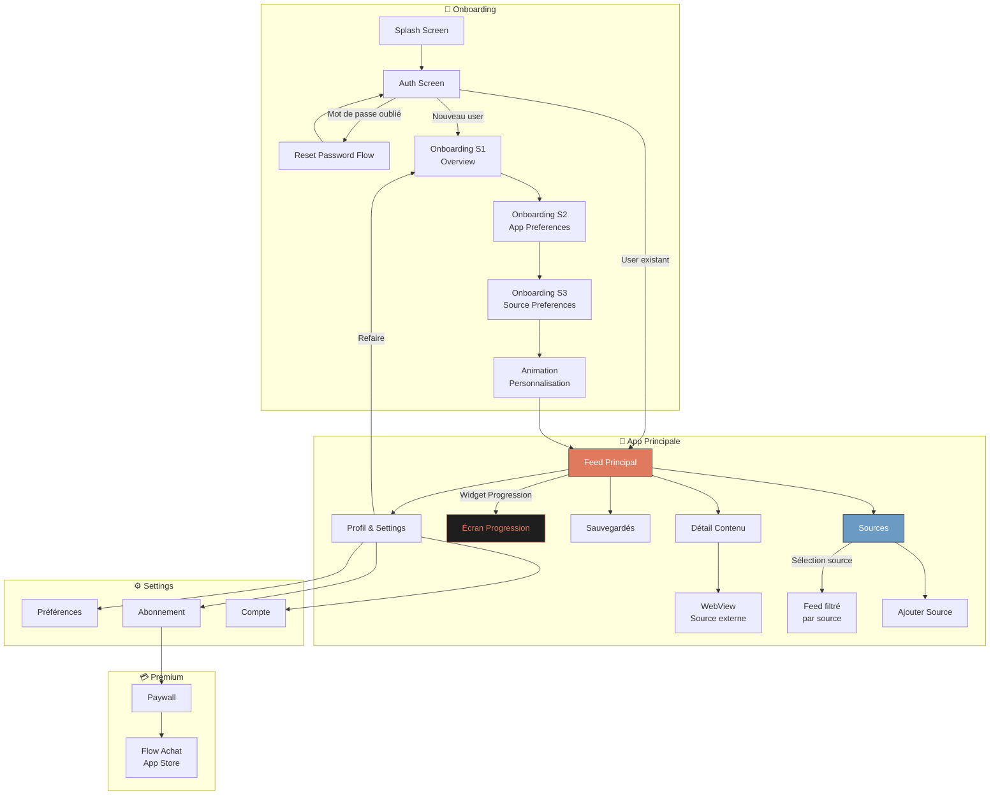
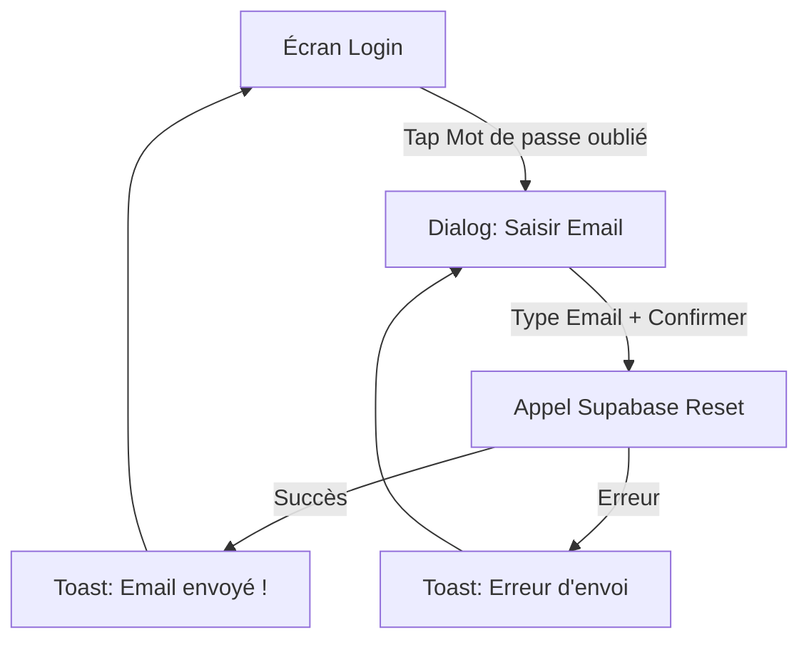
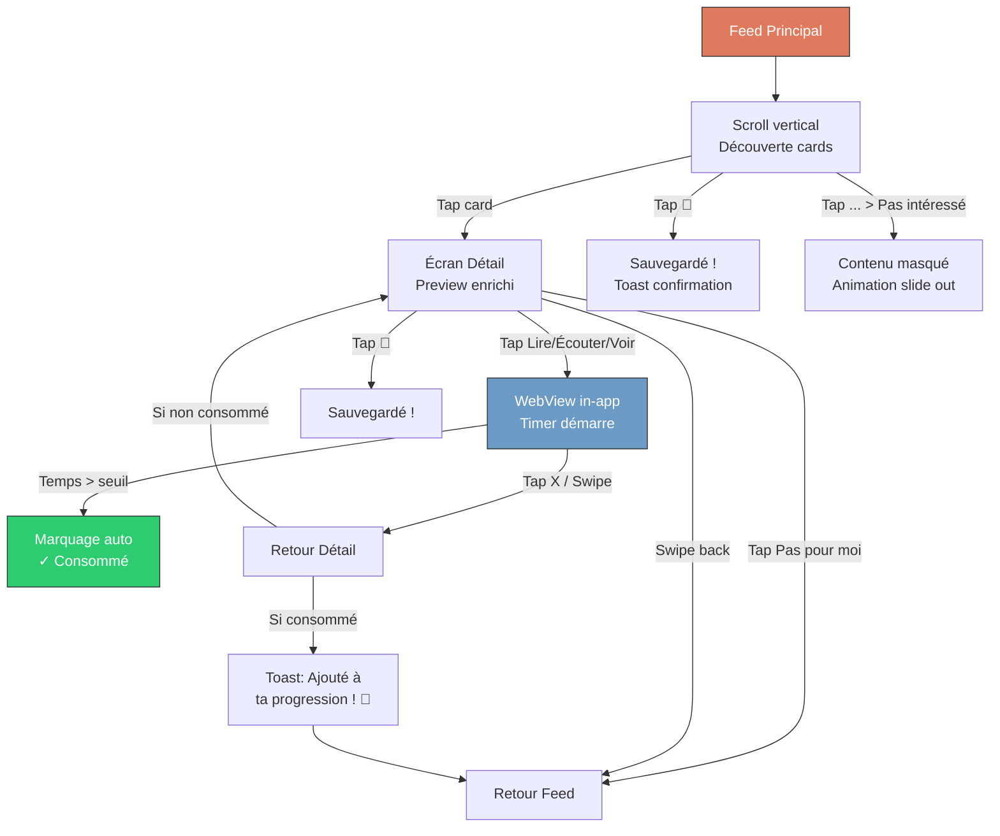
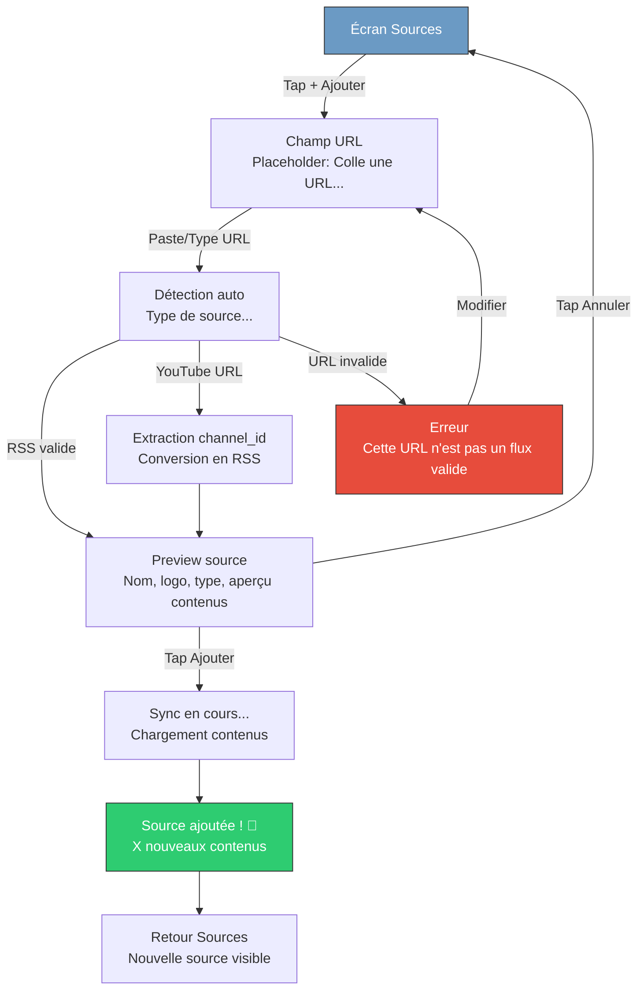
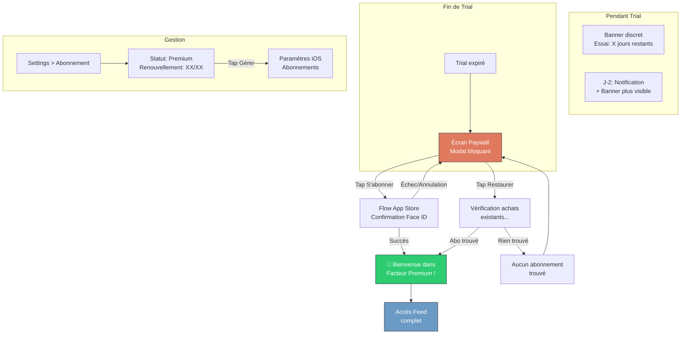

# Facteur — UI/UX Specification

**Version:** 1.0  
**Date:** 7 janvier 2026  
**Auteur:** UX Expert (Sally) — BMad Method  
**Statut:** Draft

---

## 1. Introduction

Ce document définit les objectifs d'expérience utilisateur, l'architecture de l'information, les user flows et les spécifications visuelles pour l'interface de **Facteur**. Il sert de fondation pour le design visuel et le développement frontend, assurant une expérience cohérente et centrée sur l'utilisateur.

### 1.1 Target User Personas

#### Persona Principal : Le "Curieux Intentionnel"
- **Profil :** 25-45 ans, éducation supérieure, urbain, travailleur du savoir
- **Comportement :** Abonné à 5-15 newsletters (lit 20%), a une liste de podcasts qui s'allonge, culpabilise sur les réseaux sociaux
- **Frustrations :** "Je suis submergé", "Je perds mon temps", "Je ne fais pas confiance aux algos"
- **Objectif :** Comprendre le monde de façon structurée, sans doom scrolling
- **Citation clé :** "Je veux apprendre, pas juste suivre l'actu du jour"

#### Persona Secondaire : Le "Professionnel Efficace"
- **Profil :** Cadre, entrepreneur, consultant — temps très limité
- **Comportement :** Besoin de veille sectorielle, prêt à payer pour gagner du temps
- **Frustrations :** "Je n'ai pas le temps de tout lire pour rester pertinent"
- **Objectif :** Veille efficace, contenus pertinents pour son métier

### 1.2 Usability Goals

| Objectif | Métrique cible |
|----------|---------------|
| **Apprentissage rapide** | Onboarding complet en < 3 minutes |
| **Efficacité d'usage** | Accès au premier contenu en < 5 secondes après ouverture |
| **Sentiment post-session** | "Clarté" et "Satisfaction" (vs "Flou" du doom scrolling) |
| **Finitude** | L'utilisateur peut "finir" sa session (≠ scroll infini) |
| **Rétention** | Retour 3x/semaine minimum |

### 1.3 Design Principles

1. **Clarté apaisante** — L'opposé du chaos des réseaux sociaux. Chaque élément a un but clair.
2. **Progression visible** — L'utilisateur voit qu'il avance (streak, barre de progression).
3. **Finitude intentionnelle** — Sentiment de "j'ai fini pour aujourd'hui" possible.
4. **Fluidité sans friction** — Transitions douces, pas de friction inutile.
5. **Confiance par la transparence** — L'utilisateur comprend pourquoi il voit ce qu'il voit (V1).

### Change Log

| Date | Version | Description | Auteur |
|------|---------|-------------|--------|
| 07/01/2026 | 1.0 | Création initiale | Sally (UX Expert) |
| 24/01/2026 | 1.1 | Onboarding Section 3 : Flow Thèmes → Sources avec pré-sélection (Story 2.7) | Antigravity |

---

## 2. Information Architecture

### 2.1 Site Map / Screen Inventory



### 2.2 Navigation Structure

#### Navigation Principale (Bottom Tab Bar)

| Position | Icône | Label | Écran | Description |
|----------|-------|-------|-------|-------------|
| 1 | 🏠 | Feed | Feed Principal | Contenus personnalisés, tous confondus |
| 2 | 🔖 | Sauvegardés | Liste bookmarks | Contenus mis de côté |
| 3 | 📚 | Sources | Liste des sources | Explorer/filtrer par source |
| 4 | ⚙️ | Profil | Settings | Paramètres, compte, abonnement |

#### Widget Progression (dans le Feed)

**Emplacement :** Header du Feed, sous les filtres rapides (si gamification activée)

```
┌─────────────────────────────────────────┐
│  🔥 12 jours   ████████░░ 7/10 semaine  │
│                                    →    │
└─────────────────────────────────────────┘
```

**Comportement :**
- **Visible uniquement si** `gamification = true` dans les préférences
- **Tap** → Ouvre l'écran Progression (modal ou push)
- **Design :** Discret, intégré au header, ne prend pas trop de place
- **Caché si désactivé** → Le header est plus compact

#### Écran Sources (Tab 3)

```
┌─────────────────────────────────────────┐
│  Sources                    [+ Ajouter] │
├─────────────────────────────────────────┤
│  ○ Toutes les sources (défaut)          │
├─────────────────────────────────────────┤
│  📰 CATALOGUE                           │
│  ┌───────┐ ┌───────┐ ┌───────┐         │
│  │ Hugo  │ │Underscore│ │ TTSO │        │
│  │Décrypte│ │   _   │ │  🎧  │         │
│  └───────┘ └───────┘ └───────┘         │
│                                         │
│  ➕ MES SOURCES                         │
│  ┌───────┐ ┌───────┐                   │
│  │ Mon   │ │ Ma    │                   │
│  │ blog  │ │chaîne │                   │
│  └───────┘ └───────┘                   │
└─────────────────────────────────────────┘
```

**Interactions :**
- **Tap sur une source** → Feed filtré uniquement sur cette source
- **Tap "+ Ajouter"** → Flow d'ajout de source custom
- **Long press** (sources custom) → Options (supprimer, voir infos)

#### Navigation Secondaire

| Contexte | Type | Éléments |
|----------|------|----------|
| **Feed** | Header fixe | Logo + [Widget Progression] + Filtres (type/thème) |
| **Feed filtré** | Header avec contexte | ← Retour + Nom source + Logo |
| **Détail** | Header avec back | ← Retour + Nom source + ... (menu) |
| **Settings** | Liste groupée | Sections avec chevron → |
| **Progression** | Modal/Push | Stats complètes, fermeture par X ou swipe |

---

## 3. User Flows

### 3.1 Flow Onboarding

**User Goal :** Configurer mon profil pour recevoir des contenus personnalisés dès le premier usage.

**Entry Points :** Première ouverture de l'app après inscription

**Success Criteria :** L'utilisateur arrive sur un feed personnalisé en < 3 minutes

```mermaid
flowchart TD
    START([Inscription réussie]) --> S1_INTRO[Section 1: Overview<br/>Écran intro animé]
    
    subgraph "Section 1 — Overview"
        S1_INTRO --> Q1[Q1: Pourquoi es-tu là ?<br/>• Apprendre • Me cultiver • Veille pro]
        Q1 --> R1[Réaction: Super ! Facteur est fait<br/>pour ça...]
        R1 --> Q2[Q2: Tranche d'âge<br/>18-24 / 25-34 / 35-44 / 45+]
        Q2 --> Q3[Q3: Genre<br/>Optionnel]
        Q3 --> Q4[Q4: Tu préfères...<br/>• Aller droit au but • Prendre le temps]
    end
    
    Q4 --> S2_INTRO[Section 2: App Preferences<br/>Transition animée]
    
    subgraph "Section 2 — App Preferences"
        S2_INTRO --> Q5[Q5: Big-picture ou Détails ?<br/>Illustration choix visuel]
        Q5 --> Q6[Q6: Réponses tranchées ou nuancées ?]
        Q6 --> Q7[Q7: Actu récente ou analyses long-terme ?]
        Q7 --> R2[Réaction contextuelle]
        R2 --> Q8[Q8: Activer la gamification ?<br/>🔥 Streak + 📊 Progression]
        Q8 --> |Oui| Q8B[Q8b: Objectif hebdo ?<br/>5 / 10 / 15 contenus]
        Q8 --> |Non| S3_INTRO
        Q8B --> S3_INTRO
    end
    
    S3_INTRO[Section 3: Sources<br/>Transition animée]
    
    subgraph "Section 3 — Source Preferences"
        S3_INTRO --> Q9[Q9: Tes thèmes ?<br/>Multi-sélection avec sous-thèmes]
        Q9 --> Q10[Q10: Tes sources de confiance ?<br/>Pré-sélection automatique + message 💡]
        Q10 --> FINALIZE[Écran Finalize<br/>Résumé + Créer mon flux]
    end
    
    FINALIZE --> FINAL[Animation finale<br/>Préparation du feed...]
    FINAL --> FEED([Feed personnalisé 🎉])
    
    style START fill:#1E1E1E,stroke:#E07A5F
    style FEED fill:#E07A5F,stroke:#333,color:#fff
    style FINAL fill:#6B9AC4,stroke:#333,color:#fff
```



**Edge Cases & Error Handling :**
- ⚠️ Fermeture app pendant onboarding → Reprendre là où on en était
- ⚠️ Aucun thème sélectionné (Q9) → Empêcher de continuer, message d'erreur doux
- ⚠️ Pré-sélection sources (Q10) → Si aucune source recommandée, afficher liste vide avec message "Sélectionnez les sources qui vous intéressent"
- ⚠️ Connexion perdue → Sauvegarder localement, sync au retour
- ⚠️ Session non-persistante → Forcer login au démarrage si "Rester connecté" décoché

**Note UX (Section 3) :** L'ordre Thèmes → Sources permet de pré-sélectionner automatiquement des sources basées sur les intérêts de l'utilisateur. Un message informatif "💡 Pré-sélection basée sur vos thèmes" est affiché pour expliquer cette pré-sélection.

---

### 3.1b Flow Mot de passe oublié

**User Goal :** Récupérer l'accès à mon compte si j'ai oublié mon mot de passe.

**Entry Points :** Écran Login > "Mot de passe oublié ?"

**Success Criteria :** Email de réinitialisation envoyé et confirmation affichée.




### 3.2 Flow Découverte & Consommation

**User Goal :** Découvrir un contenu intéressant et le consulter.

**Entry Points :** Feed principal, Feed filtré par source, Sauvegardés

**Success Criteria :** Contenu marqué comme "consommé" après lecture/écoute



**Seuils de consommation :**

| Type | Seuil | Logique |
|------|-------|---------|
| 📄 Article | 30 secondes | Temps de lecture minimum |
| 🎧 Podcast | 60 secondes | Début d'écoute significatif |
| 🎬 Vidéo | 60 secondes | Engagement confirmé |

**Edge Cases :**
- ⚠️ Perte de connexion pendant WebView → Cache local si possible, message
- ⚠️ Fermeture app dans WebView → Timer sauvegardé, reprise au retour
- ⚠️ Contenu déjà consommé → Badge "✓ Lu" sur la card, pas de double comptage

---

### 3.3 Flow Gestion des Sources

**User Goal :** Ajouter une source personnalisée pour enrichir mon feed.

**Entry Points :** Tab Sources > "+ Ajouter"

**Success Criteria :** Source ajoutée et premiers contenus visibles dans le feed



**Types détectés automatiquement :**
- `https://example.com/feed.xml` → RSS Article
- `https://example.com/podcast.rss` → RSS Podcast  
- `https://youtube.com/channel/...` ou `@handle` → YouTube RSS

**Edge Cases :**
- ⚠️ URL déjà ajoutée → Message "Tu suis déjà cette source"
- ⚠️ Flux sans contenu → Warning "Ce flux semble vide"
- ⚠️ Timeout détection → "Impossible de vérifier, réessaie"

---

### 3.4 Flow Premium & Paywall

**User Goal :** M'abonner pour continuer à utiliser Facteur après le trial.

**Entry Points :** Fin de trial (J+7), Settings > Abonnement

**Success Criteria :** Abonnement activé, accès complet restauré



**Contenu Paywall :**

```
┌─────────────────────────────────────────┐
│           [Illustration]                │
│                                         │
│    Continue à apprendre avec            │
│         Facteur Premium                 │
│                                         │
│  ✓ Accès illimité à ton feed            │
│  ✓ Sources personnalisées               │
│  ✓ Progression & statistiques           │
│  ✓ Nouveautés en avant-première         │
│                                         │
│  ┌─────────────────────────────────┐   │
│  │  7,99€/mois  ou  49,99€/an     │   │
│  │       (économise 48%)           │   │
│  └─────────────────────────────────┘   │
│                                         │
│  [    S'abonner - 7,99€/mois    ]      │
│                                         │
│  Restaurer mes achats                   │
│  Conditions · Confidentialité           │
└─────────────────────────────────────────┘
```

**Edge Cases :**
- ⚠️ Paiement en cours interrompu → Reprendre le flow
- ⚠️ Abo expiré (non renouvelé) → Retour au paywall
- ⚠️ Changement de device → Restaurer achats automatiquement au login

---

## 4. Wireframes & Mockups

### 4.1 Design Files

**Primary Design Files :** À créer dans Figma (post-validation de ce document)

**Référence style :** Notion (simplicité) + Le Monde (crédibilité) + Deepstash (fluidité)

---

### 4.2 Key Screen Layouts

#### Écran 1 : Feed Principal

**Purpose :** Écran d'accueil, point d'entrée vers tous les contenus personnalisés

```
┌─────────────────────────────────────────┐
│ ▄▄▄                              ●●●    │  ← Status bar iOS
├─────────────────────────────────────────┤
│  📬 Facteur                             │  ← Header avec logo
├─────────────────────────────────────────┤
│  🔥 12    ████████░░ 7/10    →          │  ← Widget progression (optionnel)
├─────────────────────────────────────────┤
│  [Tous] [📄 Articles] [🎧 Podcasts] [🎬]│  ← Filtres chips scrollables
├─────────────────────────────────────────┤
│                                         │
│  ┌─────────────────────────────────┐   │
│  │ ┌─────────┐                     │   │
│  │ │ 🖼️      │  Hugo Décrypte      │   │  ← Card contenu
│  │ │ Thumb   │  L'IA va-t-elle...  │   │
│  │ │         │  📄 8 min · Il y a 2h│   │
│  │ └─────────┘                 🔖  │   │
│  └─────────────────────────────────┘   │
│                                         │
│  ┌─────────────────────────────────┐   │
│  │ ┌─────────┐                     │   │
│  │ │ 🖼️      │  Underscore_       │   │
│  │ │ Thumb   │  Le futur de...     │   │
│  │ │         │  🎧 45 min · Hier   │   │
│  │ └─────────┘                 🔖  │   │
│  └─────────────────────────────────┘   │
│                                         │
├─────────────────────────────────────────┤
│  🏠        🔖        📚        ⚙️       │  ← Bottom tab bar
│  Feed    Saved    Sources   Profil     │
└─────────────────────────────────────────┘
```

**Key Elements :**
- Header fixe avec logo Facteur
- Widget progression conditionnel (si gamification ON)
- Filtres horizontaux scrollables
- Liste de cards avec infinite scroll
- Bottom tab bar (4 items)

**Interaction Notes :**
- Pull-to-refresh depuis le haut
- Tap card → Écran détail
- Tap ❤️ → Toggle like (feedback haptic, boost subtopic +0.15)
- Tap 🔖 → Toggle sauvegarde (feedback haptic, boost subtopic +0.05)
- Tap 👁️ → Masquer article ("Voir moins")
- Tap ℹ️ → Ouvrir bottom sheet personnalisation
- Long press card (digest) → Afficher scoring breakdown

---

#### Écran 2 : Card Contenu (Composant)

**Purpose :** Aperçu d'un contenu dans le feed et le digest

```
┌─────────────────────────────────────────┐
│ ┌─────────────────────────────────────┐ │
│ │          IMAGE THUMBNAIL            │ │  ← Image 16:9
│ └─────────────────────────────────────┘ │
│  Titre du contenu sur deux lignes max   │  ← Titre (3 lignes max)
│  📄 8 min                               │  ← Type + durée
├─────────────────────────────────────────┤
│  🔵 Source · 2h    ❤️  🔖  👁️  ℹ️       │  ← Footer: Source + Actions
└─────────────────────────────────────────┘
```

**Footer Action Bar** (Story 4.1f) — 4 boutons compacts alignés à droite :

| Icône | Action | État actif | Couleur active |
|-------|--------|------------|----------------|
| ❤️ `PhosphorIcons.heart` | Like / Unlike | `isLiked` → fill | Terracotta `#E07A5F` |
| 🔖 `PhosphorIcons.bookmark` | Save / Unsave | `isSaved` → fill | Terracotta `#E07A5F` |
| 👁️ `PhosphorIcons.eyeSlash` | Voir moins | - | `textSecondary` |
| ℹ️ `PhosphorIcons.info` | Ouvrir personnalisation | - | `textSecondary` |

> **Note :** Le bouton ℹ️ ouvre un `ModalBottomSheet` (personnalisation dans le feed, scoring breakdown dans le digest). L'ancien bouton texte "Personnalisation" a été remplacé par cette icône compacte.

Variante "Lu" :
```
┌─────────────────────────────────────────┐
│ ┌─────────────────────────────────────┐ │
│ │     IMAGE (opacity 0.6)      [✓ Lu]│ │  ← Badge "Lu" en haut à droite
│ └─────────────────────────────────────┘ │
│  Titre du contenu...                    │
├─────────────────────────────────────────┤
│  🔵 Source · Lu      ❤️  🔖  👁️  ℹ️    │
└─────────────────────────────────────────┘
```

**Variants :** Default (non lu), Read (lu), Saved (sauvegardé), Liked (aimé)

**States :** Normal, Pressed (scale 0.98), Loading (skeleton)

---

#### Écran 3 : Détail Contenu

**Purpose :** Preview enrichi avant redirection vers la source

```
┌─────────────────────────────────────────┐
│  ←  Hugo Décrypte                  ···  │  ← Header avec back
├─────────────────────────────────────────┤
│                                         │
│  ┌─────────────────────────────────┐   │
│  │                                 │   │
│  │         IMAGE LARGE             │   │  ← Thumbnail grand format
│  │         (16:9)                  │   │
│  │                                 │   │
│  └─────────────────────────────────┘   │
│                                         │
│  L'IA va-t-elle remplacer               │  ← Titre complet
│  les développeurs ?                     │
│                                         │
│  📄 Article · 8 min de lecture          │  ← Type + durée
│  Publié il y a 2 heures                 │  ← Date relative
│                                         │
│  ─────────────────────────────────────  │
│                                         │
│  Lorem ipsum dolor sit amet,            │  ← Description/extrait
│  consectetur adipiscing elit. Sed       │
│  do eiusmod tempor incididunt ut        │
│  labore et dolore magna aliqua...       │
│                                         │
│  ─────────────────────────────────────  │
│                                         │
│  ┌─────────────────────────────────┐   │
│  │        📖 Lire l'article        │   │  ← CTA principal
│  └─────────────────────────────────┘   │
│                                         │
│  🔖 Sauvegarder    ✕ Pas pour moi      │  ← Actions secondaires
│                                         │
└─────────────────────────────────────────┘
```

**Interaction Notes :**
- Swipe right → Retour au feed
- CTA dynamique selon type (📖 Lire / 🎧 Écouter / ▶️ Voir)

---

#### Écran 4 : Onboarding Question

**Purpose :** Écran type pour les questions de l'onboarding

```
┌─────────────────────────────────────────┐
│                                         │
│  ████████████░░░░░░░░  Section 1/3     │  ← Progress bar
│                                         │
│                                         │
│           [Illustration]                │  ← Illustration thématique
│                                         │
│                                         │
│     Pourquoi es-tu là ?                 │  ← Question
│                                         │
│  ┌─────────────────────────────────┐   │
│  │  📚  Apprendre de nouvelles     │   │  ← Option 1
│  │      choses                     │   │
│  └─────────────────────────────────┘   │
│                                         │
│  ┌─────────────────────────────────┐   │
│  │  🌍  Me cultiver et comprendre  │   │  ← Option 2
│  │      le monde                   │   │
│  └─────────────────────────────────┘   │
│                                         │
│  ┌─────────────────────────────────┐   │
│  │  💼  Faire ma veille            │   │  ← Option 3
│  │      professionnelle            │   │
│  └─────────────────────────────────┘   │
│                                         │
└─────────────────────────────────────────┘
```

**Variants :** Single choice, Multi choice (chips), Binary choice, Slider

**States :** Default, Selected (border terracotta), Disabled

---

#### Écran 5 : Paywall

**Purpose :** Conversion trial → premium

```
┌─────────────────────────────────────────┐
│                                    ✕    │  ← Close (si accessible)
│                                         │
│           [Illustration                 │
│            Facteur Premium]             │  ← Illustration branded
│                                         │
│     Continue à apprendre avec           │
│        Facteur Premium ✨               │  ← Titre accrocheur
│                                         │
│  ┌─────────────────────────────────┐   │
│  │ ✓ Accès illimité à ton feed     │   │
│  │ ✓ Sources personnalisées        │   │  ← Value props
│  │ ✓ Progression & statistiques    │   │
│  │ ✓ Nouveautés en avant-première  │   │
│  └─────────────────────────────────┘   │
│                                         │
│  ┌─────────────────────────────────┐   │
│  │ ○  7,99€/mois                   │   │  ← Option mensuel
│  └─────────────────────────────────┘   │
│  ┌─────────────────────────────────┐   │
│  │ ●  49,99€/an  💎 -48%           │   │  ← Option annuel (recommandé)
│  └─────────────────────────────────┘   │
│                                         │
│  ┌─────────────────────────────────┐   │
│  │         S'abonner               │   │  ← CTA principal
│  └─────────────────────────────────┘   │
│                                         │
│     Restaurer mes achats               │  ← Lien secondaire
│     Conditions · Confidentialité        │
│                                         │
└─────────────────────────────────────────┘
```

---

## 5. Component Library / Design System

### 5.1 Design System Approach

**Approche :** Design system custom léger, inspiré de Material Design 3 avec personnalisation Facteur.

**Librairie Flutter :** Composants custom basés sur les widgets natifs Flutter.

### 5.2 Core Components

#### Buttons

| Variant | Usage | Style |
|---------|-------|-------|
| **Primary** | CTA principal | Fond terracotta #E07A5F, texte blanc |
| **Secondary** | Actions secondaires | Fond transparent, border terracotta |
| **Ghost** | Actions tertiaires | Texte terracotta, pas de fond |
| **Danger** | Actions destructives | Fond rouge #E74C3C |

**States :** Default, Pressed (opacity 0.8), Disabled (opacity 0.4), Loading (spinner)

#### Cards

| Variant | Usage |
|---------|-------|
| **Content Card** | Affichage contenu dans le feed |
| **Source Card** | Affichage source dans l'écran Sources |
| **Selection Card** | Choix dans l'onboarding |

**Style commun :** Background #1E1E1E, Border radius 12px, Padding 16px

#### Inputs

| Type | Usage |
|------|-------|
| **Text Input** | Ajout URL source |
| **Search** | (V1) Recherche dans feed |
| **Chips** | Filtres, multi-sélection onboarding |

**Style :** Background #252525, Border 1px #333 (focus: terracotta), Border radius 8px

#### Navigation

| Component | Description |
|-----------|-------------|
| **Bottom Tab Bar** | 4 tabs, icônes + labels |
| **Header** | Logo ou titre + actions |
| **Back Button** | ← Retour navigation stack |

#### Feedback

| Component | Usage |
|-----------|-------|
| **Toast** | Confirmations rapides |
| **Snackbar** | Messages avec action |
| **Modal** | Confirmations importantes |
| **Skeleton** | Loading state des cards |

#### Progress

| Component | Usage |
|-----------|-------|
| **Progress Bar** | Onboarding, objectif hebdo |
| **Streak Badge** | 🔥 X jours |
| **Circular Progress** | Chargements |

#### Digest Mode Selector

| Component | Usage |
|-----------|-------|
| **DigestModeSegmentedControl** | Sélecteur de mode compact iOS-style (3 modes) dans le header de la carte digest |
| **DigestBriefingSection** | Container principal du digest avec gradient adaptatif selon le mode |

**Modes disponibles (3) :**

| Mode | Icône Phosphor | Couleur | Gradient Card (dark) | Background (dark) | Sous-titre |
|------|---------------|---------|---------------------|-------------------|------------|
| Pour vous | `sunDim` (fill) | `#D4944C` (ambre doré) | `#261C0E → #1A1408` | `#1A150C` | "Votre sélection personnalisée" |
| Serein | `flowerLotus` (fill) | `#4CAF7D` (jade/forêt) | `#0E2218 → #0A1A10` | `#0C1A10` | "Sans politique ni infos anxiogènes" |
| Perspective | `detective` (fill) | `#6B8FBF` (bleu acier) | `#0E1526 → #0A101E` | `#0C1220` | "Découvrir l'autre bord politique" |

**Comportement :**
- Sliding indicator animé (AnimatedPositioned 250ms, easeOutCubic)
- Bordure + glow couleur du mode sur segment sélectionné
- Le container digest anime son gradient via TweenAnimationBuilder (500ms)
- Sous-titre contextuel apparaît 4s après changement, puis disparaît
- Pendant régénération : articles en opacité 0.15 + overlay pulsing glow

**Fichiers source :**
- `apps/mobile/lib/features/digest/models/digest_mode.dart`
- `apps/mobile/lib/features/digest/widgets/digest_mode_tab_selector.dart`
- `apps/mobile/lib/features/digest/widgets/digest_briefing_section.dart`

---

## 6. Branding & Style Guide

### 6.1 Visual Identity

**Brand Guidelines :** Document dédié à créer (logo, ton, illustrations)

**Positionnement visuel :**
- **Crédibilité** (Le Monde) — Sérieux, typographie éditoriale
- **Accessibilité** (Notion) — Simplicité, clarté, espaces
- **Chaleur** (Le Facteur) — Touche humaine, couleurs chaudes en accent

**Thème par défaut :** 🌙 **Dark Mode**

---

### 6.2 Color Palette

#### Couleurs principales

| Rôle | Nom | Hex | Usage |
|------|-----|-----|-------|
| **Background Primary** | Noir profond | `#121212` | Fond principal de l'app |
| **Background Secondary** | Noir élevé | `#1A1A1A` | Fond alternatif, sections |
| **Surface** | Gris charbon | `#1E1E1E` | Cards, éléments surélevés |
| **Surface Elevated** | Gris foncé | `#252525` | Inputs, éléments interactifs |

#### Couleurs d'accent

| Rôle | Nom | Hex | Usage |
|------|-----|-----|-------|
| **Primary / Accent** | Terracotta | `#E07A5F` | CTAs, éléments actifs, liens |
| **Primary Hover** | Terracotta clair | `#E8917A` | Hover states |
| **Secondary** | Bleu acier | `#6B9AC4` | Éléments secondaires, infos |

#### Couleurs sémantiques

| Rôle | Nom | Hex | Usage |
|------|-----|-----|-------|
| **Success** | Vert émeraude | `#2ECC71` | Confirmations, succès |
| **Warning** | Orange ambre | `#F39C12` | Alertes, attention |
| **Error** | Rouge corail | `#E74C3C` | Erreurs, actions destructives |
| **Info** | Bleu info | `#3498DB` | Informations neutres |

#### Couleurs de texte

| Rôle | Hex | Opacity | Usage |
|------|-----|---------|-------|
| **Text Primary** | `#F5F5F5` | 100% | Titres, texte principal |
| **Text Secondary** | `#F5F5F5` | 70% | Sous-titres, métadonnées |
| **Text Tertiary** | `#F5F5F5` | 50% | Placeholders, hints |
| **Text Disabled** | `#F5F5F5` | 30% | États désactivés |

---

### 6.3 Typography

#### Font Families

| Usage | Font | Fallback | Poids |
|-------|------|----------|-------|
| **Primary (Titres)** | **Fraunces** | Georgia, serif | 400, 500, 600, 700 |
| **Secondary (Corps)** | **DM Sans** | -apple-system, sans-serif | 400, 500, 700 |
| **Monospace** | **JetBrains Mono** | monospace | 400 |

**Pourquoi ces choix :**
- **Fraunces** : Typographie éditoriale avec du caractère, inspiration presse de qualité
- **DM Sans** : Lisibilité parfaite sur écran, géométrique mais chaleureux

#### Type Scale

| Element | Font | Size | Weight | Line Height |
|---------|------|------|--------|-------------|
| **H1 / Display** | Fraunces | 32px | 600 | 1.2 |
| **H2 / Title** | Fraunces | 24px | 600 | 1.3 |
| **H3 / Headline** | Fraunces | 20px | 500 | 1.3 |
| **Body Large** | DM Sans | 17px | 400 | 1.5 |
| **Body** | DM Sans | 15px | 400 | 1.5 |
| **Body Small** | DM Sans | 13px | 400 | 1.4 |
| **Caption** | DM Sans | 12px | 500 | 1.3 |
| **Overline** | DM Sans | 11px | 700 | 1.2 |

---

### 6.4 Iconography

**Icon Library :** [Phosphor Icons](https://phosphoricons.com/)

**Style par défaut :** Regular (outline)  
**Style actif/sélectionné :** Fill (rempli)

| Contexte | Icône | Phosphor Name |
|----------|-------|---------------|
| Feed | 🏠 | `house` |
| Sauvegardés | 🔖 | `bookmark-simple` |
| Sources | 📚 | `books` |
| Profil | ⚙️ | `gear` |
| Article | 📄 | `article` |
| Podcast | 🎧 | `headphones` |
| Vidéo | 🎬 | `video` |
| Streak | 🔥 | `fire` |

**Tailles :** Navigation 24px, In-content 20px, Small 16px

---

### 6.5 Spacing & Layout

#### Spacing Scale (base 4px)

| Token | Value | Usage |
|-------|-------|-------|
| `space-1` | 4px | Icône-texte |
| `space-2` | 8px | Padding inputs |
| `space-3` | 12px | Entre éléments liés |
| `space-4` | 16px | Padding cards, marges standard |
| `space-6` | 24px | Entre groupes |
| `space-8` | 32px | Sections majeures |

#### Border Radius

| Element | Radius |
|---------|--------|
| Cards | 12px |
| Buttons | 8px |
| Inputs | 8px |
| Chips | 20px (pill) |
| Thumbnails | 8px |

---

## 7. Accessibility Requirements

### 7.1 Compliance Target

**Standard :** WCAG 2.1 Level AA

### 7.2 Key Requirements

#### Visual

| Requirement | Specification |
|-------------|---------------|
| **Color Contrast** | Minimum 4.5:1 (texte normal), 3:1 (texte large) |
| **Focus Indicators** | Ring visible 2px terracotta sur tous les éléments focusables |
| **Text Sizing** | Support Dynamic Type iOS (jusqu'à 200%) |
| **Color Independence** | Information jamais transmise uniquement par la couleur |

#### Interaction

| Requirement | Specification |
|-------------|---------------|
| **Touch Targets** | Minimum 44x44pt pour tous les éléments interactifs |
| **Gesture Alternatives** | Toute action par geste a une alternative bouton |
| **Screen Reader** | Support complet VoiceOver iOS |
| **Reduced Motion** | Respecter `prefers-reduced-motion` |

#### Content

| Requirement | Specification |
|-------------|---------------|
| **Alternative Text** | Toutes les images ont un alt text descriptif |
| **Heading Structure** | Hiérarchie logique H1 → H2 → H3 |
| **Form Labels** | Tous les inputs ont des labels associés |
| **Error Messages** | Erreurs clairement identifiées et décrites |

### 7.3 Testing Strategy

- Tests manuels VoiceOver sur device réel
- Audit contraste avec Stark ou Figma plugin
- Validation Dynamic Type sur toutes les tailles
- Tests utilisateurs avec personnes en situation de handicap (V1)

---

## 8. Responsiveness Strategy

### 8.1 Target Platform

**MVP :** iOS uniquement (iPhone)

**Devices supportés :**

| Device | Screen Width | Priorité |
|--------|--------------|----------|
| iPhone SE (3rd gen) | 375pt | ✅ Support |
| iPhone 14/15 | 390pt | ✅ Prioritaire |
| iPhone 14/15 Pro Max | 430pt | ✅ Support |

### 8.2 Adaptation Patterns

**Layout :** Pas de breakpoints, layout fluide qui s'adapte

| Element | Comportement |
|---------|--------------|
| **Cards** | Largeur 100% - marges (16px chaque côté) |
| **Images** | Ratio fixe (16:9), largeur responsive |
| **Texte** | Wrap naturel, pas de troncature excessive |
| **Bottom Tab** | Espacement égal, labels toujours visibles |

### 8.3 Safe Areas

- Respect des safe areas iOS (notch, home indicator)
- Bottom tab bar au-dessus du home indicator
- Contenu scrollable sous le notch avec padding

---

## 9. Animation & Micro-interactions

### 9.1 Motion Principles

1. **Purposeful** — Chaque animation a une raison (feedback, orientation, délice)
2. **Quick** — Durées courtes pour ne pas ralentir l'utilisateur
3. **Natural** — Easings physiques, pas de mouvements robotiques
4. **Respectful** — Respecter `prefers-reduced-motion`

### 9.2 Key Animations

| Animation | Trigger | Duration | Easing | Description |
|-----------|---------|----------|--------|-------------|
| **Card Press** | Touch down | 100ms | ease-out | Scale 0.98 |
| **Card Release** | Touch up | 150ms | ease-out | Scale 1.0 |
| **Bookmark Toggle** | Tap | 200ms | spring | Icône pulse + fill |
| **Toast Appear** | Event | 200ms | ease-out | Slide up + fade in |
| **Toast Dismiss** | Auto/swipe | 150ms | ease-in | Slide down + fade out |
| **Screen Transition** | Navigation | 300ms | ease-in-out | Slide horizontal |
| **Modal Appear** | Open | 250ms | spring | Scale up + fade |
| **Pull to Refresh** | Pull | — | linear | Rotation spinner |
| **Skeleton Shimmer** | Loading | 1500ms | linear | Gradient sweep loop |
| **Streak Celebration** | Record | 800ms | spring | Confetti + scale |
| **Progress Bar Fill** | Update | 400ms | ease-out | Width animation |

### 9.3 Transition Patterns

| Pattern | Usage |
|---------|-------|
| **Push** | Navigation vers un écran enfant (Feed → Détail) |
| **Modal** | Overlays (Paywall, Progression) |
| **Fade** | Changement de contenu dans le même écran |
| **Slide Out** | Suppression d'élément (Pas intéressé) |

---

## 10. Performance Considerations

### 10.1 Performance Goals

| Metric | Target | Measurement |
|--------|--------|-------------|
| **App Launch** | < 2s | Cold start to interactive |
| **Feed Load** | < 1s | API response + render |
| **Scroll FPS** | 60fps | Constant during scroll |
| **Interaction Response** | < 100ms | Touch to visual feedback |
| **Animation FPS** | 60fps | No dropped frames |

### 10.2 Design Strategies

| Strategy | Implementation |
|----------|----------------|
| **Image Optimization** | Thumbnails en WebP, tailles adaptées au device |
| **Lazy Loading** | Images chargées à l'approche du viewport |
| **Skeleton States** | Placeholder pendant chargement (pas de spinner plein écran) |
| **Pagination** | 20 items par page, infinite scroll |
| **Caching** | Cache local des contenus déjà vus |
| **Offline Support** | Contenus cachés accessibles hors ligne |

### 10.3 Perceived Performance

| Technique | Usage |
|-----------|-------|
| **Optimistic UI** | Bookmark sauvegardé visuellement avant confirmation API |
| **Progressive Loading** | Texte d'abord, images ensuite |
| **Instant Feedback** | Feedback visuel immédiat sur toute interaction |
| **Preloading** | Préchargement de l'écran Détail au scroll proche |

---

## 11. Next Steps

### 11.1 Immediate Actions

1. ✅ Valider ce document avec les stakeholders
2. 🎨 Créer les maquettes Figma haute-fidélité
3. 🏗️ Passer à l'Architecture technique (Architect agent)
4. 📋 Créer les stories de développement

### 11.2 Design Handoff Checklist

- [x] User flows documentés
- [x] Component inventory complet
- [x] Accessibility requirements définis
- [x] Responsive strategy claire
- [x] Brand guidelines incorporés
- [x] Performance goals établis
- [ ] Maquettes Figma créées
- [ ] Prototype interactif validé
- [ ] Assets exportés (icônes, images)

---

*Document généré via BMad Method — UX Expert (Sally)*

