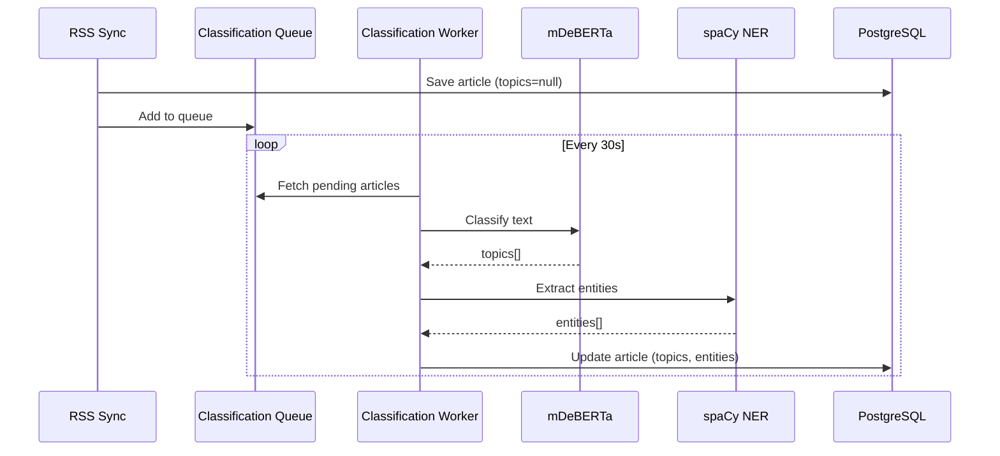

# User Story 4.2 : Recommendation Engine V3 - ML Classification + NER

**Status:** Draft  
**Priority:** P0 - Critical  
**Sprint:** 2026-W05 / W06  
**Owner:** Lead Developer  
**Estimated Effort:** 12 days (2 weeks)

---

## 🎯 Context & Problem Statement

### Current Situation
The existing recommendation system (Story 4.1) has critical limitations:

1. **Theme Matching Bug:** `Source.theme` contains French labels ("Tech & Futur") while `UserInterest.interest_slug` contains normalized slugs ("tech"). The matching never works → recommendations are quasi-random.

2. **Static Taxonomy:** 47 predefined topics are too broad to capture user niches like "Neuralink", "fast fashion", or specific geopolitical events.

3. **ML Not Integrated:** The mDeBERTa classification service exists but is **never called** during RSS sync. Articles inherit `source.granular_topics` without ML classification.

4. **No Entity Recognition:** Cannot detect specific entities (people, organizations, products) that users care about.

### Goal
Build a GAFAM-level recommendation system with:
- **3-level architecture:** Broad labels (47) + Unlimited entities (NER) + Micro-topics
- **Asynchronous ML processing:** No sync delays, scalable to 1000+ articles/day
- **Granular user profiling:** Detect and score user interests at entity level
- **Transparent scoring:** Users understand WHY an article is recommended

---

## 📋 Acceptance Criteria (Gherkin)

### AC-1: Theme Matching Fixed
```gherkin
Given a user with interests=["tech", "science"]
When the system evaluates an article from source.theme="tech"
Then the ThemeMatch bonus (+50pts) is applied
And the recommendation reason shows "Thème: Tech & Innovation"
```

### AC-2: Asynchronous Classification
```gherkin
Given a RSS sync imports 50 new articles
When the sync completes
Then all articles are saved within 2 seconds
And added to the classification queue
And a background worker processes them without blocking
```

### AC-3: mDeBERTa Classification
```gherkin
Given an article with title "Elon Musk launches Neuralink brain chip"
When the classification worker processes it
Then content.topics contains relevant labels like ["tech", "science"]
And processing time is < 300ms
```

### AC-4: NER Extraction
```gherkin
Given an article mentioning "Elon Musk" and "Tesla"
When the NER service extracts entities
Then content.entities contains ["Elon Musk", "Tesla"]
And entity types are stored (PERSON, ORG, PRODUCT)
```

### AC-5: Entity-Aware Scoring
```gherkin
Given a user who read 3 articles mentioning "Tesla"
When a new article mentions "Tesla"
Then EntityLayer adds +60pts to the score
And the recommendation reason shows "Centre d'intérêt: Tesla"
```

### AC-6: System Monitoring
```gherkin
Given the system is in production
When I check metrics
Then classification avg time < 250ms
And success rate > 95%
And topic accuracy > 80%
```

---

## 🏗️ Architecture Overview

### 3-Level Recommendation System

```
┌─────────────────────────────────────────────────────────────┐
│                    RECOMMENDATION V3                        │
├─────────────────────────────────────────────────────────────┤
│                                                             │
│  LEVEL 1: Broad Labels (47 topics)                         │
│  ├─ mDeBERTa zero-shot classification                       │
│  ├─ High precision (85-90%)                                │
│  └─ Stored in: content.topics[]                            │
│                                                             │
│  LEVEL 2: Named Entities (Unlimited)                       │
│  ├─ spaCy NER extraction                                    │
│  ├─ People, orgs, products, events                         │
│  └─ Stored in: content.entities[]                          │
│                                                             │
│  LEVEL 3: User Interest Detection                          │
│  ├─ Track entities in read articles                        │
│  ├─ Build user_entity profile                              │
│  └─ Score: +60pts per matched entity                       │
│                                                             │
└─────────────────────────────────────────────────────────────┘
```

### Data Flow



---

## 📊 Scoring Matrix V3

| Layer | Match Type | Score | Reason Label |
|-------|-----------|-------|--------------|
| **CoreLayer** | Theme match (source.theme) | +50 | "Thème match" |
| **CoreLayer** | Trusted source (followed) | +40 | "Source suivie" |
| **ArticleTopicLayer** | Topic match (content.topics) | +40 per topic | "Sujet: {topic}" |
| **EntityLayer** | Entity match (content.entities ∩ user.entities) | +60 per entity | "Centre d'intérêt: {entity}" |
| **MicroTopicLayer** | Micro-topic match | +30 | "Découverte: {topic}" |
| **QualityLayer** | High reliability source | +10 | "Source fiable" |
| **PersonalizationLayer** | Muted topic penalty | -50 | "Sujet masqué" |

**Total articles scored per feed request:** 100-200 candidates  
**Latency target:** < 500ms for full scoring

---

## 🗂️ Sub-Stories Breakdown

| ID | Title | Duration | Dependencies |
|----|-------|----------|--------------|
| [US-1](./us-1-fix-theme-matching.story.md) | Fix Theme Matching Bug (Single Taxonomy) | 1 day | None |
| [US-2](./us-2-async-queue.story.md) | Async Queue Architecture | 2 days | US-1 |
| [US-3](./us-3-mdeberta-worker.story.md) | Integrate mDeBERTa in Worker | 2 days | US-2 |
| [US-4](./us-4-ner-service.story.md) | NER Service (spaCy) | 2 days | US-2 |
| [US-5](./us-5-entity-layer.story.md) | EntityLayer Scoring | 3 days | US-3, US-4 |
| [US-6](./us-6-tests-monitoring.story.md) | Tests & Monitoring | 2 days | All above |

**Total:** 12 days (2 weeks) with 2 days buffer

---

## ⚠️ Deprecated Stories

The following stories are **deprecated** and replaced by this V3:

- ~~`docs/stories/core/4.1.feed-algorithme.md`~~ → Replaced by 4.2
- ~~All 4.1.x sub-stories~~ → Replaced by US-1 to US-6

**Migration notes:**
- CoreLayer logic is preserved but fixed
- ArticleTopicLayer is enhanced, not replaced
- Existing scoring weights remain valid

---

## 🔧 Technical Stack

| Component | Technology | Reason |
|-----------|-----------|--------|
| **Classification** | mDeBERTa-v3-base-xnli | Already implemented, 85-90% accuracy |
| **NER** | spaCy + fr_core_news_md | Fast (10ms), French optimized, 50MB RAM |
| **Queue** | PostgreSQL table | No new infra, transactional |
| **Worker** | Asyncio background task | Simple, no Celery/RabbitMQ needed |
| **Storage** | JSONB (topics, entities) | Flexible schema, indexable |

---

## 📈 Success Metrics

| Metric | Current | Target V3 |
|--------|---------|-----------|
| Theme match rate | ~5% (broken) | >70% |
| Topic classification | 0% (not called) | >90% articles classified |
| Entity extraction | N/A | >80% relevant entities |
| Feed relevance score* | 3.2/5 | >4.2/5 |
| Processing time | N/A | <300ms/article |
| System uptime | 99% | 99.5% |

*Measured by user feedback: "Was this recommendation relevant?" Yes/No

---

## 🚀 Deployment Plan

### Phase 1: Fix & Foundation (Week 1)
1. Deploy US-1 (bug fix)
2. Deploy US-2 (queue infra)
3. Deploy US-3 (ML activation)

### Phase 2: Intelligence (Week 2)
4. Deploy US-4 (NER)
5. Deploy US-5 (Entity scoring)
6. Deploy US-6 (monitoring)

### Rollback Strategy
Each US is independently deployable. If issues:
1. Disable `ml_enabled` flag → Falls back to source themes
2. Revert specific US via git
3. Database migrations are backward compatible (nullable new fields)

---

## 📝 Notes

- **Privacy:** All ML processing is local (no external API). User reading history stays in our DB.
- **Scalability:** Queue-based architecture supports 1000+ articles/day. Can add workers if needed.
- **Transparency:** All scoring factors are logged and visible to user (Glass Box principle).

---

*Story created: 2026-01-29*  
*Last updated: 2026-01-29*  
*Status: Ready for development*
